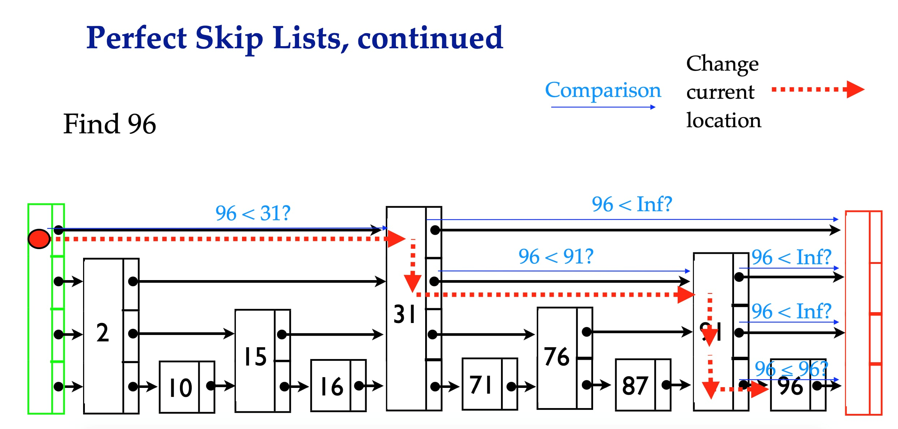
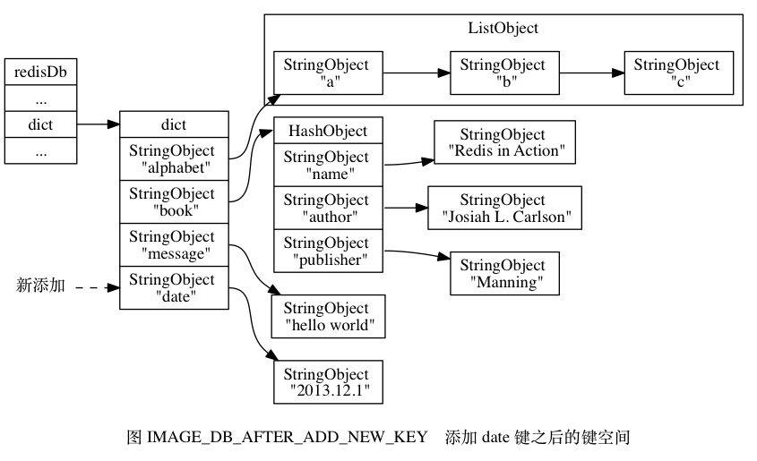

# redis实现原理

## 数据结构与对象

### 简单动态字符串 SDS

扩展C语言中的string，添加free剩余字节程度方便内存扩展、length字节长度提高获取长度的效率，动态扩容机制。


redis只会使用C字符串作为字面量，在大多数情况下，Redis使用SDS ( Simple Dynamic String，简单动态字符串)作为字符串表示。
比起C字符串，SDS具有以下优点:

- 常数复杂度获取字符串长度。（length属性）
- 杜绝缓冲区溢出。（free属性）
- 减少修改字符串长度时所需的内存重分配次数。
    空间预分配：小于1M则长度为（2*length+1）byte，大于1M则长度为（length+1M+1byte）；
    惰性空间释放：实际长度从长变短时并不释放空间，避免缩短短字符串时所需的内存重分配操作，并未将来可能的增长操作提供了优化。
- 二进制安全，不仅可以保持文本，还可以保存任意格式的二进制数据。
- 兼容部分C字符串函数，重用一部分string库的函数。

### 链表

**链表结构**


链表：表头节点、表尾节点、节点总数量、节点复制函数、节点释放函数、节点对比函数
链表节点：带有prev和next指针
特性：

- 双端:链表节点带有prev和next指针，获取某个节点的前置节点和后置节点的复杂度都是0(1)。
- 无环:表头节点的prev指针和表尾节点的next指针都指向NULL，对链表的访问以NUL为终点。
- 带表头指针和表尾指针:通过list结构的head指针和tail指针，程序获取链表的表头节点和表尾节点的复杂度为0(1)。
- 带链表长度计数器:程序使用list结构的len属性来对list持有的链表节点进行计数，程序获取链表中节点数量的复杂度为0(1)。
- 多态:链表节点使用void*指针来保存节点值，并且可以通过list结构的dup、free. match三个属性为节点值设置类型特定函数，所以链表可以用于保存各种不
    同类型的值。

### 字典

**字典用于保存键值对的抽象数据结构**


哈希表结构dictht：数组、大小、索引值、节点数量
哈希表节点dictEntry：key、union、next指针
字典dict：type、privdata、哈希表 ht[1]、rehash索引
type和privdata针对不同类型键值对，为创建多态字典而设置。
ht[0]:字典使用的dictht哈希表，ht[1]哈希表进行rehash时使用。

**rehash重新散列**

为了让哈希表的负载因子保持在合理的范围，哈希表的扩容和收缩机制。
**负载因子=哈希表已保存节点数量/哈希表大小**
load_factor=ht[0].used/ht[o].size
扩容算法 = (2的n次方幂第一个大于等于当前哈希表已保存数量）

**rehash时机**：

- 服务器目前没有在执行BGSAVE命令或者BGREWRITEAOF命令，并且哈希表的负载因子大于等于1。
- 服务器目前正在执行BGSAVE命令或者BGREWRITEAOF命令，并且哈希表的负载因子大于等于5。
- 当哈希表的负载因子小于0.1时,程序自动开始对哈希表执行收缩操作。

**rehash步骤**：

- 为字典的ht[1]哈希表分配空间，大小就是ht[0].used。
- 将ht[0]中所有的键值对rehash到ht[1]上面。
- 当ht[0]包含的所有键都迁移到ht[1]之后，释放ht[0]，将ht[1]设置为ht[0]，并在ht[1]新建一个空白哈希表，为下次rehash准备。

### 跳跃表 zskiplist

跳跃表是一种有序数据结构，每个节点中维持多个指向其他节点的指针，从而达到快速访问的目的。
Redis 的跳跃表由 redis.h/zskiplistNode 和 redis.h/zskiplist 两个结构定义， 其中 zskiplistNode 结构用于表示跳跃表节点， 而 zskiplist 结构则用于保存跳跃表节点的相关信息， 比如节点的数量， 以及指向表头节点和表尾节点的指针， 等等。


图 5-1 展示了一个跳跃表示例， 位于图片最左边的是 zskiplist 结构， 该结构包含以下属性：

- header ：指向跳跃表的表头节点。
- tail ：指向跳跃表的表尾节点。
- level ：记录目前跳跃表内，层数最大的那个节点的层数（表头节点的层数不计算在内）。
- length ：记录跳跃表的长度，也即是，跳跃表目前包含节点的数量（表头节点不计算在内）。

位于 zskiplist 结构右方的是四个 zskiplistNode 结构， 该结构包含以下属性：

- 层（level）：节点中用 L1 、 L2 、 L3 等字样标记节点的各个层， L1 代表第一层， L2 代表第二层，以此类推。每个层都带有两个属性：前进指针和跨度。前进指针用于访问位于表尾方向的其他节点，而跨度则记录了前进指针所指向节点和当前节点的距离。在上面的图片中，连线上带有数字的箭头就代表前进指针，而那个数字就是跨度。当程序从表头向表尾进行遍历时，访问会沿着层的前进指针进行。
- 后退（backward）指针：节点中用 BW 字样标记节点的后退指针，它指向位于当前节点的前一个节点。后退指针在程序从表尾向表头遍历时使用。
- 分值（score）：各个节点中的 1.0 、 2.0 和 3.0 是节点所保存的分值。在跳跃表中，节点按各自所保存的分值从小到大排列。
- 成员对象（obj）：各个节点中的 o1 、 o2 和 o3 是节点所保存的成员对象。




### 整数集合

整数集合( intset)是集合键的底层实现之一,当一个集合只包含整数值元素，并且这个集合的元素数量不多时，Redis就会使用整数集合作为集合键的底层实现。

```bash
redis> SADD numbers 1 3 57 9
(integer) 5
redis> OBJECT ENCODING nubers
"intset"
1234
```

每个 intset.h/intset 结构表示一个整数集合：

```bash
typedef struct intset {

    // 编码方式
    uint32_t encoding;

    // 集合包含的元素数量
    uint32_t length;

    // 保存元素的数组
    int8_t contents[];

} intset;
```

encoding包含int16，int32，int64.

**升级**

当放入的值超过之前设置的int取值范围，则所有值都升级为合适的int位。
特点：

- 灵活，通过标记类型来自动升级底层数组。
- 节约内存，超出才升级类型。
- 不支持降级


### 压缩列表

压缩列表（ziplist）是列表键和哈希键的底层实现之一。
当一个列表键只包含少量列表项， 并且每个列表项要么就是小整数值， 要么就是长度比较短的字符串， 那么 Redis 就会使用压缩列表来做列表键的底层实现。


图 7-2 展示了一个压缩列表示例：

- 列表 zlbytes 属性的值为 0x50 （十进制 80）， 表示压缩列表的总长为 80 字节。
- 列表 zltail 属性的值为 0x3c （十进制 60）， 这表示如果我们有一个指向压缩列表起始地址的指针 p ， 那么只要用指针 p 加上偏移量 60 ， 就可以计算出表尾节点 entry3 的地址。
- 列表 zllen 属性的值为 0x3 （十进制 3）， 表示压缩列表包含三个节点。

**列表节点**

毎个圧縮列表节点都由previous_entry_length、 encoding、content三个部分組成
previous_entry_length：记录压缩列表中前一个节点的长度。可根据此长度找到上一个节点的位置。
encoding：记录了节点的content属性所保存数据的类型以及长度。
content：节点的值。

**连锁更新**

由于节点是连续并且记录上一个节点的偏移量的，在添加或删除节点时可能触发连锁更新，更新分配空间。

### 对象

#### 对象类型

字符串对象 | string
列表对象 | list
哈希对象 | hash
集合对象 | set
有序集合对象 | zset

#### 对象的编码

编码常量 编码所对应的底层数据结构
REDIS_ENCODING_INT long 类型的整数
REDIS_ENCODING_EMBSTR embstr 编码的简单动态字符串
REDIS_ENCODING_RAW 简单动态字符串
REDIS_ENCODING_HT 字典
REDIS_ENCODING_LINKEDLIST 双端链表
REDIS_ENCODING_ZIPLIST 压缩列表
REDIS_ENCODING_INTSET 整数集合
REDIS_ENCODING_SKIPLIST 跳跃表和字典

#### 不同类型和编码的对象

类型 编码 对象
REDIS_STRING REDIS_ENCODING_INT 使用整数值实现的字符串对象。
REDIS_STRING REDIS_ENCODING_EMBSTR 使用 embstr 编码的简单动态字符串实现的字符串对象。
REDIS_STRING REDIS_ENCODING_RAW 使用简单动态字符串实现的字符串对象。
REDIS_LIST REDIS_ENCODING_ZIPLIST 使用压缩列表实现的列表对象。
REDIS_LIST REDIS_ENCODING_LINKEDLIST 使用双端链表实现的列表对象。
REDIS_HASH REDIS_ENCODING_ZIPLIST 使用压缩列表实现的哈希对象。
REDIS_HASH REDIS_ENCODING_HT 使用字典实现的哈希对象。
REDIS_SET REDIS_ENCODING_INTSET 使用整数集合实现的集合对象。
REDIS_SET REDIS_ENCODING_HT 使用字典实现的集合对象。
REDIS_ZSET REDIS_ENCODING_ZIPLIST 使用压缩列表实现的有序集合对象。
REDIS_ZSET REDIS_ENCODING_SKIPLIST 使用跳跃表和字典实现的有序集合对象。

#### OBJECT ENCODING 对不同编码的输出

对象所使用的底层数据结构 编码常量 OBJECT ENCODING 命令输出
整数 REDIS_ENCODING_INT “int”
embstr 编码的简单动态字符串（SDS） REDIS_ENCODING_EMBSTR “embstr”
简单动态字符串 REDIS_ENCODING_RAW “raw”
字典 REDIS_ENCODING_HT “hashtable”
双端链表 REDIS_ENCODING_LINKEDLIST “linkedlist”
压缩列表 REDIS_ENCODING_ZIPLIST “ziplist”
整数集合 REDIS_ENCODING_INTSET “intset”
跳跃表和字典 REDIS_ENCODING_SKIPLIST “skiplist”

#### 内存回收：

**引用计数器**

- 在创建一个新对象时，引用计数的值会被初始化为1;
- 当对象被一个新程序使用时，它的引用计数值会被增一;
- 当对象不再被一个程序使用时，它的引用计数值会被减一;
- 当对象的引用计数值变为0时，对象所占用的内存会被释放。

#### 对象共享

内存有效利用
初始化0~9999整数常量，因为复杂对象的时间复杂度高。

#### 对象的空转时长

lru属性：记录对象最后一次被命令访问时间。
除了可以被OBJECT IDLETIME命令打印出来之外，键的空转时长还有另外一项作用:如果服务器打开了maxmemory选项,并且服务器用于回收内存的算法为volatile-lru或者allkeys-lru,那么当服务器占用的内存数超过了maxmemory选项所设置的上限值时，空转时长较高的那部分键会优先被服务器释放,从而回收内存。

## 单机数据库的实现

### 数据库

服务器中的数据库 redisServer

切换数据库 select 1（数据库序列）

#### 数据库键空间

Redis 是一个键值对（key-value pair）数据库服务器， 服务器中的每个数据库都由一个 redis.h/redisDb 结构表示， 其中， redisDb 结构的 dict 字典保存了数据库中的所有键值对， 我们将这个字典称为键空间（key space）：

```bash
typedef struct redisDb {

    // ...

    // 数据库键空间，保存着数据库中的所有键值对
    dict *dict;

    // ...

} redisDb;
```



#### 键的生存时间

EXPIRE key time_value

#### 3种过期策略

1. **定时删除:**在设置键的过期时间的同时，创建一个定时器( timer),让定时器在键的过期时间来临时，立即执行对键的删除操作。

- 优点：定时删除策略对内存是最友好的:通过使用定时器，定时删除策略可以保证过期键会尽可能快地被删除，并释放过期键所占用的内存。
- 缺点：它对CPU时间是最不友好的:在过期键比较多的情况下，删除过期键这一行为可能会占用相当一部分CPU时间，在内存不紧张，但是CPU时间非常紧张的情况下，将CPU时间用在删除和当前任务无关的过期键上，无疑会对服务器的响应时间和吞吐量造成影响。

2. **惰性删除:**放任键过期不管，但是每次从键空间中获取键时，都检查取得的键是否过期，如果过期的话，就删除该键;如果没有过期，就返回该键。

- 惰性删除策略对CPU时间来说是最友好的:程序只会在取出键时才对键进行过期检查,这可以保证删除过期键的操作只会在非做不可的情况下进行，并且删除的目标仅限于当前处理的键，这个策略不会在删除其他无关的过期键上花费任何CPU时间。
- 惰性删除策略的缺点是，它对内存是最不友好的:如果一个键已经过期，而这个键又仍然保留在数据库中，那么只要这个过期键不被删除，它所占用的内存就不会释放。

3. **定期删除:**每隔一段时间，程序就对数据库进行一次检查，删除里面的过期键。至于要删除多少过期键，以及要检查多少个数据库，则由算法决定。
    定期删除策略每隔一段时间执行一次删除过期键操作，并通过限制删除操作执行的时长和频率来减少删除操作对CPU时间的影响。除此之外，通过定期删除过期键，定期删除策略有效地减少了因为过期键而带来的内存浪费。
    定期删除策略的难点是确定删除操作执行的时长和频率: 如果删除操作执行得太频繁，或者执行的时间太长，定期删除策略就会退化成定时删除策略，以至于将CPU时间过多地消耗在删除过期键上面。如果删除操作执行得太少，或者执行的时间太短，定期删除策略又会和惰性删除策略一样，出现浪费内存的情况。因此，如果采用定期删除策略的话，服务器必须根据情况，合理地设置删除操作的执行时长和执行频率。

redis采用惰性删除加定期删除的方式控制键的过期处理。

#### AOF、RDB和复制功能对过期键的处理

RDB文件
主服务器不会保存过期键，从服务器保存所有键，因为主从同步时会情况从服务器所以不浪费内存。
AOF文件
已过期的追加删除命令。已过期的重写时忽略。复制时从服务器不处理过期，只有主服务器同步删除才删除。

#### 数据库通知

redis 2.8版本新增的功能。可以让客户端通过订阅给定的频道来获取数据库中键的变化。

### RDB持久化

RDB持久化功能所生成的RDB文件是一个经过压缩的二进制文件，通过该文件可以还原生成RDB文件时的数据库状态。

#### RDB文件的创建和载入

有两个Redis命令可以用于生成RDB文件，一个是SAVE,另一个是BGSAVE。
SAVE命令会阻塞Redis服务器进程，直到RDB文件创建完毕为止，在服务器进程阻塞期间，服务器不能处理任何命令请求。
BGSAVE命令会派生出一个子进程，然后由子进程负责创建RDB文件，服务器进程(父进程)继续处理命令请求。

#### 自动间隔性保存

设置服务器配置的save选项，来间隔执行BGSAVE命令。
可配置多个保存条件，满足一个就保存。

```
save 900 1  //服务器在900秒之内，对数据库进行了至少1次修改。
save 300 10     //服务器在300秒之内，对数据库进行了至少10次修改。
save 60 10000   //服务器在60秒之内，对数据库进行了至少10000次修改。
123
```

### AOF持久化

AOF持久化是通过保存redis服务器所执行的写命令来记录数据库状态的。
AOF持久化功能的实现可以分为命令追加( append)、.文件写入、文件同步(sync)三个步骤。

#### AOF重写的实现

通过分析命令相同的命令只保留最后有效行。
AOF重写可以产生一个新的AOF文件，这个新的AOF文件和原有的AOF文件所保存的数据库状态一样,但体积更小。

## 事件

redis事件分为：文件事件和时间事件。

### 文件事件

Redis基于Reactor模式开发了自己的网络事件处理器:这个处理器被称为文件事件处理器( fle event handler ):

- 文件事件处理器使用IO多路复用(multiplexing)程序来同时监听多个套接字，并根据套接字目前执行的任务来为套接字关联不同的事件处理器。
- 当被监听的套接字准备好执行连接应答(accept)、读取(read)、写人(write)、关闭(close)等操作时，与操作相对应的文件事件就会产生，这时文件事件处理器就会调用套接字之前关联好的事件处理器来处理这些事件。

### 时间事件

redis的时间事件分为两大类。

- 定时事件:让一段程序在指定的时间之后执行-次。比如说，让程序X在当前时间的30毫秒之后执行一次。
- 周期性事件:让-一段程序每隔指定时间就执行-次。比如说，让程序Y每隔30毫秒就执行一次。

### 客户端

### 服务器


## 多机数据库的实现

### 复制

redis中用户可以通过SLAVEOF命令或者设置slaveof选项，让一个服务器去复制另一个服务器。被复制的叫主服务器，复制的叫从服务器。

#### 旧版复制同步

SYNC命令的执行步骤:

- 从服务器向主服务器发送SYNC命令。
- 收到SYNC命令的主服务器执行BGSAVE命令，在后台生成-一个RDB文件，并使用一个缓冲区记录从现在开始执行的所有写命令。
- 当主服务器的BGSAVE命令执行完毕时，主服务器会将BGSAVE命令生成的RDB文件发送给从服务器，从服务器接收并载人这个RDB文件，将自己的数据库状态更新至主服务器执行BGSAVE命令时的数据库状态。
- 主服务器将记录在缓冲区里面的所有写命令发送给从服务器，从服务器执行这些写命令，将自己的数据库状态更新至主服务器数据库当前所处的状态。
    缺陷：断线后不能续传，而是重新开始。

#### 新版复制同步

在旧版的基础上，在断点后可以做到部分重同步。通过实现偏移量实现。
部分重同步功能实现的三个部分。

- 主服务器的复制偏移量( replication offset )和从服务器的复制偏移量。
- 主服务器的复制积压缓冲区( replication backlog )。
- 服务器的运行ID ( run ID )。

#### 复制的实现

- 设置主服务器的地址和端口
    SLAVEOF <master_ip> <master_port>
- 建立套接字连接
- 发送ping命令
- 身份认证 从服务器设置masterauth则需要身份验证
- 发送端口信息，从服务器执行REPLCONF listening-port ，向主服务器发送从服务器的监听端口号。
- 同步 从服务器向主服务器发送PSYNC命令，执行同步操作。
- 命令传播 同步完成之后，主服务器就一直将写命令发送给从服务器，从服务器执行写命令达到主从一致。

#### 心跳检测

在命令传播阶段，从服务器默认会以每秒一次的频率，向主服务器发送命令:
REPLCONP ACK crep1ication_ offset>
其中replication_ offset 是从服务器当前的复制偏移量。
发送REPLCONF ACK命令对于主从服务器有三个作用:

- 检测主从服务器的网络连接状态。
- 辅助实现min-slaves选项。
- 检测命令丢失。

### 哨兵sentinel

哨兵系统可以监视任意多个主服务器，已经主服务器下的从服务器。

#### 启动初始化sentinel

启动一个 Sentinel 可以使用命令：
$ redis-sentinel /path/to/your/sentinel.conf
当一个 Sentinel 启动时， 它需要执行以下步骤：

1. 初始化服务器。
2. 将普通 Redis 服务器使用的代码替换成 Sentinel 专用代码。
3. 初始化 Sentinel 状态。
4. 根据给定的配置文件， 初始化 Sentinel 的监视主服务器列表。
5. 创建连向主服务器的网络连接。

#### sentinel服务器

只保留七个命令PING 、 SENTINEL 、 INFO 、 SUBSCRIBE 、 UNSUBSCRIBE 、 PSUBSCRIBE 和 PUNSUBSCRIBE

#### sentinel服务器的工作

初始化master属性，记录所有主服务器信息。
创建和主服务器的网络连接。
间隔获取主服务器信息。
获取从服务器信息。
向主从服务器发送信息。
接收主从服务器的频道信息。
更新sentinels字典。
创建连向其他sentinel的命令连接。

#### 标记下线

ping命令的回复信息：PONG LOADING MASTERDOWN 以及无响应。
如果连续无响应超过配置文件指定sentinel的down-after-milliseconds选项的值那么就会标记为主观下线。
客观下线：如果超过配置中的sentinel数量认为主观下线则认为客观下线。

```
sentinel monitor master 127.0.0.1 6379 2
```

#### 选举领头哨兵

选举规则和方法

- 任何哨兵都可能成为leader
- 每次不论选举是否成功，配置纪元都会自增一次。
- 在一个配置纪元里，大家都有一次选举将某哨兵选举为leader的机会，选成功后不能更改。
- 发现客观下线的哨兵都会要求其他哨兵将自己设置为局部leader
- 先到先得
- 半数选举制。比如10个有6个
- 只有一个leader
- 直到选出leader为止

#### 故障转移

1. 在已下线主服务器属下的所有从服务器里面，挑选出一个从服务器，并将其转换为主服务器。
2. 让已下线主服务器属下的所有从服务器改为复制新的主服务器。
3. 将已下线主服务器设置为新的主服务器的从服务器，当这个旧的主服务器重新上线时，它就会成为新的主服务器的从服务器。

#### 选出新的主服务器

1. 更新删除无效服务器
2. 复制偏移量最大的优先成为主服务器
3. 复制偏移量相同情况下，选出运行id最小的从服务器为主服务器。

### 集群

redis集群是通过分片来进行数据共享，并提供复制和故障转移功能。

#### 节点

一个 Redis 集群通常由多个节点（node）组成， 在刚开始的时候， 每个节点都是相互独立的， 它们都处于一个只包含自己的集群当中， 要组建一个真正可工作的集群， 我们必须将各个独立的节点连接起来， 构成一个包含多个节点的集群。
连接各个节点的工作可以使用 CLUSTER MEET 命令来完成， 该命令的格式如下：

```
CLUSTER MEET <ip> <port>
1
```

向一个节点 node 发送 CLUSTER MEET 命令， 可以让 node 节点与 ip 和 port 所指定的节点进行握手（handshake）， 当握手成功时， node 节点就会将 ip 和 port 所指定的节点添加到 node 节点当前所在的集群中。

#### 集群数据结构

clusterNode 结构保存了一个节点的当前状态， 比如节点的创建时间， 节点的名字， 节点当前的配置纪元， 节点的 IP 和地址， 等等。
每个节点都会使用一个 clusterNode 结构来记录自己的状态，并为集群中的所有其他节点（包括主节点和从节点）都创建一个相应的 clusterNode 结构，以此来记录其他节点的状态。

#### 槽指派

Redis集群通过分片的方式来保存数据库中的键值对:集群的整个数据库被分为16384个槽(slot),数据库中的每个键都属于这16384个槽的其中-一个，集群中的每个节点可以处理0个或最多16384个槽。
当数据库中的16384个槽都有节点在处理时，集群处于上线状态(ok);相反地，如果数据库中有任何-一个槽没有得到处理，那么集群处于下线状态( fail )。

#### clusterNode记录节点的槽指派信息

#### 传播节点的槽指派信息

节点会将自己的slots数组通过消息发送给集群中的其他节点，告知其他节点自己目前负责的槽信息。

#### clusterState记录集群所有槽的指派信息

#### 在集群里执行命令

- 如果键所在的槽正好就指派给了当前节点，那么节点直接执行这个命令。
- 如果键所在的槽并没有指派给当前节点，那么节点会向客户端返回一个MOVED错误，指引客户端转向(redirect)至正确的节点，并再次发送之前想要执行的命令。

#### 计算键属于哪个槽

```
//计算代码
def solt_number(key):
    return CRC16(key) & 16383

//查询方法
CLUSTER KEYSLOT "key"
(integer)2022
1234567
```

#### 判断槽是否由当前节点处理

节点中的clusterState.slots数组中的项i，判断是否由自己负责

- 如果clusterState.slots[i]等于clusterState .myself,那么说明槽i由当前节点负责，节点可以执行客户端发送的命令。
- 如果clusterState.slots[i]不等于clusterState.myself,那么说明槽i并非由当前节点负责，节点会根据clusterState.slots[i]指向的clusterNode结构所记录的节点IP和端口号，向客户端返回MOVED错误，指引客户端转向至正在处理槽i的节点。

#### 重新分片原理

新增节点时会重新分片。

#### ask错误

与此相反，如果节点没有在自己的数据库里找到键key,那么节点会检查自己的clusterState . migrating_ slots_to[i],看键key所属的槽1是否正在进行迁移，如果槽i的确在进行迁移的话，那么节点会向客户端发送一个ASK错误，引导客户端到正在导人槽i的节点去查找键key。

#### ask错误和moved错误

- moved错误表示槽的负责权已经转移到其他节点，之后的请求会指向正确的节点。
- ask错误只是两个节点正在迁移槽的过程中的临时措施。请求不会转向。

#### 设置从节点

CLUSTER REPLICATE <node_id>

#### 故障检测 ping心跳

#### 故障转移

#### 选举主节点

## 独立功能的实现

#### 发布与订阅

Redis的发布与订阅功能由PUBLISH、SUBSCRIBE、PSUBSCRIBE 等命令组成。通过执行SUBSCRIBE命令，客户端可以订阅-一个或多个频道，从而成为这些频道的订阅者(subscriber):每当有其他客户端向被订阅的频道发送消息( message)时，频道的所有订阅者都会收到这条消息。

#### 频道的订阅与退订 

SUBSCRIBE UNSUBSCRIBE

#### 订阅模式的订阅与退订

PSUBSCRIBE PUNSUNSCRIBE

使用模式可以聚合多个频道一起订阅。

#### 发送消息

PUBLISH 

#### 查看订阅信息

PUBSUB CHANNELS [pattern]用于返回服务器当前被订阅的频道。
PUBSUB NUMSUB [channel-1 channel-2 … ] 接收任意多个频道。
PUBSUB NUMPAT 返回服务器当前被订阅模式的数量。

## 事务

redis通过MULTI EXEC WATCH 等命令来实现事务。
事务提供了一个将多个命令打包，一次性按顺序执行的机制。事务执行时不会执行其他命令，执行完后才处理其他请求。

#### 事务阶段

事务开始 命令入队 事务执行

#### WATCH命令

watch是一个乐观锁，她可以在exec执行之前，监视任意数量的数据库键，如果监视的键被修改过那么拒绝执行事务。

#### 事务的ACID性质

原子性：要么整体执行，要么不执行
一致性：事务执行前后数据库仍然是一致的。redis会检查错误语法
隔离线：串行运行，事务之间不会相互影响
耐久性：redis具有持久化特性。

## lua脚本

lua的作用：

- 为c语言新增一些基础库，已经面向对象特性
- 让redis可以编写复杂的redis脚本编程

## 排序

- sort 对数字进行排序
- sort ALPHA 对字符串进行排序
- sort ASC 升序
- sort DESC 降序
- sort BY * 数字条件排序
- sort BY * ALPHA 字符串条件排序
- sort ALPHA LIMIT 

## 二进制数组

SETBIT 命令用于为位数组指定偏移量上的二进制位设置值，位数组的偏移量从0开始计数，而二进制位的值则可以是0或者1
GETBIT用于获取位数组指定偏移量，上的二进制位的值
BITCOUNT用于统计位数组里面，值为1的二进制位的数量
BITOP命令既可以对多个位数组进行按位与(and)、按位或(or)、按位异或(xor)运算

## 慢查询日志

Redis的慢查询日志功能用于记录执行时间超过给定时长的命令请求，用户可以通过这个功能产生的日志来监视和优化查询速度。
服务器配置有两个和慢查询日志相关的选项:

- slowlog- log-slower-than选项指定执行时间超过多少微秒(1秒等于1000 000微秒)的命令请求会被记录到日志上。
- slowlog-max-len选项指定服务器最多保存多少条慢查询日志。
- 使用SLOWLOG GET命令查看服务器所保存的慢查询日志

## 监视器

通过执行MONITOR命令,客户端可以将自己变为一个监视器，实时地接收并打印出服务器当前处理的命令请求的相关信息