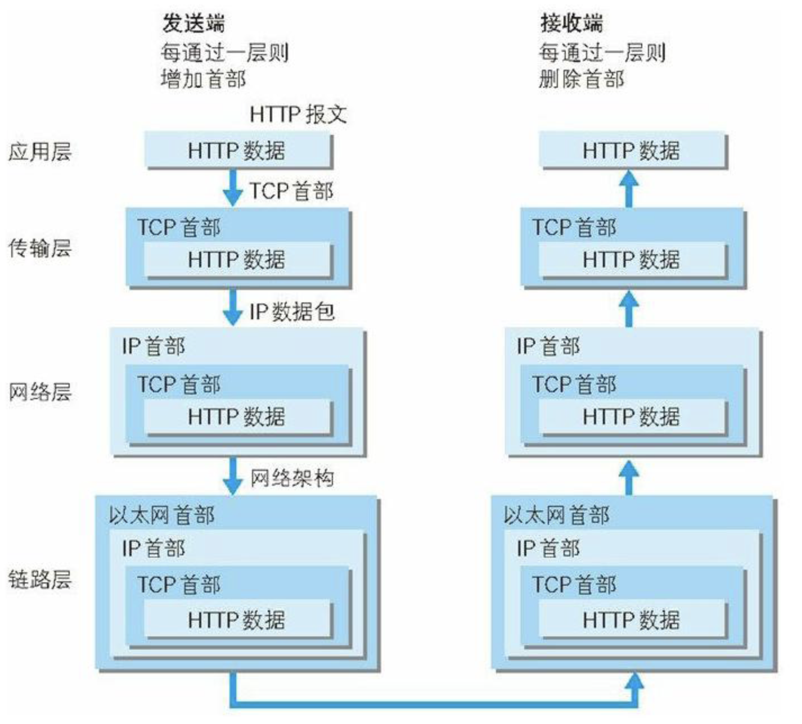
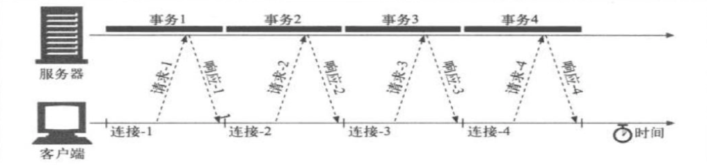
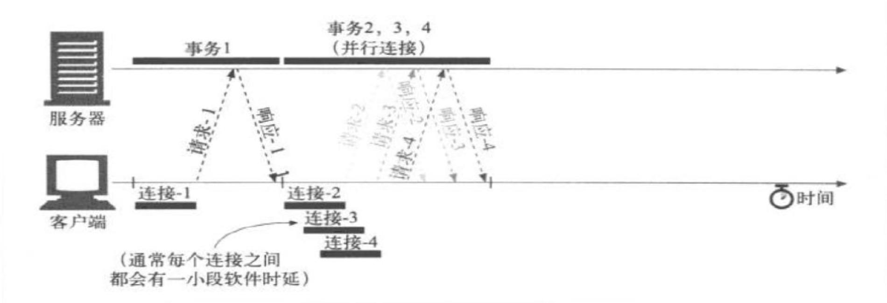
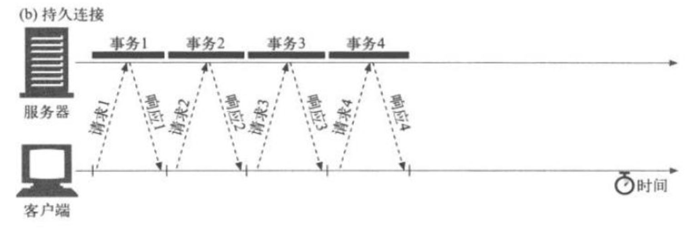
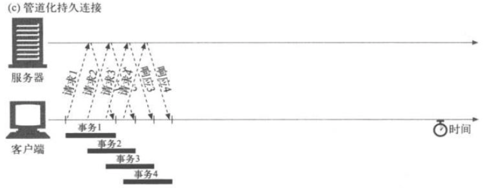

# 抓取[www.baiu.com](www.baiu.com)的首页内容

### 抓取[www.baiu.com的首页内容](http://www.baiu.com的首页内容)。

#### telnet协议

```bash
# Telnet远程登录--常用命令
Telnet程序中还有许多命令。这些命令可以通过在键盘上键入 telnet，或^]，进入其特殊的命令状态来实现。在该命令状态提示符(telnet＞)下，键入问号(?)，就可以得到Telnet的命令清单。不同版本的Telnet程序可用的命令有所不同，需要具体试用。大多数的Telnet程序都配有如下命令：
telnet 
telnet> ? 
Commands may be abbreviated. Commands are:
close                     close current connection 
logout                   forcibly logout remote user and close the connection 
display                 display operating parameters 
mode                       try to enter line or character mode ('mode ?' for more) 
open                       connect to a site 
quit                       exit telnet 
send                       transmit special characters ('send ?' for more) 
set                         set operating parameters ('set ?' for more) 
unset                     unset operating parameters ('unset ?' for more) 
status                   print status information 
toggle                   toggle operating parameters ('toggle ?' for more) 
z                             suspend telnet 
?                             print help information 
!                             invoke a subshell 
environ                 change environment variables ('environ ?' for more) 
slc                         change state of special charaters ('slc ?' for more)
telnet>
```

**命令的功能:**

1.  **close** 终止当前已经建立的联接或正在进行的联接。自动将本地系统与远程系统切断。有时进入某个网络时由于某种原因会被锁住，远程主机系统不能识别任何本地用户在键盘上键入的命令，甚至不能用logout命令退出Telnet状态，这时可以用^]键，进入Telnet的命令状态，然后用close命令切断当前的联接，重新开始新的登录。用close命令切断联接后，可用o或open加主机名再打开一个新的联接.

2. **display**   显示系统当前的操作参数。在Telnet的命令状态下，键入display，按回车键，屏幕将显示当前系统的操作参数，例如，在紧急状态下是否发送中断字符，是否重新确认控制字符，以及^E(回应)，^](进入命令状态)，^C(中断)，^U(删除一行)等键盘命令的含义.

3. **mode**   进入逐行方式(line)：用户每键入一行信息，本地系统向远端主机发送一次；或逐个字符方式(character)：用户每键入一个字符，本地系统向远端主机发送一次。

4. **open** (或 o) 主机名   与指定的这台主机建立Telnet联接，同“telnet主机名”命令的意义相同。在打开一个新的联接前，必须终止当前所有的联接。也就是说在同一窗口下一台本地机同一时间内只能与一台远程主机建立联接（在Windows或类Windows的图形界面环境下可打开多个窗口，建立与多台主机的联接）。这是Telnet的一个特性。

5. **quit**   退出Telnet应用进程，回到本地系统，任何Telnet命令不再起作用。

6. **logout**   强制关闭登录的用户帐号，并关闭连接，退回本地系统（它与许多系统下的 EXIT具有相同功能）。

7. **send**   已经登录到某台主机后，可以通过send命令发送一些信息到远程系统上。关于send命令的详细信息可以在Telnet的命令状态下，通过键入send ?命令获得。

8. **set**   设置所有可以用display命令显示的操作参数。例如，设置^ E为启动本地回应开关命令，^ ]为进入Telnet命令状态的命令，^ U为删除一行，用?显示帮助信息，等等。例如：“set echo ^ E”表示本地回应开关为^ E。关于set命令的详细信息可以在Telnet命令状态下，通过键入set ?命令获得。

9. **unset**   取消已设置的用display命令显示的操作参数。它与set命令功能刚好相反。

10. **status**   显示当前状态信息。该命令只有已经登录到某一台主机后才有效。

11. **toggle**   激活某些操作参数，这些参数决定Telnet对事件的响应方式，例如，激活在发出中断命令后，系统自动排出全部存储结果

     (autofluh)；收到故障反馈后，自动映射(crmod)等等。关于toggle命令的详细信息可以在Telnet命令状态下，用toggle ?命令获得。

12. **z**   暂时中止Telnet通信，使本地系统可以执行其它命令，例如回到本地系统，看看有没有新邮件到来等。一般用fg命令可以恢复原来的联接或用open(或o)命令建立新的联接。也有一些系统在执行z命令后，便退出Telnet状态。

13. **?**  显示帮助信息，帮助用户了解系统可以提供哪些命令、每个命令的用法。

14. **! 、 environ、slc**  这三个命令是UNIX系统下的命令，有些系统不提供，因此这里不作详细解释。

     **注意: **虽然用close或quit命令都可关闭当前的Telnet联接，但是最好还是用logout退出远程系统，以确保系统工作正常。logout方式退出可确保Telnet进程确实终止和用户所要的数据存盘。
     上述命令都是Telnet应用程序的命令，因此只能在Telnet状态下才有效。初学者有时会在装有Telnet应用程序的本地机上键入open、close之类的命令，当然，本地系统不能识别这些命令。因为其本地机上虽然装载有Telnet程序，但并没有进入Telnet状态，本地机上可能装载有许多Internet网络工具的客户机程序，用户键入不同的命令，系统执行不同的程序。

#### http协议

> - 概念
>
>      HyperText Transfer Protocol 超文本传输协议。超文本：在电脑中显示的、含有可以指向其他文本的链接的文本。
>
> - 工作机制
>
>      浏览器通过Http向服务器发送请求，服务器返回响应，浏览器通过其渲染引擎，也就是内核，将服务器返回的响应渲染到浏览器上。
>
>      - 浏览器是怎样将URL转化成发送给服务器的请求的
>
>           - 
>           - 如上所示，http:是协议类型、//hencoder.com/是服务器地址、users?gender=male是路径path
>
>      - 请求和响应的格式分别是什么
>
>           - Request
>
>                - 
>
>                - 上图中详细写明了请求报文的格式，请求行中的path和body是给服务器看的。path用来寻找是服务器中的哪一个表，body是要插入的数据。
>
>                     #### Request Method：
>
>                     · GET：获取资源，没有Body。（从网上拿东西）
>                     · POST：增加或修改资源，一定有Body。
>                     ·PUT：修改资源，有Body，只修改。
>                     ·DELETE ：删除资源，没有Body。
>                     ·HEAD：与GET相同，不同的是服务器不会返回Body，可在下载时使用，先请求一下，查看文件大小等信息。
>
>           - Response
>
>                - 
>
>                - #### Response Status Code
>
>                     对结果做出类型化描述。
>                     ·1xx：临时性消息。100：分段发生请求时，服务器接受到每段消息时返回100，提醒客户端可以继续发送了。101
>                     ·2xx：成功。
>                     ·3xx：重定向。
>                     ·4xx：客户端错误。如：400:参数不对，服务器无法理解该请求。401:未登录。等
>                     ·5xx：服务器错误。
>
> - 结合OSI七层协议
>
> - 
>
> - 提升http性能
>
> - 
>
>      - 并行连接
>           - 通过多条TCP连接发起并发的HTTP请求
>           - 
>      - 持久连接
>           - keep-alive,长连接，重用TCP连接，以消除连接和关闭的时延,以事务个数和时间来决定是否关闭连接
>           - 
>      - 管道化连接
>           - 通过共享TCP连接发起并发的HTTP请求
>           - 
>      - 复用的连接：
>             　　交替传送请求和响应报文（实验阶段）


#### 解决方案

```bash
# 连接百度
telnet www.baidu.com 80
# 命令+域名+端口
```

仅仅连接还不行，因为没有请求动作

- GET 请求动作
- /index.html 路径，也就是要抓取的内容有一点前端内容啦
- HTTP/1.1 http协议版本
- host：www.baidu.com 输入地址

```bash
GET /index.html HTTP/1.1
Host: www.baidu.com
```

```bash
[zhengdongqi@2-188 ~]$ telnet www.baidu.com 80
Trying 61.135.185.32...
Connected to www.baidu.com.
Escape character is '^]'.
GET /index.html HTTP/1.1
Host: www.baidu.com

HTTP/1.1 200 OK
Accept-Ranges: bytes
Cache-Control: no-cache
Connection: keep-alive
Content-Length: 14615
Content-Type: text/html
Date: Fri, 06 Nov 2020 08:08:12 GMT
P3p: CP=" OTI DSP COR IVA OUR IND COM "
P3p: CP=" OTI DSP COR IVA OUR IND COM "
Pragma: no-cache
Server: BWS/1.1
Set-Cookie: BAIDUID=FE91539ECA102E2D7D0FB95EE01314FA:FG=1; expires=Thu, 31-Dec-37 23:55:55 GMT; max-age=2147483647; path=/; domain=.baidu.com
Set-Cookie: BIDUPSID=FE91539ECA102E2D7D0FB95EE01314FA; expires=Thu, 31-Dec-37 23:55:55 GMT; max-age=2147483647; path=/; domain=.baidu.com
Set-Cookie: PSTM=1604650092; expires=Thu, 31-Dec-37 23:55:55 GMT; max-age=2147483647; path=/; domain=.baidu.com
Set-Cookie: BAIDUID=FE91539ECA102E2D03F338CD8F299273:FG=1; max-age=31536000; expires=Sat, 06-Nov-21 08:08:12 GMT; domain=.baidu.com; path=/; version=1; comment=bd
Traceid: 1604650092330406887410782094787577139863
Vary: Accept-Encoding
X-Ua-Compatible: IE=Edge,chrome=1

<!DOCTYPE html><!--STATUS OK-->
<html>
<head>
	<meta http-equiv="content-type" content="text/html;charset=utf-8">
	<meta http-equiv="X-UA-Compatible" content="IE=Edge">
	<link rel="dns-prefetch" href="//s1.bdstatic.com"/>
	<link rel="dns-prefetch" href="//t1.baidu.com"/>
	<link rel="dns-prefetch" href="//t2.baidu.com"/>
	<link rel="dns-prefetch" href="//t3.baidu.com"/>
	<link rel="dns-prefetch" href="//t10.baidu.com"/>
	<link rel="dns-prefetch" href="//t11.baidu.com"/>
	<link rel="dns-prefetch" href="//t12.baidu.com"/>
	<link rel="dns-prefetch" href="//b1.bdstatic.com"/>
	<title>百度一下，你就知道</title>
	<link href="http://s1.bdstatic.com/r/www/cache/static/home/css/index.css" rel="stylesheet" type="text/css" />
	<!--[if lte IE 8]><style index="index" >#content{height:480px\9}#m{top:260px\9}</style><![endif]-->
	<!--[if IE 8]><style index="index" >#u1 a.mnav,#u1 a.mnav:visited{font-family:simsun}</style><![endif]-->
	<script>var hashMatch = document.location.href.match(/#+(.*wd=[^&].+)/);if (hashMatch && hashMatch[0] && hashMatch[1]) {document.location.replace("http://"+location.host+"/s?"+hashMatch[1]);}var ns_c = function(){};</script>
	<script>function h(obj){obj.style.behavior='url(#default#homepage)';var a = obj.setHomePage('//www.baidu.com/');}</script>
	<noscript><meta http-equiv="refresh" content="0; url=/baidu.html?from=noscript"/></noscript>
	<script>window._ASYNC_START=new Date().getTime();</script>
</head>
<body link="#0000cc"><div id="wrapper" style="display:none;"><div id="u"><a href="//www.baidu.com/gaoji/preferences.html"  onmousedown="return user_c({'fm':'set','tab':'setting','login':'0'})">搜索设置</a>|<a id="btop" href="/"  onmousedown="return user_c({'fm':'set','tab':'index','login':'0'})">百度首页</a>|<a id="lb" href="https://passport.baidu.com/v2/?login&tpl=mn&u=http%3A%2F%2Fwww.baidu.com%2F" onclick="return false;"  onmousedown="return user_c({'fm':'set','tab':'login'})">登录</a><a href="https://passport.baidu.com/v2/?reg&regType=1&tpl=mn&u=http%3A%2F%2Fwww.baidu.com%2F"  onmousedown="return user_c({'fm':'set','tab':'reg'})" target="_blank" class="reg">注册</a></div><div id="head"><div class="s_nav"><a href="/" class="s_logo" onmousedown="return c({'fm':'tab','tab':'logo'})"></a><div class="s_tab" id="s_tab"><a href="http://news.baidu.com/ns?cl=2&rn=20&tn=news&word=" wdfield="word"  onmousedown="return c({'fm':'tab','tab':'news'})">新闻</a>&#12288;<b>网页</b>&#12288;<a href="http://tieba.baidu.com/f?kw=&fr=wwwt" wdfield="kw"  onmousedown="return c({'fm':'tab','tab':'tieba'})">贴吧</a>&#12288;<a href="http://zhidao.baidu.com/q?ct=17&pn=0&tn=ikaslist&rn=10&word=&fr=wwwt" wdfield="word"  onmousedown="return c({'fm':'tab','tab':'zhidao'})">知道</a>&#12288;<a href="http://music.baidu.com/search?fr=ps&key=" wdfield="key"  onmousedown="return c({'fm':'tab','tab':'music'})">音乐</a>&#12288;<a href="http://image.baidu.com/i?tn=baiduimage&ps=1&ct=201326592&lm=-1&cl=2&nc=1&word=" wdfield="word"  onmousedown="return c({'fm':'tab','tab':'pic'})">图片</a>&#12288;<a href="http://v.baidu.com/v?ct=301989888&rn=20&pn=0&db=0&s=25&word=" wdfield="word"   onmousedown="return c({'fm':'tab','tab':'video'})">视频</a>&#12288;<a href="http://map.baidu.com/m?word=&fr=ps01000" wdfield="word"  onmousedown="return c({'fm':'tab','tab':'map'})">地图</a>&#12288;<a href="http://wenku.baidu.com/search?word=&lm=0&od=0" wdfield="word"  onmousedown="return c({'fm':'tab','tab':'wenku'})">文库</a>&#12288;<a href="//www.baidu.com/more/"  onmousedown="return c({'fm':'tab','tab':'more'})">更多»</a></div></div><form id="form" name="f" action="/s" class="fm" ><input type="hidden" name="ie" value="utf-8"><input type="hidden" name="f" value="8"><input type="hidden" name="rsv_bp" value="1"><span class="bg s_ipt_wr"><input name="wd" id="kw" class="s_ipt" value="" maxlength="100"></span><span class="bg s_btn_wr"><input type="submit" id="su" value="百度一下" class="bg s_btn" onmousedown="this.className='bg s_btn s_btn_h'" onmouseout="this.className='bg s_btn'"></span><span class="tools"><span id="mHolder"><div id="mCon"><span>输入法</span></div><ul id="mMenu"><li><a href="javascript:;" name="ime_hw">手写</a></li><li><a href="javascript:;" name="ime_py">拼音</a></li><li class="ln"></li><li><a href="javascript:;" name="ime_cl">关闭</a></li></ul></span><span class="shouji"><strong>推荐&nbsp;:&nbsp;</strong><a href="http://w.x.baidu.com/go/mini/8/10000020" onmousedown="return ns_c({'fm':'behs','tab':'bdbrowser'})">百度浏览器，打开网页快2秒！</a></span></span></form></div><div id="content"><div id="u1"><a href="http://news.baidu.com" name="tj_trnews" class="mnav">新闻</a><a href="http://www.hao123.com" name="tj_trhao123" class="mnav">hao123</a><a href="http://map.baidu.com" name="tj_trmap" class="mnav">地图</a><a href="http://v.baidu.com" name="tj_trvideo" class="mnav">视频</a><a href="http://tieba.baidu.com" name="tj_trtieba" class="mnav">贴吧</a><a href="https://passport.baidu.com/v2/?login&tpl=mn&u=http%3A%2F%2Fwww.baidu.com%2F" name="tj_login" id="lb" onclick="return false;">登录</a><a href="//www.baidu.com/gaoji/preferences.html" name="tj_settingicon" id="pf">设置</a><a href="//www.baidu.com/more/" name="tj_briicon" id="bri">更多产品</a></div><div id="m"><p id="lg"></p><p id="nv"><a href="http://news.baidu.com">新&nbsp;闻</a>　<b>网&nbsp;页</b>　<a href="http://tieba.baidu.com">贴&nbsp;吧</a>　<a href="http://zhidao.baidu.com">知&nbsp;道</a>　<a href="http://music.baidu.com">音&nbsp;乐</a>　<a href="http://image.baidu.com">图&nbsp;片</a>　<a href="http://v.baidu.com">视&nbsp;频</a>　<a href="http://map.baidu.com">地&nbsp;图</a></p><div id="fm"><form id="form1" name="f1" action="/s" class="fm"><span class="bg s_ipt_wr"><input type="text" name="wd" id="kw1" maxlength="100" class="s_ipt"></span><input type="hidden" name="rsv_bp" value="0"><input type=hidden name=ch value=""><input type=hidden name=tn value="baidu"><input type=hidden name=bar value=""><input type="hidden" name="rsv_spt" value="3"><input type="hidden" name="ie" value="utf-8"><span class="bg s_btn_wr"><input type="submit" value="百度一下" id="su1" class="bg s_btn" onmousedown="this.className='bg s_btn s_btn_h'" onmouseout="this.className='bg s_btn'"></span></form><span class="tools"><span id="mHolder1"><div id="mCon1"><span>输入法</span></div></span></span><ul id="mMenu1"><div class="mMenu1-tip-arrow"><em></em><ins></ins></div><li><a href="javascript:;" name="ime_hw">手写</a></li><li><a href="javascript:;" name="ime_py">拼音</a></li><li class="ln"></li><li><a href="javascript:;" name="ime_cl">关闭</a></li></ul></div><p id="lk"><a href="http://baike.baidu.com">百科</a>　<a href="http://wenku.baidu.com">文库</a>　<a href="http://www.hao123.com">hao123</a><span>&nbsp;|&nbsp;<a href="//www.baidu.com/more/">更多&gt;&gt;</a></span></p><p id="lm"></p></div></div><div id="ftCon"><div id="ftConw"><p id="lh"><a id="seth" onClick="h(this)" href="/" onmousedown="return ns_c({'fm':'behs','tab':'homepage','pos':0})">把百度设为主页</a><a id="setf" href="//www.baidu.com/cache/sethelp/index.html" onmousedown="return ns_c({'fm':'behs','tab':'favorites','pos':0})" target="_blank">把百度设为主页</a><a onmousedown="return ns_c({'fm':'behs','tab':'tj_about'})" href="http://home.baidu.com">关于百度</a><a onmousedown="return ns_c({'fm':'behs','tab':'tj_about_en'})" href="http://ir.baidu.com">About Baidu</a></p><p id="cp">&copy;2018&nbsp;Baidu&nbsp;<a href="/duty/" name="tj_duty">使用百度前必读</a>&nbsp;京ICP证030173号&nbsp;</p></div></div><div id="wrapper_wrapper"></div></div><div class="c-tips-container" id="c-tips-container"></div>
<script>window.__async_strategy=2;</script>
<script>var bds={se:{},su:{urdata:[],urSendClick:function(){}},util:{},use:{},comm : {domain:"http://www.baidu.com",ubsurl : "http://sclick.baidu.com/w.gif",tn:"baidu",queryEnc:"",queryId:"",inter:"",templateName:"baidu",sugHost : "http://suggestion.baidu.com/su",query : "",qid : "",cid : "",sid : "",indexSid : "",stoken : "",serverTime : "",user : "",username : "",loginAction : [],useFavo : "",pinyin : "",favoOn : "",curResultNum:"",rightResultExist:false,protectNum:0,zxlNum:0,pageNum:1,pageSize:10,newindex:0,async:1,maxPreloadThread:5,maxPreloadTimes:10,preloadMouseMoveDistance:5,switchAddMask:false,isDebug:false,ishome : 1},_base64:{domain : "http://b1.bdstatic.com/",b64Exp : -1,pdc : 0}};var name,navigate,al_arr=[];var selfOpen = window.open;eval("var open = selfOpen;");var isIE=navigator.userAgent.indexOf("MSIE")!=-1&&!window.opera;var E = bds.ecom= {};bds.se.mon = {'loadedItems':[],'load':function(){},'srvt':-1};try {bds.se.mon.srvt = parseInt(document.cookie.match(new RegExp("(^| )BDSVRTM=([^;]*)(;|$)"))[2]);document.cookie="BDSVRTM=;expires=Sat, 01 Jan 2000 00:00:00 GMT"; }catch(e){}</script>
<script>if(!location.hash.match(/[^a-zA-Z0-9]wd=/)){document.getElementById("ftCon").style.display='block';document.getElementById("u1").style.display='block';document.getElementById("content").style.display='block';document.getElementById("wrapper").style.display='block';setTimeout(function(){try{document.getElementById("kw1").focus();document.getElementById("kw1").parentNode.className += ' iptfocus';}catch(e){}},0);}</script>
<script type="text/javascript" src="http://s1.bdstatic.com/r/www/cache/static/jquery/jquery-1.10.2.min_f2fb5194.js"></script>
<script>(function(){var index_content = $('#content');var index_foot= $('#ftCon');var index_css= $('head [index]');var index_u= $('#u1');var result_u= $('#u');var wrapper=$("#wrapper");window.index_on=function(){index_css.insertAfter("meta:eq(0)");result_common_css.remove();result_aladdin_css.remove();result_sug_css.remove();index_content.show();index_foot.show();index_u.show();result_u.hide();wrapper.show();if(bds.su&&bds.su.U&&bds.su.U.homeInit){bds.su.U.homeInit();}setTimeout(function(){try{$('#kw1').get(0).focus();window.sugIndex.start();}catch(e){}},0);if(typeof initIndex=='function'){initIndex();}};window.index_off=function(){index_css.remove();index_content.hide();index_foot.hide();index_u.hide();result_u.show();result_aladdin_css.insertAfter("meta:eq(0)");result_common_css.insertAfter("meta:eq(0)");result_sug_css.insertAfter("meta:eq(0)");wrapper.show();};})();</script>
<script>window.__switch_add_mask=1;</script>
<script type="text/javascript" src="http://s1.bdstatic.com/r/www/cache/static/global/js/instant_search_newi_redirect1_20bf4036.js"></script>
<script>initPreload();$("#u,#u1").delegate("#lb",'click',function(){try{bds.se.login.open();}catch(e){}});if(navigator.cookieEnabled){document.cookie="NOJS=;expires=Sat, 01 Jan 2000 00:00:00 GMT";}</script>
<script>$(function(){for(i=0;i<3;i++){u($($('.s_ipt_wr')[i]),$($('.s_ipt')[i]),$($('.s_btn_wr')[i]),$($('.s_btn')[i]));}function u(iptwr,ipt,btnwr,btn){if(iptwr && ipt){iptwr.on('mouseover',function(){iptwr.addClass('ipthover');}).on('mouseout',function(){iptwr.removeClass('ipthover');}).on('click',function(){ipt.focus();});ipt.on('focus',function(){iptwr.addClass('iptfocus');}).on('blur',function(){iptwr.removeClass('iptfocus');}).on('render',function(e){var $s = iptwr.parent().find('.bdsug');var l = $s.find('li').length;if(l>=5){$s.addClass('bdsugbg');}else{$s.removeClass('bdsugbg');}});}if(btnwr && btn){btnwr.on('mouseover',function(){btn.addClass('btnhover');}).on('mouseout',function(){btn.removeClass('btnhover');});}}});</script>
<script type="text/javascript" src="http://s1.bdstatic.com/r/www/cache/static/home/js/bri_7f1fa703.js"></script>
<script>(function(){var _init=false;window.initIndex=function(){if(_init){return;}_init=true;var w=window,d=document,n=navigator,k=d.f1.wd,a=d.getElementById("nv").getElementsByTagName("a"),isIE=n.userAgent.indexOf("MSIE")!=-1&&!window.opera;(function(){if(/q=([^&]+)/.test(location.search)){k.value=decodeURIComponent(RegExp["\x241"])}})();(function(){var u = G("u1").getElementsByTagName("a"), nv = G("nv").getElementsByTagName("a"), lk = G("lk").getElementsByTagName("a"), un = "";var tj_nv = ["news","tieba","zhidao","mp3","img","video","map"];var tj_lk = ["baike","wenku","hao123","more"];un = bds.comm.user == "" ? "" : bds.comm.user;function _addTJ(obj){addEV(obj, "mousedown", function(e){var e = e || window.event;var target = e.target || e.srcElement;if(target.name){ns_c({'fm':'behs','tab':target.name,'un':encodeURIComponent(un)});}});}for(var i = 0; i < u.length; i++){_addTJ(u[i]);}for(var i = 0; i < nv.length; i++){nv[i].name = 'tj_' + tj_nv[i];}for(var i = 0; i < lk.length; i++){lk[i].name = 'tj_' + tj_lk[i];}})();(function() {var links = {'tj_news': ['word', 'http://news.baidu.com/ns?tn=news&cl=2&rn=20&ct=1&ie=utf-8'],'tj_tieba': ['kw', 'http://tieba.baidu.com/f?ie=utf-8'],'tj_zhidao': ['word', 'http://zhidao.baidu.com/search?pn=0&rn=10&lm=0'],'tj_mp3': ['key', 'http://music.baidu.com/search?fr=ps&ie=utf-8'],'tj_img': ['word', 'http://image.baidu.com/i?ct=201326592&cl=2&nc=1&lm=-1&st=-1&tn=baiduimage&istype=2&fm=&pv=&z=0&ie=utf-8'],'tj_video': ['word', 'http://video.baidu.com/v?ct=301989888&s=25&ie=utf-8'],'tj_map': ['wd', 'http://map.baidu.com/?newmap=1&ie=utf-8&s=s'],'tj_baike': ['word', 'http://baike.baidu.com/search/word?pic=1&sug=1&enc=utf8'],'tj_wenku': ['word', 'http://wenku.baidu.com/search?ie=utf-8']};var domArr = [G('nv'), G('lk'),G('cp')],kw = G('kw1');for (var i = 0, l = domArr.length; i < l; i++) {domArr[i].onmousedown = function(e) {e = e || window.event;var target = e.target || e.srcElement,name = target.getAttribute('name'),items = links[name],reg = new RegExp('^\\s+|\\s+\x24'),key = kw.value.replace(reg, '');if (items) {if (key.length > 0) {var wd = items[0], url = items[1],url = url + ( name === 'tj_map' ? encodeURIComponent('&' + wd + '=' + key) : ( ( url.indexOf('?') > 0 ? '&' : '?' ) + wd + '=' + encodeURIComponent(key) ) );target.href = url;} else {target.href = target.href.match(new RegExp('^http:\/\/.+\.baidu\.com'))[0];}}name && ns_c({'fm': 'behs','tab': name,'query': encodeURIComponent(key),'un': encodeURIComponent(bds.comm.user || '') });};}})();};if(window.pageState==0){initIndex();}})();document.cookie = 'IS_STATIC=1;expires=' + new Date(new Date().getTime() + 10*60*1000).toGMTString();</script>
</body></html>
^]
HTTP/1.1 400 Bad Request

Connection closed by foreign host.
[zhengdongqi@2-188 ~]$ 
```

