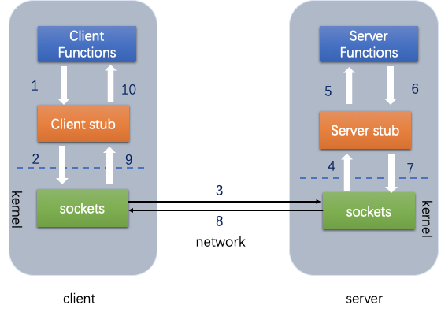
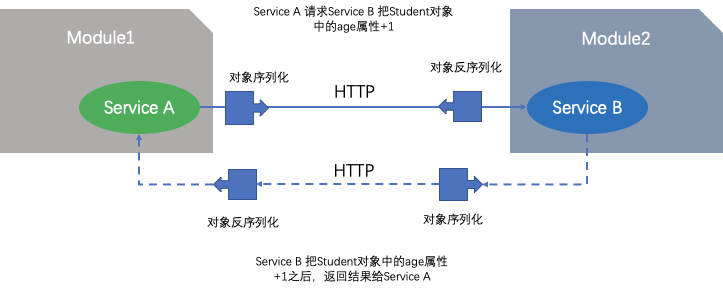
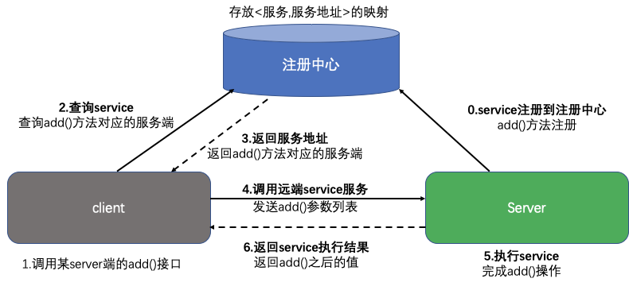

# RPC实现原理

## 基本原理

- RPC（Remote Procedure Call）远程过程调用，简单的理解是一个节点请求另一个节点提供的服务

### 本地调用

- 本地过程调用：如果需要将本地student对象的age+1，可以实现一个addAge()方法，将student对象传入，对年龄进行更新之后返回即可，本地方法调用的函数体通过函数指针来指定。

RPC就是要像调用本地的函数一样去调远程函数。在研究RPC前，我们先看看本地调用是怎么调的。假设我们要调用函数Multiply来计算lvalue * rvalue的结果:

```cpp
int Multiply(int l, int r) {
    int y = l * r;
    return y;
}
 
int lvalue = 10;
int rvalue = 20;
int l_times_r = Multiply(lvalue, rvalue);
```

> 那么在第8行时，我们实际上执行了以下操作：
>
> 1. 将 lvalue 和 rvalue 的值压栈
> 2. 进入Multiply函数，取出栈中的值10 和 20，将其赋予 l 和 r
> 3. 执行第2行代码，计算 l * r ，并将结果存在 y
> 4. 将 y 的值压栈，然后从Multiply返回
> 5. 第8行，从栈中取出返回值 200 ，并赋值给 l_times_r
>
> 以上5步就是执行本地调用的过程。（以上步骤只是为了说明原理。事实上编译器经常会做优化，对于参数和返回值少的情况会直接将其存放在寄存器，而不需要压栈弹栈的过程，甚至都不需要调用call，而直接做inline操作。仅就原理来说，这5步是没有问题的。）

### 远程调用

在远程调用时，我们需要执行的函数体是在远程的机器上的，也就是说，Multiply是在另一个进程中执行的。这就带来了几个新问题：

1. Call ID映射。我们怎么告诉远程机器我们要调用Multiply，而不是Add或者FooBar呢？在本地调用中，函数体是直接通过函数指针来指定的，我们调用Multiply，编译器就自动帮我们调用它相应的函数指针。但是在远程调用中，函数指针是不行的，因为两个进程的地址空间是完全不一样的。所以，在RPC中，所有的函数都必须有自己的一个ID。这个ID在所有进程中都是唯一确定的。客户端在做远程过程调用时，必须附上这个ID。然后我们还需要在客户端和服务端分别维护一个 {函数 <--> Call ID} 的对应表。两者的表不一定需要完全相同，但相同的函数对应的Call ID必须相同。当客户端需要进行远程调用时，它就查一下这个表，找出相应的Call ID，然后把它传给服务端，服务端也通过查表，来确定客户端需要调用的函数，然后执行相应函数的代码。
2. 序列化和反序列化。客户端怎么把参数值传给远程的函数呢？在本地调用中，我们只需要把参数压到栈里，然后让函数自己去栈里读就行。但是在远程过程调用时，客户端跟服务端是不同的进程，不能通过内存来传递参数。甚至有时候客户端和服务端使用的都不是同一种语言（比如服务端用C++，客户端用Java或者Python）。这时候就需要客户端把参数先转成一个字节流，传给服务端后，再把字节流转成自己能读取的格式。这个过程叫序列化和反序列化。同理，从服务端返回的值也需要序列化反序列化的过程。
3. 网络传输。远程调用往往用在网络上，客户端和服务端是通过网络连接的。所有的数据都需要通过网络传输，因此就需要有一个网络传输层。网络传输层需要把Call ID和序列化后的参数字节流传给服务端，然后再把序列化后的调用结果传回客户端。只要能完成这两者的，都可以作为传输层使用。因此，它所使用的协议其实是不限的，能完成传输就行。尽管大部分RPC框架都使用TCP协议，但其实UDP也可以，而gRPC干脆就用了HTTP2。Java的Netty也属于这层的东西。

所以，要实现一个RPC框架，其实只需要把以上三点实现了就基本完成了。Call ID映射可以直接使用函数字符串，也可以使用整数ID。映射表一般就是一个哈希表。序列化反序列化可以自己写，也可以使用Protobuf或者FlatBuffers之类的。网络传输库可以自己写socket，或者用asio，ZeroMQ，Netty之类。

- 远程过程调用：上述操作的过程中，如果addAge()这个方法在服务端，执行函数的函数体在远程机器上，如何告诉机器需要调用这个方法呢？
  1. 首先客户端需要告诉服务器，需要调用的函数，这里函数和进程ID存在一个映射，客户端远程调用时，需要查一下函数，找到对应的ID，然后执行函数的代码。
  2. 客户端需要把本地参数传给远程函数，本地调用的过程中，直接压栈即可，但是在远程调用过程中不再同一个内存里，无法直接传递函数的参数，因此需要客户端把参数转换成字节流，传给服务端，然后服务端将字节流转换成自身能读取的格式，是一个序列化和反序列化的过程。
  3. 数据准备好了之后，如何进行传输？网络传输层需要把调用的ID和序列化后的参数传给服务端，然后把计算好的结果序列化传给客户端，因此TCP层即可完成上述过程，gRPC中采用的是HTTP2协议。
     总结一下上述过程：

```csharp
// Client端 
// Student student = Call(ServerAddr, addAge, student)
1. 将这个调用映射为Call ID。
2. 将Call ID，student（params）序列化，以二进制形式打包
3. 把2中得到的数据包发送给ServerAddr，这需要使用网络传输层
4. 等待服务器返回结果
5. 如果服务器调用成功，那么就将结果反序列化，并赋给student，年龄更新

// Server端
1. 在本地维护一个Call ID到函数指针的映射call_id_map，可以用Map<String, Method> callIdMap
2. 等待服务端请求
3. 得到一个请求后，将其数据包反序列化，得到Call ID
4. 通过在callIdMap中查找，得到相应的函数指针
5. 将student（params）反序列化后，在本地调用addAge()函数，得到结果
6. 将student结果序列化后通过网络返回给Client
```



- 在微服务的设计中，一个服务A如果访问另一个Module下的服务B，可以采用HTTP REST传输数据，并在两个服务之间进行序列化和反序列化操作，服务B把执行结果返回过来



- 由于HTTP在应用层中完成，整个通信的代价较高，远程过程调用中直接基于TCP进行远程调用，数据传输在传输层TCP层完成，更适合对效率要求比较高的场景，RPC主要依赖于客户端和服务端之间建立Socket链接进行，底层实现比REST更复杂。

## gRPC与REST

- REST通常以业务为导向，将业务对象上执行的操作映射到HTTP动词，格式非常简单，可以使用浏览器进行扩展和传输，通过JSON数据完成客户端和服务端之间的消息通信，直接支持请求/响应方式的通信。不需要中间的代理，简化了系统的架构，不同系统之间只需要对JSON进行解析和序列化即可完成数据的传递。
- 但是REST也存在一些弊端，比如只支持请求/响应这种单一的通信方式，对象和字符串之间的序列化操作也会影响消息传递速度，客户端需要通过服务发现的方式，知道服务实例的位置，在单个请求获取多个资源时存在着挑战，而且有时候很难将所有的动作都映射到HTTP动词。
- 正是因为REST面临一些问题，因此可以采用gRPC作为一种替代方案，gRPC 是一种基于二进制流的消息协议，可以采用基于Protocol Buffer的IDL定义grpc API,这是Google公司用于序列化结构化数据提供的一套语言中立的序列化机制，客户端和服务端使用HTTP/2以Protocol Buffer格式交换二进制消息。
- gRPC的优势是，设计复杂更新操作的API非常简单，具有高效紧凑的进程通信机制，在交换大量消息时效率高，远程过程调用和消息传递时可以采用双向的流式消息方式，同时客户端和服务端支持多种语言编写，互操作性强；不过gRPC的缺点是不方便与JavaScript集成，某些防火墙不支持该协议。
- 注册中心：当项目中有很多服务时，可以把所有的服务在启动的时候注册到一个注册中心里面，用于维护服务和服务器之间的列表，当注册中心接收到客户端请求时，去找到该服务是否远程可以调用，如果可以调用需要提供服务地址返回给客户端，客户端根据返回的地址和端口，去调用远程服务端的方法，执行完成之后将结果返回给客户端。这样在服务端加新功能的时候，客户端不需要直接感知服务端的方法，服务端将更新之后的结果在注册中心注册即可，而且当修改了服务端某些方法的时候，或者服务降级服务多机部署想实现负载均衡的时候，我们只需要更新注册中心的服务群即可。



## Tars-RPC

### Call ID映射

- 客户端

```c++
Communicator comm;
HelloPrx prx; // 声明代理 
comm.stringToProxy("TestApp.HelloServer.HelloObj@tcp -h 10.120.129.226 -p 20001" , prx); // RPC----->ID
```

- 服务端

```c++
void HelloServer::initialize() {
    //initialize application here:

    //添加Servant接口实现类HelloImp与路由Obj绑定关系
    addServant<HelloImp>(ServerConfig::Application + "." + ServerConfig::ServerName + ".HelloObj");
}
```


### 序列化和反序列化

Tars.Tup协议中编写了自己的编码解码函数

```c++
// /TarsCpp2.4/servant/tup/tup.h
/**
 * 编码，结果的包头4个字节为整个包的长度，网络字节序
 * @throw runtime_error
 * @param buff：存放编码结果的buffer指针
 * @param len： 输入buff长度，输出编码结果长度
 */
void encode(char* buff, size_t & len) {
    TarsOutputStream<TWriter>& os = UniAttribute<TWriter, TReader>::os;
    os.reset();
    doEncode(os);
    os.reset();
    writeTo(os);
    tars::Int32 iHeaderLen = htonl(sizeof(tars::Int32) + os.getLength());
    if (len < sizeof(tars::Int32) + os.getLength()) throw runtime_error("encode error, buffer length too short");

    memcpy(buff, &iHeaderLen, sizeof(tars::Int32));
    memcpy(buff + sizeof(tars::Int32), os.getBuffer(), os.getLength());

    len = sizeof(tars::Int32) + os.getLength();

    // TarsOutputStream<TWriter> &os = UniAttribute<TWriter, TReader,Alloc>::os;
    // os.reset();
    // doEncode(os);
    // tars::Int32 iHeaderLen = htonl(sizeof(tars::Int32) + os.getLength());
    // if(len < sizeof(tars::Int32) + os.getLength()) throw runtime_error("encode error, buffer length too short");

    // memcpy(buff, &iHeaderLen, sizeof(tars::Int32));
    // memcpy(buff + sizeof(tars::Int32), os.getBuffer(), os.getLength());

    // len = sizeof(tars::Int32) + os.getLength();
}

/** 解码
 * 
 * @throw runtime_error
 * @param buff：待解码字节流的buffer指针
 * @param len： 待解码字节流的长度
 */

void decode(const char* buff, size_t len) {
    if(len < sizeof(tars::Int32)) throw runtime_error("packet length too short, first 4 bytes must be buffer length.");
    
    TarsInputStream<TReader> &is = UniAttribute<TWriter, TReader,Alloc>::is;

    is.reset();
    is.setBuffer(buff + sizeof(tars::Int32), len - sizeof(tars::Int32));
    readFrom(is);

    UniAttribute<TWriter, TReader,Alloc>::_iVer = iVersion;
    is.reset();
    is.setBuffer(sBuffer);

    UniAttribute<TWriter, TReader,Alloc>::_data.clear();
	
    is.read(UniAttribute<TWriter, TReader,Alloc>::_data, 0, true);
		
}
```


### 网络传输

```c++
“TestApp.HelloServer.HelloObj@tcp -h 10.120.129.226 -p 20001” // 通过tcp传输
```


## RPC分类

### 通信协议层面

在通讯协议层面可以分为如下几类

- 基于私有协议的单种语言或平台特定支持的通信技术(例如Java平台的RMI、.NET平台Remoting)

- 基于HTTP协议（例如基于文本的SOAP（XML）、Rest（JSON），基于二进制Hessian（Binary））平台无关：支持跨平台通信的技术（例如HTTP Rest、Thrift等）

- 基于TCP协议的（通常会借助Mina、Netty等高性能网络框架）

### 调用过程层面

在调用过程层面来看可以分为如下几类

- 同步通信调用（同步RPC）
- 异步通信调用（MQ、异步RPC）