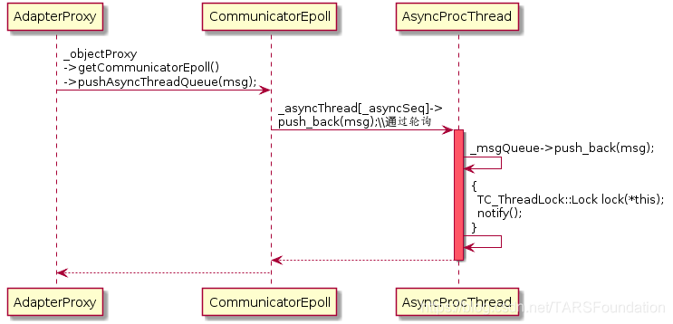
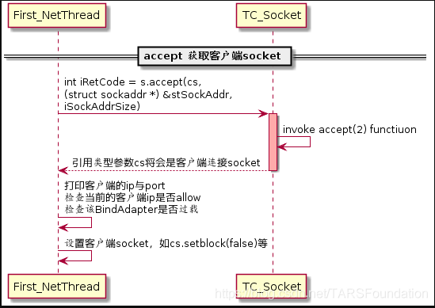

# Tars源码解读


## 什么是Tars

TARS是腾讯使用十年的微服务开发框架，目前支持C++、Java、PHP、Node.js、Go语言。该开源项目为用户提供了涉及到开发、运维、以及测试的一整套微服务平台PaaS解决方案，帮助一个产品或者服务快速开发、部署、测试、上线。目前该框架应用在腾讯各大核心业务，基于该框架部署运行的服务节点规模达到数十万。
TARS的通信模型中包含客户端和服务端。客户端服务端之间主要是利用RPC进行通信。本系列文章对RPC调用部分进行源码解析。

## Tars客户端

### 初识客户端

TARS的客户端最重要的类是Communicator，一个客户端只能声明出一个Communicator类实例，用户可以通过CommunicatorPtr& Application::getCommunicator()获取线程安全的Communicator类单例。Communicator类聚合了两个比较重要的类，一个是CommunicatorEpoll，负责网络线程的建立与通过ObjectProxyFactory生成ObjectProxy；另一个是ServantProxyFactory，生成不同的RPC服务句柄，即ServantProxy，用户通过ServantProxy调用RPC服务。下面简单介绍几个类的作用。

#### Communicator

一个Communicator实例就是一个客户端，负责与服务端建立连接，生成RPC服务句柄，可以通过CommunicatorPtr& Application::getCommunicator()获取Communicator实例，用户最后不要自己声明定义新的Communicator实例。

#### ServantProxy与ServantProxyFactory

ServantProxy就是一个服务代理，ServantProxy可以通过ServantProxyFactory工厂类生成，用户往往通过Communicator的template void stringToProxy()接口间接调用ServantProxyFactory的ServantPrx::element_type* getServantProxy()接口以获取服务代理，通过服务代理ServantProxy，用户就可以进行RPC调用了。ServantProxy内含多个服务实体ObjectProxy，能够帮助用户在同一个服务代理内进行负载均衡。

#### CommunicatorEpoll

CommunicatorEpoll类代表客户端的网络模块，内含TC_Epoller作为IO复用，能够同时处理不同主调线程（caller线程）的多个请求。CommunicatorEpoll内含服务实体工厂类ObjectProxyFactory，意味着在同一网络线程中，能够产生不同服务的实体，能够完成不同的RPC服务调用。CommunicatorEpoll还聚合了异步调用处理线程AsyncProcThread，负责接收到异步的响应包之后，将响应包交给该线程处理。

#### ObjectProxy与ObjectProxyFactory

ObjectProxy类是一个服务实体，注意与ServantProxy类是一个服务代理相区别，前者表示一个网络线程上的某个服务实体A，后者表示对所有网络线程上的某服务实体A的总代理，更详细的介绍可见下文。ObjectProxy通过ObjectProxyFactory生成，而ObjectProxyFactory类的实例是CommunicatorEpoll的成员变量，意味着一个网络线程CommunicatorEpoll能够产生各种各样的服务实体ObjectProxy，发起不同的RPC服务。ObjectProxy通过AdapterProxy来管理对服务端的连接。
好了，介绍完所有的类之后，先通过类图理一理他们之间的关系，这个类图在之后的文章中将会再次出现。


TARS的客户端最重要的类是Communicator，一个客户端只能声明出一个Communicator类实例，用户可以通过CommunicatorPtr& Application::getCommunicator()获取线程安全的Communicator类单例。Communicator类聚合了两个比较重要的类，一个是CommunicatorEpoll，负责网络线程的建立与通过ObjectProxyFactory生成ObjectProxy；另一个是ServantProxyFactory，生成不同的RPC服务句柄，即ServantProxy，用户通过ServantProxy调用RPC服务。
根据用户配置，Communicator拥有n个网络线程，即n个CommunicatorEpoll。每个CommunicatorEpoll拥有一个ObjectProxyFactory类，每个ObjectProxyFactory可以生成一系列的不同服务的实体对象ObjectProxy，因此，假如Communicator拥有两个CommunicatorEpoll，并有foo与bar这两类不同的服务实体对象，那么如下图（Tars-c2）所示，每个CommunicatorEpoll可以通过 ObjectProxyFactory创建两类ObjectProxy，这是TARS客户端的第一层负载均衡，每个线程都可以分担所有服务的RPC请求，因此，一个服务的阻塞可能会影响其他服务，因为网络线程是多个服务实体ObjectProxy所共享的。


Communicator类下另一个比较重要的ServantProxyFactory类的作用是依据实际服务端的信息（如服务器的socket标志）与Communicator中客户端的信息（如网络线程数）而生成ServantProxy句柄，通过句柄调用RPC服务。举个例子，如下图（Tars-c3）所示，Communicator实例通过ServantProxyFactory成员变量的getServantProxy()接口在构造fooServantProxy句柄的时候，会获取Communicator实例下的所有CommunicatorEpoll（即CommunicatorEpoll-1与CommunicatorEpoll-2）中的fooObjectProxy（即fooObjectProxy-1与fooObjectProxy-2），并作为构造fooServantProxy的参数。Communicator通过ServantProxyFactory能够获取foo与bar这两类ServantProxy，ServantProxy与相应的ObjectProxy存在相应的聚合关系：


另外，每个ObjectProxy都拥有一个EndpointManager，例如，fooObjectProxy 的EndpointManager管理fooObjectProxy 下面的所有fooAdapterProxy，每个AdapterProxy连接到一个提供相应foo服务的服务端物理机socket上。通过EndpointManager还可以以不同的负载均衡方式获取连接AdapterProxy。假如foo服务有两台物理机，bar服务有一台物理机，那么ObjectProxy，EndpointManager与AdapterProxy关系如下图（Tars-c4）所示。上面提到，不同的网络线程CommunicatorEpoll均可以发起同一RPC请求，对于同一RPC服务，选取不同的ObjectProxy（或可认为选取不同的网络线程CommunicatorEpoll）是第一层的负载均衡，而对于同一个被选中的ObjectProxy，通过EndpointManager选择不同的socket连接AdapterProxy（假如ObjectProxy有大于1个的AdapterProxy，如图的fooObjectProxy）是第二层的负载均衡。


在客户端进行初始化时，必须建立上面介绍的关系，因此相应的类图如图（Tars-c5）所示，通过类图可以看出各类的关系，以及初始化需要用到的函数。


### 初始化

现在，通过代码跟踪来看看，在客户端初始化过程中，各个类是如何被初始化出来并建立上述的架构关系的。在简述之前，可以先看看函数的调用流程图，若看不清晰，可以将图片保存下来，用看图软件放大查看，强烈建议结合文章的代码解析以TARS源码一起查看，文章后面的所有代码流程图均如此。
接下来，将会按照函数调用流程图来一步一步分析客户端代理是如何被初始化出来的：


#### 1. 执行stringToProxy

在客户端程序中，一开始会执行下面的代码进行整个客户端代理的初始化：

```c++
Communicator comm;
HelloPrx prx;
comm.stringToProxy("TestApp.HelloServer.HelloObj@tcp -h 1.1.1.1 -p 20001", prx);
```

先声明一个Communicator变量comm（其实不建议这么做）以及一个ServantProxy类的指针变量prx，在此处，服务为Hello，因此声明一个HelloPrx prx。注意一个客户端只能拥有一个Communicator。为了能够获得RPC的服务句柄，我们调用Communicator::stringToProxy()，并传入服务端的信息与prx变量，函数返回后，prx就是RPC服务的句柄。
进入Communicator::stringToProxy()函数中，我们通过Communicator::getServantProxy()来依据objectName与setName获取服务代理ServantProxy：

```c++
/**
* 生成代理
* @param T
* @param objectName
* @param setName 指定set调用的setid
* @param proxy
*/
template<class T> void stringToProxy(const string& objectName, T& proxy, const string& setName="") {
    ServantProxy *pServantProxy = getServantProxy(objectName,setName);
    proxy = (typename T::element_type*)(pServantProxy);
}
```

#### 2.执行Communicator的初始化函数

进入Communicator::getServantProxy()，首先会执行Communicator::initialize()来初始化Communicator，需要注意一点，Communicator:: initialize()只会被执行一次，下一次执行Communicator::getServantProxy()将不会再次执行Communicator:: initialize()函数：

```c++
void Communicator::initialize() {
    TC_LockT<TC_ThreadRecMutex> lock(*this);
    if (_initialized) // 已经被初始化则直接返回
        return;
    ......
｝
```

进入Communicator::initialize()函数中，在这里，将会new出上文介绍的与Communicator密切相关的类ServantProxyFactory与n个CommunicatorEpoll，n为客户端的网络线程数，最小为1，最大为MAX_CLIENT_THREAD_NUM：

```c++
void Communicator::initialize() {
    ......
    _servantProxyFactory = new ServantProxyFactory(this);
    ......
    for (size_t i = 0; i < _clientThreadNum; ++i) {
        _communicatorEpoll[i] = new CommunicatorEpoll(this, i);
        _communicatorEpoll[i]->start(); // 启动网络线程
    }
    ......
｝
```

在CommunicatorEpoll的构造函数中，ObjectProxyFactory被创建出来，这是构造图关系的前提。除此之外，还可以看到获取相应配置，创建并启动若干个异步回调后的处理线程。创建完成后，调用CommunicatorEpoll::start()启动网络线程。至此，Communicator::initialize()顺利执行。通过下图（Tars-c7）回顾上面的过程：


#### 3.尝试获取ServantProxy

代码回到Communicator::getServantProxy()中 Communicator::getServantProxy()会执行ServantProxyFactory::getServantProxy()并返回相应的服务代理：

```c++
ServantProxy *Communicator::getServantProxy(const string& objectName, const string& setName) {
    ……
    return _servantProxyFactory->getServantProxy(objectName, setName);
}
```

进入ServantProxyFactory::getServantProxy()，首先会加锁，从map<string, ServantPrx> _servantProxy中查找目标，若查找成功直接返回。若查找失败，TARS需要构造出相应的ServantProxy，ServantProxy的构造需要如图所示的相对应的ObjectProxy作为构造函数的参数，由此可见，在ServantProxyFactory::getServantProxy()中有如下获取ObjectProxy指针数组的代码：

```c++
ObjectProxy **ppObjectProxy = new ObjectProxy *[_comm->getClientThreadNum()];
assert(ppObjectProxy != NULL);
for(size_t i = 0; i < _comm->getClientThreadNum(); ++i) {
    ppObjectProxy[i] = _comm->getCommunicatorEpoll(i)->getObjectProxy(name, setName);
}
```

#### 4.获取ObjectProxy

代码来到ObjectProxyFactory::getObjectProxy()，同样，会首先加锁，再从map<string,ObjectProxy*> _objectProxys中查找是否已经拥有目标ObjectProxy，若查找成功直接返回。若查找失败，需要新建一个新的ObjectProxy，通过类图可知，ObjectProxy需要一个CommunicatorEpoll对象进行初始化，由此关联管理自己的CommunicatorEpoll，CommunicatorEpoll之后便可以通过getObjectProxy()接口获取属于自己的ObjectProxy。详细过程可见下图：


#### 5.建立ObjectProxy与AdapterProxy的关系

新建ObjectProxy的过程同样非常值得关注，在ObjectProxy::ObjectProxy()中，关键代码是：

```c++
_endpointManger.reset(new EndpointManager(this, _communicatorEpoll->getCommunicator(), sObjectProxyName, pCommunicatorEpoll->isFirstNetThread(), setName));
```

每个ObjectProxy都有属于自己的EndpointManager负责管理到服务端的所有socket连接AdapterProxy，每个AdapterProxy连接到一个提供相应服务的服务端物理机socket上。通过EndpointManager还可以以不同的负载均衡方式获取与服务器的socket连接AdapterProxy。
ObjectProxy:: ObjectProxy()是图（Tars-c6）或者图（Tars-c8）中的略1，具体的代码流程如图（Tars-c9）所示。ObjectProxy创建一个EndpointManager对象，在EndpointManager的初始化过程中，依据客户端提供的信息，直接创建连接到服务端物理机的TCP/UDP连接AdapterProxy或者从代理中获取服务端物理机socket列表后再创建TCP/UDP连接AdapterProxy。


按照图（Tars-c9）的程序流程执行完成后，便会建立如图（Tars-c3）所示的一个ObjectProxy对多个AdapterProxy的关系。
新建ObjectProxy之后，就可以调用其ObjectProxy::initialize()函数进行ObjectProxy对象的初始化了，当然，需要将ObjectProxy对象插入ObjectProxyFactory的成员变量_objectProxys与_vObjectProxys中，方便下次直接返回ObjectProxy对象。

#### 6.继续完成ServantProxy的创建

退出层层的函数调用栈，代码再次回 ServantProxyFactory::getServantProxy()，此时，ServantProxyFactory已经获得相应的ObjectProxy数组ObjectProxy** ppObjectProxy，接着便可以调用：

```c++
ServantPrx sp = new ServantProxy(_comm, ppObjectProxy, _comm->getClientThreadNum());
```

进行ServantProxy的构造。构造完成便可以呈现出如图（Tars-c1）的关系。在ServantProxy的构造函数中可以看到，ServantProxy在新建一个EndpointManagerThread变量，这是对外获取路由请求的类，是TARS为调用逻辑而提供的多种解决跨地区调用等问题的方案。同时可以看到：

```c++
for(size_t i = 0; i < _objectProxyNum; ++i) {
   (*(_objectProxy + i))->setServantProxy(this);
}
```

建立了ServantProxy与ObjectProxy的相互关联关系。剩下的是读取配置文件，获取相应的信息。
构造ServantProxy变量完成后，ServantProxyFactory::getServantProxy()获取一些超时参数，赋值给ServantProxy变量，同时将其放进map<string, ServantPrx> _servantProxy中，方便下次直接查找获取。
ServantProxyFactory::getServantProxy()将刚刚构造的ServantProxy指针变量返回给调用他的Communicator::getServantProxy()，在Communicator::getServantProxy()中：

```c++
ServantProxy *Communicator::getServantProxy(const string &objectName, const string& setName) {
    ……
    return _servantProxyFactory->getServantProxy(objectName,setName);
}
```

直接将返回值返回给调用起Communicator::getServantProxy()的Communicator::stringToProxy()。可以看到：

```c++
template<class T> void stringToProxy(const string &objectName, T &proxy, const string& setName = "") {
    ServantProxy *pServantProxy = getServantProxy(objectName, setName);
    proxy = (typename T::element_type*)(pServantProxy);
}
```

Communicator::stringToProxy()将返回值强制转换为客户端代码中与HelloPrx prx同样的类型HelloPrx。由于函数参数proxy就是prx的引用。那么实际就是将句柄prx成功初始化了，用户可以利用句柄prx进行RPC调用了。

### 同步调用

当我们获得一个ServantProxy句柄后，便可以进行RPC调用了。Tars提供四种RPC调用方式，分别是同步调用，异步调用，promise调用与协程调用。其中最简单最常见的RPC调用方式是同步调用，接下来，将简单分析Tars的同步调用。

现假设有一个MyDemo.StringServer.StringServantObj的服务，提供一个RPC接口是append，传入两个string类型的变量，返回两个string类型变量的拼接结果。而且假设有两台服务器，socket标识分别是192.168.106.129:34132与192.168.106.130:34132，设置客户端的网络线程数为3，那么执行如下代码：

```c++
Communicator _comm;
StringServantPrx _proxy;
_comm.stringToProxy("MyDemo.StringServer.StringServantObj@tcp -h 192.168.106.129 -p 34132", _proxy);
_comm.stringToProxy("MyDemo.StringServer.StringServantObj@tcp -h 192.168.106.130 -p 34132", _proxy);
```

经过上文关于客户端初始化的分析介绍可知，可以得出如下图（Tars-c10）所示的关系图：


获取StringServantPrx _proxy后，直接调用：

```c++
string str1(abc-), str2(defg), rStr;
int retCode = _proxy->append(str1, str2, rStr);
```

成功进行RPC同步调用后，返回的结果是rStr = “abc-defg”。

同样，我们先看看与同步调用相关的类图，如下图（Tars-c11）所示：


StringServantProxy是继承自ServantProxy的，StringServantProxy提供了RPC同步调用的接口Int32 append()，当用户发起同步调用_proxy->append(str1, str2, rStr)时，所进行的函数调用过程如下图（Tars-c12）所示。


在函数StringServantProxy::append()中，程序会先构造ServantProxy::tars_invoke()所需要的参数，如请求包类型，RPC方法名，方法参数等，需要值得注意的是，传递参数中有一个ResponsePacket类型的变量，在同步调用中，最终的返回结果会放置在这个变量上。接下来便直接调用了ServantProxy::tars_invoke()方法：

```c++
tars_invoke(tars::TARSNORMAL, "append", _os.getByteBuffer(), context, _mStatus, rep);
```

在ServantProxy::tars_invoke()方法中，先创建一个ReqMessage变量msg，初始化msg变量，给变量赋值，如Tars版本号，数据包类型，服务名，RPC方法名，Tars的上下文容器，同步调用的超时时间（单位为毫秒）等。最后，调用ServantProxy::invoke()进行远程方法调用。

无论同步调用还是各种异步调用，ServantProxy::invoke()都是RPC调用的必经之地。在ServantProxy::invoke()中，继续填充传递进来的变量ReqMessage msg。此外，还需要获取调用者caller线程的线程私有数据ServantProxyThreadData，用来指导RPC调用。客户端的每个caller线程都有属于自己的维护调用上下文的线程私有数据，如hash属性，消息染色信息。最关键的还是每条caller线程与每条客户端网络线程CommunicatorEpoll进行信息交互的桥梁——通**信队列ReqInfoQueue数组**，数组中的每个ReqInfoQueue元素负责与一条网络线程进行交互，如图（Tars-c13）所示，图中橙色阴影代表数组**ReqInfoQueue[]**，阴影内的圆柱体代表数组元素**ReqInfoQueue**。假如客户端create两条线程（下称caller线程）发起StringServant服务的RPC请求，且客户端网络线程数设置为2，那么两条caller线程各自有属于自己的线程私有数据**请求队列数组ReqInfoQueue[]**，数组里面的ReqInfoQueue元素便是该数组对应的caller线程与两条网络线程的通信桥梁，一条网络线程对应着数组里面的一个元素，通过网络线程ID进行数组索引。整个关系有点像生产者消费者模型，生产者Caller线程向自己的线程私有数据**ReqInfoQueue[]**中的第N个元素ReqInfoQueue[N] push请求包，消费者客户端第N个网络线程就会从这个队列中pop请求包。


阅读代码可能会发现几个常量值，如MAX_CLIENT_THREAD_NUM=64，这是最大网络线程数，在图（Tars-c13）中为单个请求队列数组ReqInfoQueue[]的最大size；MAX_CLIENT_NOTIFYEVENT_NUM=2048，在图（Tars-c13）中，可以看作caller线程的最大数量，或者请求队列数组ReqInfoQueue[]的最大数量（反正两者一一对应，每个caller线程都有自己的线程私有数据ReqInfoQueue[]）。

接着依据caller线程的线程私有数据进行第一次的负载均衡——选取ObjectProxy（即选择网络线程CommunicatorEpoll）和与之相对应的ReqInfoQueue：

```c++
ObjectProxy * pObjProxy = NULL;
ReqInfoQueue * pReqQ = NULL;
// 选择网络线程
selectNetThreadInfo(pSptd, pObjProxy, pReqQ);
```

在ServantProxy::selectNetThreadInfo()中，通过轮询的形式来选取ObjectProxy与ReqInfoQueue。

退出ServantProxy::selectNetThreadInfo()后，便得到ObjectProxy*类型的pObjProxy及其对应的ReqInfoQueue*类型的ReqInfoQueue，稍后通过pObjectProxy来发送RPC请求，请求信息会暂存在ReqInfoQueue中。

由于是同步调用，需要新建一个条件变量去监听RPC的完成，可见：

```c++
// 同步调用 new 一个ReqMonitor
assert(msg->pMonitor == NULL);
if (msg->eType == ReqMessage::SYNC_CALL) {
		msg->bMonitorFin = false;
		if (pSptd->_sched) {
    		msg->bCoroFlag = true;
    		msg->sched 	= pSptd->_sched;
    		msg->iCoroId   = pSptd->_sched->getCoroutineId();
		} else {
    		msg->pMonitor = new ReqMonitor;
		}
}
```

创建完条件变量，接下来往ReqInfoQueue中push_back()请求信息包msg，并通知pObjProxy所属的CommunicatorEpoll进行数据发送：

```c++
if (!pReqQ->push_back(msg, bEmpty)) {
	TLOGERROR("[TARS][ServantProxy::invoke msgQueue push_back error num:" << pSptd->_netSeq << "]" << endl);
	delete msg;
	msg = NULL;
	pObjProxy->getCommunicatorEpoll()->notify(pSptd->_reqQNo, pReqQ);
	throw TarsClientQueueException("client queue full");
}
 
pObjProxy->getCommunicatorEpoll()->notify(pSptd->_reqQNo, pReqQ);
```

来到CommunicatorEpoll::notify()中，往请求事件通知数组NotifyInfo _notify[]中添加请求事件，通知CommunicatorEpoll进行请求包的发送。注意了，这个函数的作用仅仅是通知网络线程准备发送数据，通过TC_Epoller::mod()或者TC_Epoller::add()触发一个EPOLLIN事件，从而促使阻塞在TC_Epoller::wait()（在CommunicatorEpoll::run()中阻塞）的网络线程CommunicatorEpoll被唤醒，并设置唤醒后的epoll_event中的联合体epoll_data变量为&_notify[iSeq].stFDInfo：

```c++
void CommunicatorEpoll::notify(size_t iSeq,ReqInfoQueue *msgQueue) {
	assert(iSeq < MAX_CLIENT_NOTIFYEVENT_NUM);
 
	if (_notify[iSeq].bValid) {
    	_ep.mod(_notify[iSeq].notify.getfd(), (long long)&_notify[iSeq].stFDInfo, EPOLLIN);
    	assert(_notify[iSeq].stFDInfo.p == (void*)msgQueue);
	} else {
    	_notify[iSeq].stFDInfo.iType = FDInfo::ET_C_NOTIFY;
    	_notify[iSeq].stFDInfo.p = (void*)msgQueue;
	    _notify[iSeq].stFDInfo.fd = _notify[iSeq].eventFd;
    	_notify[iSeq].stFDInfo.iSeq	= iSeq;
    	_notify[iSeq].notify.createSocket();
    	_notify[iSeq].bValid = true;
 
    	_ep.add(_notify[iSeq].notify.getfd(),(long long)&_notify[iSeq].stFDInfo, EPOLLIN);
	}
}
```

就是经过这么一个操作，网络线程就可以被唤醒，唤醒后通过epoll_event变量可获得&_notify[iSeq].stFDInfo。接下来的请求发送与响应的接收会在后面会详细介绍。

随后，代码再次回到ServantProxy::invoke()，阻塞于：

```c++
if (!msg->bMonitorFin) {
	TC_ThreadLock::Lock lock(*(msg->pMonitor));
	// 等待直到网络线程通知过来
	if (!msg->bMonitorFin) {
    	msg->pMonitor->wait();
	}
}
```

等待网络线程接收到数据后，对其进行唤醒。
接收到响应后，检查是否成功获取响应，是则直接退出函数即可，响应信息在传入的参数msg中：

```c++
if (msg->eStatus == ReqMessage::REQ_RSP && msg->response.iRet == TARSSERVERSUCCESS) {
	snprintf(pSptd->_szHost, sizeof(pSptd->_szHost), "%s", msg->adapter->endpoint().desc().c_str());
	// 成功
	return;
}
```

若接收失败，会抛出异常，并删除msg：

```c++
TarsException::throwException(ret, os.str());
```

若接收成功，退出ServantProxy::invoke()后，回到ServantProxy::tars_invoke()，获取ResponsePacket类型的响应信息，并删除msg包：

```c++
rsp = msg->response;
delete msg;
msg = NULL;
```

代码回到StringServantProxy::append()，此时经过同步调用，可以直接获取RPC返回值并回到客户端中。

#### 网络线程发送请求

上面提到，当在ServantProxy::invoke()中，调用CommunicatorEpoll::notify()通知网络线程进行请求发送后，接下来，网络线程的具体执行流程如下图（Tars-c14）所示：


由于CommunicatorEpoll继承自TC_Thread，在上文1.2.2节中的第2小点的初始化CommunicatorEpoll之后便调用其CommunicatorEpoll::start()函数启动网络线程，网络线程在CommunicatorEpoll::run()中一直等待_ep.wait(iTimeout)。由于在上一节的描述中，在CommunicatorEpoll::notify()，caller线程发起了通知notify，网络线程在CommunicatorEpoll::run()就会调用CommunicatorEpoll::handle()处理通知：

```c++
void CommunicatorEpoll::run() {
	......
    try {
    	int iTimeout = ((_waitTimeout < _timeoutCheckInterval) ? _waitTimeout : _timeoutCheckInterval);
        int num = _ep.wait(iTimeout);
 
        	if (_terminate) {
            	break;
        	}
 
        	// 先处理epoll的网络事件
        	for (int i = 0; i < num; ++i) {
            	//获取epoll_event变量的data，就是1.3.1节中提过的&_notify[iSeq].stFDInfo
            	const epoll_event& ev = _ep.get(i);
            	uint64_t data = ev.data.u64;
 
            	if (data == 0) {
                	continue; // data非指针, 退出循环
            	}
            	handle((FDInfo*)data, ev.events);
        	}
    	}
	......
   
}
```

在CommunicatorEpoll::handle()中，通过传递进来的epoll_event中的data成员变量获取前面被选中的ObjectProxy并调用其ObjectProxy::invoke()函数：

```c++
void CommunicatorEpoll::handle(FDInfo *pFDInfo, uint32_t events) {
	try {
    	assert(pFDInfo != NULL);
 
    	//队列有消息通知过来
    	if (FDInfo::ET_C_NOTIFY == pFDInfo->iType) {
        	ReqInfoQueue *pInfoQueue = (ReqInfoQueue*)pFDInfo->p;
        	ReqMessage *msg = NULL;
 
        	try {
            	while (pInfoQueue->pop_front(msg)) {
             	......
 
                	try {
                    	msg->pObjectProxy->invoke(msg);
                	}
                	......
            	}
        	}
        	......
    	}
    	......
}
```

在ObjectProxy::invoke()中将进行第二次的负载均衡，像图（1-4）所示，每个ObjectProxy通过EndpointManager可以以不同的负载均衡方式对AdapterProxy进行选取选择：

```c++
void ObjectProxy::invoke(ReqMessage *msg) {
	......
	// 选择一个远程服务的Adapter来调用
	AdapterProxy *pAdapterProxy = NULL;
	bool bFirst = _endpointManger->selectAdapterProxy(msg, pAdapterProxy);
	......
}
```

在EndpointManager:: selectAdapterProxy()中，有多种负载均衡的方式来选取AdapterProxy，如getHashProxy()，getWeightedProxy()，getNextValidProxy()等。

获取AdapterProxy之后，便将选择到的AdapterProxy赋值给EndpointManager:: selectAdapterProxy()函数中的引用参数pAdapterProxy，随后执行：

```c++
void ObjectProxy::invoke(ReqMessage *msg) {
   	......
	msg->adapter = pAdapterProxy;
	pAdapterProxy->invoke(msg);
}
```

调用pAdapterProxy将请求信息发送出去。而在AdapterProxy::invoke()中，AdapterProxy将调用Transceiver::sendRequset()进行请求的发送。
至此，对应同步调用的网络线程发送请求的工作就结束了，网络线程会回到CommunicatorEpoll::run()中，继续等待数据的收发。

#### 网络线程接收响应

当网络线程CommunicatorEpoll接收到响应数据之后，如同之前发送请求那样， 在CommunicatorEpoll::run()中，程序获取活跃的epoll_event的变量，并将其中的epoll_data_t data传递给CommunicatorEpoll::handle()：

```c++
// 先处理epoll的网络事件
for (int i = 0; i < num; ++i) {
	const epoll_event& ev = _ep.get(i);
	uint64_t data = ev.data.u64;
 
	if (data == 0) {
   		continue; //data非指针, 退出循环
	}
	handle((FDInfo*)data, ev.events);
}
```

接下来的程序流程如下图（Tars-c15）所示：


在CommunicatorEpoll::handle()中，从epoll_data::data中获取Transceiver指针，并调用CommunicatorEpoll::handleInputImp()：

```c++
Transceiver *pTransceiver = (Transceiver*)pFDInfo->p;
// 先收包
if (events & EPOLLIN) {
	try {
		handleInputImp(pTransceiver);
	} catch(exception &e) {
		TLOGERROR("[TARS]CommunicatorEpoll::handle exp:"<<e.what()<<" ,line:"<<__LINE__<<endl);
	} catch(...) {
		TLOGERROR("[TARS]CommunicatorEpoll::handle|"<<__LINE__<<endl);
	}
}
```

在CommunicatorEpoll::handleInputImp()中，除了对连接的判断外，主要做两件事，调用Transceiver::doResponse()以及AdapterProxy::finishInvoke(ResponsePacket&)，前者的工作是从socket连接中获取响应数据并判断接收的数据是否为一个完整的RPC响应包。后者的作用是将响应结果返回给客户端，同步调用的会唤醒阻塞等待在条件变量中的caller线程，异步调用的会在异步回调处理线程中执行回调函数。
在AdapterProxy::finishInvoke(ResponsePacket&)中，需要注意一点，假如是同步调用的，需要获取响应包rsp对应的ReqMessage信息，在Tars中，执行：

```c++
ReqMessage *msg = NULL;
// 获取响应包rsp对应的msg信息，并在超时队列中剔除该msg
bool retErase = _timeoutQueue->erase(rsp.iRequestId, msg);
```

在找回响应包对应的请求信息msg的同时，将其在超时队列中剔除出来。接着执行：

```c++
msg->eStatus = ReqMessage::REQ_RSP;
msg->response = rsp;
finishInvoke(msg);
```

程序调用另一个重载函数AdapterProxy::finishInvoke(ReqMessage*)，在AdapterProxy::finishInvoke(ReqMessage*)中，不同的RPC调用方式会执行不同的动作，例如同步调用会唤醒对应的caller线程：

```c++
// 同步调用，唤醒ServantProxy线程
if (msg->eType == ReqMessage::SYNC_CALL) {
	if (!msg->bCoroFlag) {
    	assert(msg->pMonitor);
 
    	TC_ThreadLock::Lock sync(*(msg->pMonitor));
    	msg->pMonitor->notify();
    	msg->bMonitorFin = true;
	} else {
    	msg->sched->put(msg->iCoroId);
	}
	return ;
}
```

至此，对应同步调用的网络线程接收响应的工作就结束了，网络线程会回到CommunicatorEpoll::run()中，继续等待数据的收发。
综上，客户端同步调用的过程如下图（Tars-c16）所示。


### 异步调用

在Tars中，除了最常见的同步调用之外，还可以进行异步调用，异步调用可分三种：普通的异步调用，promise异步调用与协程异步调用，这里简单介绍普通的异步调用，看看其与上文介绍的同步调用有何异同。

异步调用不会阻塞整个客户端程序，调用完成（请求发送）之后，用户可以继续处理其他事情，等接收到响应之后，Tars会在异步处理线程当中执行用户实现好的回调函数。在这里，会用到《Effective C++》中条款35所介绍的“藉由Non-Virtual Interface手法实现Template Method模式”，用户需要继承一个XXXServantPrxCallback基类，并实现里面的虚函数，异步回调线程会在收到响应包之后回调这些虚函数，具体的异步调用客户端示例这里不作详细介绍，在Tars的Example中会找到相应的示例代码。

#### 初始化

本文第一章已经详细介绍了客户端的初始化，这里再简单提一下，在第一章的“1.2.2初始化代码跟踪- 2.执行Communicator的初始化函数”中，已经提到说，在每一个网络线程CommunicatorEpoll的初始化过程中，会创建_asyncThreadNum条异步线程，等待异步调用的时候处理响应数据：

```c++
CommunicatorEpoll::CommunicatorEpoll(Communicator * pCommunicator,size_t netThreadSeq) {
 	......
   	// 异步线程数
	_asyncThreadNum = TC_Common::strto<size_t>(pCommunicator->getProperty("asyncthread", "3"));
 
	if (_asyncThreadNum == 0) {
    	_asyncThreadNum = 3;
	}
 
	if (_asyncThreadNum > MAX_CLIENT_ASYNCTHREAD_NUM) {
    	_asyncThreadNum = MAX_CLIENT_ASYNCTHREAD_NUM;
	}
 	......
	// 异步队列的大小
	size_t iAsyncQueueCap = TC_Common::strto<size_t>(pCommunicator->getProperty("asyncqueuecap", "10000"));
	if (iAsyncQueueCap < 10000) {
    	iAsyncQueueCap = 10000;
	}
 	......
	// 创建异步线程
	for (size_t i = 0; i < _asyncThreadNum; ++i) {
    	_asyncThread[i] = new AsyncProcThread(iAsyncQueueCap);
    	_asyncThread[i]->start();
	}
 	......
｝
```

在开始讲述异步调用与接收响应之前，先看看大致的调用过程，与图（Tars-c17）的同步调用来个对比。


跟同步调用的示例一样，现在有一MyDemo.StringServer.StringServantObj的服务，提供一个RPC接口是append，传入两个string类型的变量，返回两个string类型变量的拼接结果。在执行tars2cpp而生成的文件中，定义了回调函数基类StringServantPrxCallback，用户需要public继承这个基类并实现自己的方法，例如：

```c++
class asyncClientCallback : public StringServantPrxCallback {
public:
  	void callback_append(Int32 ret, const string& rStr) {
		cout <<  "append: async callback success and retCode is " << ret << " ,rStr is " << rStr << "\n";
  	}
  	void callback_append_exception(Int32 ret) {
		cout <<  "append: async callback fail and retCode is " << ret << "\n";
  	}
};
```

然后，用户就可以通过proxy->async_append(new asyncClientCallback(), str1, str2)进行异步调用了，调用过程与上文的同步调用差不多，函数调用流程如下图（Tars-18）所示，可以与图（Tars-12）进行比较，看看同步调用与异步调用的异同。


在异步调用中，客户端发起异步调用_proxy->async_append(new asyncClientCallback(), str1, str2)后，在函数StringServantProxy::async_append()中，程序同样会先构造ServantProxy::tars_invoke_async()所需要的参数，如请求包类型，RPC方法名，方法参数等，与同步调用的一个区别是，还传递了承载回调函数的派生类实例。接下来便直接调用了ServantProxy::tars_invoke_async()方法：

```c++
tars_invoke_async(tars::TARSNORMAL,"append", _os.getByteBuffer(), context, _mStatus, callback)
```

在ServantProxy::tars_invoke_async()方法中，先创建一个ReqMessage变量msg，初始化msg变量，给变量赋值，如Tars版本号，数据包类型，服务名，RPC方法名，Tars的上下文容器，异步调用的超时时间（单位为毫秒）以及异步调用后的回调函数ServantProxyCallbackPtr callback（等待异步调用返回响应后回调里面的函数）等。最后，与同步调用一样，调用ServantProxy::invoke()进行远程方法调用。

在ServantProxy::invoke()中，继续填充传递进来的变量ReqMessage msg。此外，还需要获取调用者caller线程的线程私有数据ServantProxyThreadData，用来指导RPC调用。与同步调用一样，利用ServantProxy::selectNetThreadInfo()来轮询选取ObjectProxy（网络线程CommunicatorEpoll）与对应的ReqInfoQueue，详细可看同步调用中的介绍，注意区分客户端中的调用者caller线程与网络线程，以及之间的通信桥梁。

退出ServantProxy::selectNetThreadInfo()后，便得到ObjectProxy*类型的pObjProxy及其对应的ReqInfoQueue*类型的ReqInfoQueue，在异步调用中，不需要建立条件变量来阻塞进程，直接通过pObjectProxy来发送RPC请求，请求信息会暂存在ReqInfoQueue中：

```c++
if (!pReqQ->push_back(msg,bEmpty)) {
	TLOGERROR("[TARS][ServantProxy::invoke msgQueue push_back error num:" << pSptd->_netSeq << "]" << endl);
 
	delete msg;
	msg = NULL;
 
	pObjProxy->getCommunicatorEpoll()->notify(pSptd->_reqQNo, pReqQ);
 
	throw TarsClientQueueException("client queue full");
}
 
pObjProxy->getCommunicatorEpoll()->notify(pSptd->_reqQNo, pReqQ);
```

在之后，就不需要做任何的工作，退出层层函数调用，回到客户端中，程序可以继续执行其他动作。

#### 接收响应与函数回调

异步调用的请求发送过程与同步调用的一致，都是在网络线程中通过ObjectProxy去调用AdapterProxy来发送数据。但是在接收到响应之后，通过图（Tars-c15）可以看到，在函数AdapterProxy::finishInvoke(ReqMessage*)中，同步调用会通过msg->pMonitor->notify()唤醒客户端的caller线程来接收响应包，而在异步调用中，则是如图（Tars-c19）所示，CommunicatorEpoll与AsyncProcThread的关系如图（tars-c20）所示。




在函数AdapterProxy::finishInvoke(ReqMessage*)中，程序通过：

```c++
//异步回调，放入回调处理线程中
_objectProxy->getCommunicatorEpoll()->pushAsyncThreadQueue(msg);
```

将信息包msg（带响应信息）放到异步回调处理线程中，在CommunicatorEpoll::pushAsyncThreadQueue()中，通过轮询的方式选择异步回调处理线程处理接收到的响应包，异步处理线程数默认是3，最大是1024。

```c++
void CommunicatorEpoll::pushAsyncThreadQueue(ReqMessage *msg) {
	//先不考虑每个线程队列数目不一致的情况
	_asyncThread[_asyncSeq]->push_back(msg);
	_asyncSeq ++;
 
	if (_asyncSeq == _asyncThreadNum) {
    	_asyncSeq = 0;
	}
}
```

选取之后，通过AsyncProcThread::push_back()，将msg包放在响应包队列AsyncProcThread::_msgQueue中，然后通过AsyncProcThread:: notify()函数通知本异步回调处理线程进行处理，AsyncProcThread:: notify()函数可以令阻塞在AsyncProcThread:: run()中的AsyncProcThread::timedWait()的异步处理线程被唤醒。

在AsyncProcThread::run()中，主要执行下面的程序进行函数回调：

```c++
if (_msgQueue->pop_front(msg)) {
 	......
 
	try {
    	ReqMessagePtr msgPtr = msg;
    	msg->callback->onDispatch(msgPtr);
	} catch (exception& e) {
    	TLOGERROR("[TARS][AsyncProcThread exception]:" << e.what() << endl);
	} catch (...) {
    	TLOGERROR("[TARS][AsyncProcThread exception.]" << endl);
	}
}
```

通过msg->callback，程序可以调用回调函数基类StringServantPrxCallback里面的onDispatch()函数。在StringServantPrxCallback:: onDispatch()中，分析此次响应所对应的RPC方法名，获取响应结果，并通过动态多态，执行用户所定义好的派生类的虚函数。通过ReqMessagePtr的引用计数，还可以将ReqNessage* msg删除掉，与同步调用不同，同步调用的msg的新建与删除都在caller线程中，而异步调用的msg在caller线程上构造，在异步回调处理线程中析构。

## Tars服务端

### 初识服务端

在使用TARS构建RPC服务端的时候，TARS会帮你生成一个XXXServer类，这个类是继承自Application类的，声明变量XXXServer g_app，以及调用函数：

```c++
g_app.main(argc, argv);
g_app.waitForShutdown();
```

便可以开启TARS的RPC服务了。在开始剖析TARS的服务端代码之前，先介绍几个重要的类，让大家有一个大致的认识。

#### Application

正如前面所言，一个服务端就是一个Application，Application帮助用户读取配置文件，根据配置文件初始化代理（假如这个服务端需要调用其他服务，那么就需要初始化代理了）与服务，新建以及启动网络线程与业务线程。

#### TC_EpollServer

TC_EpollServer才是真正的服务端，如果把Application比作风扇，那么TC_EpollServer就是那个马达。TC_EpollServer掌管两大模块——网络模块与业务模块，就是下面即将介绍的两个类。

#### NetThread

代表着网络模块，内含TC_Epoller作为IO复用，TC_Socket建立socket连接，ConnectionList记录众多对客户端的socket连接。任何与网络相关的数据收发都与NetThread有关。在配置文件中，利用/tars/application/server 下的netthread配置NetThread的个数

#### HandleGroup与Handle

代表着业务模块，Handle是执行PRC服务的一个线程，而众多Handle组成的HandleGroup就是同一个RPC服务的一组业务线程了。业务线程负责调用用户定义好的服务代码，并将处理结果放到发送缓存中等待网络模块发送，下文将会详细讲解业务线程如何调用用户定义的代码的，这里用到了简单的C++反射，这点在很多资料中都没有被提及。在配置文件中，利用/tars/application/server/xxxAdapter 下的threads配置一个HandleGroup中的Handle（业务线程）的个数。

#### BindAdapter

代表一个RPC服务实体，在配置文件中的/tars/application/server下面的xxxAdapter就是对BindAdapter的配置，一个BindAdapter代表一个服务实体，看其配置就知道BindAdapter的作用是什么了，其代表一个RPC服务对外的监听套接字，还声明了连接的最大数量，接收队列的大小，业务线程数，RPC服务名，所使用的协议等。

BindAdapter本身可以认为是一个服务的实例，能建立真实存在的监听socket并对外服务，与网络模块NetThread以及业务模块HandleGroup都有关联，例如，多个NetThread的第一个线程负责对BindAdapter的listen socket进行监听，有客户连接到BindAdapter的listen socket就随机在多个NetThread中选取一个，将连接放进被选中的NetThread的ConnectionList中。BindAdapter则通常会与一组HandleGroup进行关联，该HandleGroup里面的业务线程就执行BindAdapter对应的服务。可见，BindAdapter与网络模块以及业务模块都有所关联。

好了，介绍完这几个类之后，通过类图看看他们之间的关系：


服务端TC_EpollServer管理类图中左侧的网络模块与右侧的业务模块，前者负责建立与管理服务端的网络关系，后者负责执行服务端的业务代码，两者通过BindAdapter构成一个整体，对外进行RPC服务。

### 初始化

与客户端一样，服务端也需要进行初始化，来构建上面所说的整体，按照上面的介绍，可以将初始化分为两模块——网络模块的初始化与业务模块的初始化。初始化的所有代码在Application的void main()以及void waitForQuit()中，初始化包括屏蔽pipe信号，读取配置文件等，这些将忽略不讲，主要看看其如何通过epoll与建立listen socket来构建网络部分，以及如何设置业务线程组构建业务部分。

#### TC_EpollServer的初始化

在初始化网络模块与业务模块之前，TC_EpollServer需要先初始化，主要代码在：

```c++
void Application::main(int argc, char *argv[]) {
	......
    //初始化Server部分
    initializeServer();
	......
}
```

在initializeServer()中会填充ServerConfig里面的各个静态成员变量，留待需要的时候取用。可以看到有_epollServer = new TC_EpollServer(iNetThreadNum)，服务端TC_EpollServer被创建出来，而且网络线程NetThread也被建立出来了：

```c++
TC_EpollServer::TC_EpollServer(unsigned int iNetThreadNum) {
    if (_netThreadNum < 1) {
        _netThreadNum = 1;
    }
    // 网络线程的配置数目不能15个
    if (_netThreadNum > 15) {
        _netThreadNum = 15;
    }
 
    for (size_t i = 0; i < _netThreadNum; ++i) {
        TC_EpollServer::NetThread *netThreads = new TC_EpollServer::NetThread(this);
        _netThreads.push_back(netThreads);
    }
}
```

此后，其实有一个AdminAdapter被建立，但其与一般的RPC服务BindAdapter不同，这里不展开介绍。

好了，TC_EpollServer被构建之后，如何给他安排左（网络模块）右（业务模块）护法呢？

#### 网络模块初始化

在讲解网络模块之前，再认真地看看网络模块的相关类图：


先看看Application中哪些代码与网络模块的初始化有关吧：

```c++
void Application::main(int argc, char *argv[]) {
	......
    vector<TC_EpollServer::BindAdapterPtr> adapters;
    // 绑定对象和端口
    bindAdapter(adapters);
	......
    _epollServer->createEpoll();
}
 
void Application::waitForShutdown() {
    waitForQuit();
    ......
}
```

网络部分的初始化，离不开建立各RPC服务的监听端口（socket，bind，listen），接收客户端的连接（accept），建立epoll等。那么何时何地调用这些函数呢？大致过程如下图所示：


##### 1.创建服务实体的listen socket

首先在Application::main()中，调用：

```c++
vector<TC_EpollServer::BindAdapterPtr> adapters;
// 绑定对象和端口
bindAdapter(adapters);
```

在Application::bindAdapter()建立一个个服务实体BindAdapter，通过读取配置文件中的/tars/application/server下面的xxxAdapter来确定服务实体BindAdapter的个数及不同服务实体的配置，然后再调用：

```c++
BindAdapterPtr bindAdapter = new BindAdapter(_epollServer.get());
_epollServer->bind(bindAdapter);
```

来确定服务实体的listen socket。可以看到，在TC_EpollServer::bind()中：

```c++
int TC_EpollServer::bind(TC_EpollServer::BindAdapterPtr &lsPtr) {
    int iRet = 0;
    for (size_t i = 0; i < _netThreads.size(); ++i) {
        if (i == 0) {
            iRet = _netThreads[i]->bind(lsPtr);
        } else {
            // 当网络线程中listeners没有监听socket时，list使用adapter中设置的最大连接数作为初始化
            _netThreads[i]->setListSize(lsPtr->getMaxConns());
        }
    }
    return iRet;
}
```

将上文TC_EpollServer的初始化时创建的网络线程组中的第一条网络线程负责创建并监听服务实体的listen socket，那样就可以避免多线程监听同一个fd的惊群效应。

可以看到，接下来继续调用NetThread::bind(BindAdapterPtr &lsPtr)，其负责做一些准备工作，实际创建socket的是在NetThread::bind(BindAdapterPtr &lsPtr)中执行的NetThread::bind(const TC_Endpoint &ep, TC_Socket &s)：

```c++
void TC_EpollServer::NetThread::bind(const TC_Endpoint &ep, TC_Socket &s) {
    int type = ep.isUnixLocal()?AF_LOCAL:AF_INET;
 
    if (ep.isTcp()) {
        s.createSocket(SOCK_STREAM, type);
    } else {
        s.createSocket(SOCK_DGRAM, type);
    }
 
    if (ep.isUnixLocal()) {
        s.bind(ep.getHost().c_str());
    } else {
        s.bind(ep.getHost(), ep.getPort());
    }
 
    if (ep.isTcp() && !ep.isUnixLocal()) {
        s.listen(1024);
        s.setKeepAlive();
        s.setTcpNoDelay();
        // 不要设置close wait否则http服务回包主动关闭连接会有问题
        s.setNoCloseWait();
    }
    s.setblock(false);
}
```

执行到这里，已经创建了服务实体BindAdapter的listen socket了，代码退回到NetThread::bind(BindAdapterPtr &lsPtr)后，还可以看到NetThread记录fd其所负责监听的BindAdapter：

```c++
_listeners[s.getfd()] = lsPtr;
```

下图是对创建服务实体的listen socket的流程总结


##### 2.创建epoll

代码回到Application::main()中，通过执行：

```c++
_epollServer->createEpoll();
```

来让TC_EpollServer在其掌管的网络线程中建立epoll：

```c++
void TC_EpollServer::createEpoll() {
    for (size_t i = 0; i < _netThreads.size(); ++i) {
        _netThreads[i]->createEpoll(i+1);
    }
    // 必须先等所有网络线程调用createEpoll()，初始化list后，才能调用initUdp()
    for (size_t i = 0; i < _netThreads.size(); ++i) {
        _netThreads[i]->initUdp();
    }
}
```

代码来到NetThread::createEpoll(uint32_t iIndex)，这个函数可以作为网络线程NetThread的初始化函数，在函数里面建立了网络线程的内存池，创建了epoll，还将上面创建的listen socket加入epoll中，当然只有第一条网络线程才有listen socket，此外还初始化了连接管理链表ConnectionList _list。看下图对本流程的总结：


##### 3.启动网络线程

由于NetThread是线程，需要执行其start()函数才能启动线程。而这个工作不是在Application::main()中完成，而是在Application::waitForShutdown()中的Application::waitForQuit()完成，跟着下面的流程图看代码，就清楚明白了：


#### 业务模块的初始化

同样，与网络模块一样，在讲解业务模块之前，先认真地看看业务模块的相关类图：


在业务模块初始化中，我们需要理清楚两个问题：业务模块如何与用户填充实现的XXXServantImp建立联系，从而使请求到来的时候，Handle能够调用用户定义好的RPC方法？业务线程在何时何地被启动，如何等待着请求的到达？

看看Application中哪些代码与业务模块的初始化有关吧：

```c++
void Application::main(int argc, char *argv[]) {
	......
 	vector<TC_EpollServer::BindAdapterPtr> adapters;
 	bindAdapter(adapters);
 	// 业务应用的初始化
 	initialize();
 
 
    // 设置HandleGroup分组，启动线程
    for (size_t i = 0; i < adapters.size(); ++i) {
    	string name = adapters[i]->getName();
 
        string groupName = adapters[i]->getHandleGroupName();
 
        if (name != groupName) {
            TC_EpollServer::BindAdapterPtr ptr = _epollServer->getBindAdapter(groupName);
 
            if (!ptr) {
                throw runtime_error("[TARS][adater `" + name + "` setHandle to group `" + groupName + "` fail!");
            }
        }
        setHandle(adapters[i]);
    }
 
    // 启动业务处理线程
    _epollServer->startHandle();
	......
 
}
```

在bindAdapter(adapters)与initialize()中解决了前面提到的第一个问题，剩下的代码实现了handle业务线程组的创建与启动。

##### 1.将BindAdapter与用户定义的方法关联起来

如何进行关联？先看看下面的代码流程图：


如何让业务线程能够调用用户自定义的代码？这里引入了ServantHelperManager，先简单剧透一下，通过ServantHelperManager作为桥梁，业务线程可以通过BindAdapter的ID索引到服务ID，然后通过服务ID索引到用户自定义的XXXServantImp类的生成器，有了生成器，业务线程就可以生成XXXServantImp类并调用里面的方法了。下面一步一步分析。

在Application::main()调用的Application::bindAdapter()中看到有下面的代码：

```c++
for (size_t i = 0; i < adapterName.size(); i++) {
	......
    string servant = _conf.get("/tars/application/server/" + adapterName[i] + "<servant>");
    checkServantNameValid(servant, sPrefix);
 
    ServantHelperManager::getInstance()->setAdapterServant(adapterName[i], servant);
	......
}
```

举个例子，adapterNamei为**MyDemo.StringServer.StringServantAdapter**，而servant为**MyDemo.StringServer.StringServantObj**，这些都是在配置文件中读取的，前者是BindAdapter的ID，而后者是服务ID。在ServantHelperManager:: setAdapterServant()中，仅仅是执行：

```c++
void ServantHelperManager::setAdapterServant(const string &sAdapter, const string &sServant) {
    _adapter_servant[sAdapter] = sServant;
    _servant_adapter[sServant] = sAdapter;
}
```

而这两个成员变量仅仅是：

```c++
/**
 * Adapter包含的Servant(Adapter名称:servant名称)
 */
map<string, string> _adapter_servant;
 
/**
 * Adapter包含的Servant(Servant名称:Adapter名称)
 */
map<string, string> _servant_adapter;
```

在这里仅仅是作一个映射记录，后续可以通过BindAdapter的ID可以索引到服务的ID，通过服务的ID可以利用简单的C++反射得出用户实现的XXXServantImp类，从而得到用户实现的方法。

如何实现从服务ID到类的反射？同样需要通过ServantHelperManager的帮助。在Application::main()中，执行完Application::bindAdapter()会执行initialize()，这是一个纯虚函数，实际会执行派生类XXXServer的函数，类似：

```c++
void StringServer::initialize() {
    // initialize application here:
    // ...
    addServant<StringServantImp>(ServerConfig::Application + "." + ServerConfig::ServerName + ".StringServantObj");
}
```

代码最终会执行ServantHelperManager:: addServant()：

```c++
template<typename T>
void addServant(const string &id, bool check = false) {
	if (check && _servant_adapter.end() == _servant_adapter.find(id)) {
        cerr<<"[TARS]ServantHelperManager::addServant "<< id <<" not find adapter.(maybe not conf in the web)"<<endl;
        throw runtime_error("[TARS]ServantHelperManager::addServant " + id + " not find adapter.(maybe not conf in the web)");
    }
    _servant_creator[id] = new ServantCreation<T>();
}
```

其中参数const string& id是服务ID，例如上文的**MyDemo.StringServer.StringServantObj**，T是用户填充实现的XXXServantImp类。

上面代码的_servant_creatorid = new ServantCreation()是函数的关键，_servant_creator是map<string, ServantHelperCreationPtr>，可以通过服务ID索引到ServantHelperCreationPtr，而ServantHelperCreationPtr是什么？是帮助我们生成XXXServantImp实例的类生成器，这就是简单的C++反射：

```c++
/**
 * Servant
 */
class ServantHelperCreation : public TC_HandleBase {
public:
    virtual ServantPtr create(const string &s) = 0;
};
typedef TC_AutoPtr<ServantHelperCreation> ServantHelperCreationPtr;
 
/**
 * Servant
 */
template<class T>
struct ServantCreation : public ServantHelperCreation {
    ServantPtr create(const string &s) { T *p = new T; p->setName(s); return p; }
};
```

以上就是通过服务ID生成相应XXXServantImp类的简单反射技术，业务线程组里面的业务线程只需要获取到所需执行的业务的BindAdapter的ID，就可以通过ServantHelperManager获得服务ID，有了服务ID就可以获取XXXServantImp类的生成器从而生成XXXServantImp类执行里面由用户定义好的RPC方法。现在重新看图（2-8）就大致清楚整个流程了。

##### 2.Handle业务线程的启动

剩下的部分就是HandleGroup的创建，并将其与BindAdapter进行相互绑定关联，同时也需要绑定到TC_EpollServer中，随后创建/启动HandleGroup下面的Handle业务线程，启动Handle的过程涉及上文“将BindAdapter与用户定义的方法关联起来”提到的获取服务类生成器。先看看大致的代码流程图：


在这里分两部分，第一部分是在Application::main()中执行下列代码：

```c++
// 设置HandleGroup分组，启动线程
for (size_t i = 0; i < adapters.size(); ++i) {
    string name = adapters[i]->getName();
    string groupName = adapters[i]->getHandleGroupName();
 
    if (name != groupName) {
        TC_EpollServer::BindAdapterPtr ptr = _epollServer->getBindAdapter(groupName);
 
        if (!ptr) {
            throw runtime_error("[TARS][adater `" + name + "` setHandle to group `" + groupName + "` fail!");
        }
    }
    setHandle(adapters[i]);
}
```

遍历在配置文件中定义好的每一个BindAdapter（例如**MyDemo.StringServer.StringServantAdapter**），并为其设置业务线程组HandleGroup，让线程组的所有线程都可以执行该BindAdapter所对应的RPC方法。跟踪代码如下：

```c++
void Application::setHandle(TC_EpollServer::BindAdapterPtr& adapter) {
    adapter->setHandle<ServantHandle>();
}
```

注意，ServantHandle是Handle的派生类，就是业务处理线程类，随后来到：

```
template<typename T> void setHandle() {
    _pEpollServer->setHandleGroup<T>(_handleGroupName, _iHandleNum, this);
}
```

真正创建业务线程组HandleGroup以及组内的线程，并将线程组与BindAdapter，TC_EpollServer关联起来的代码在TC_EpollServer:: setHandleGroup()中：

```c++
/**
 * 创建一个handle对象组，如果已经存在则直接返回
 * @param name
 * @return HandlePtr
 */
template<class T> void setHandleGroup(const string& groupName, int32_t handleNum, BindAdapterPtr adapter) {
    map<string, HandleGroupPtr>::iterator it = _handleGroups.find(groupName);
 
    if (it == _handleGroups.end()) {
        HandleGroupPtr hg = new HandleGroup();
        hg->name = groupName;
        adapter->_handleGroup = hg;
 
        for (int32_t i = 0; i < handleNum; ++i) {
            HandlePtr handle = new T();
            handle->setEpollServer(this);
            handle->setHandleGroup(hg);
            hg->handles.push_back(handle);
        }
 
        _handleGroups[groupName] = hg;
        it = _handleGroups.find(groupName);
    }
    it->second->adapters[adapter->getName()] = adapter;
    adapter->_handleGroup = it->second;
}
```

在这里，可以看到业务线程组的创建：HandleGroupPtr hg = new HandleGroup()；业务线程的创建：HandlePtr handle = new T()（T是ServantHandle）；建立关系，例如BindAdapter与HandleGroup的相互关联：it->second->adaptersadapter->getName() = adapter和adapter->_handleGroup = it->second。执行完上面的代码，就可以得到下面的类图了：


这里再通过函数流程图简单复习一下上述代码的流程，主要内容均在TC_EpollServer:: setHandleGroup()中：


随着函数的层层退出，代码重新来到Application::main()中，随后执行：

```c++
// 启动业务处理线程
_epollServer->startHandle();
```

在TC_EpollServer::startHandle()中，遍历TC_EpollServer控制的业务模块HandleGroup中的所有业务线程组，并遍历组内的各个Handle，执行其start()方法进行线程的启动：

```c++
void TC_EpollServer::startHandle() {
    if (!_handleStarted) {
        _handleStarted = true;
 
        for (auto& kv : _handleGroups) {
            auto& hds = kv.second->handles;
            for (auto& handle : hds) {
                if (!handle->isAlive())
                    handle->start();
            }
        }
    }
}
```

由于Handle是继承自TC_Thread的，在执行Handle::start()中，会执行虚函数Handle::run()，在Handle::run()中主要是执行两个函数，一个是ServantHandle::initialize()，另一个是Handle::handleImp()：

```c++
void TC_EpollServer::Handle::run() {
    initialize();
    handleImp();
}
```

ServantHandle::initialize()的主要作用是取得用户实现的RPC方法，其实现原理与上文（“2.2.3业务模块的初始化”中的第1小点“将BindAdapter与用户定义的方法关联起来”）提及的一样，借助与其关联的BindAdapter的ID号，以及ServantHelpManager，来查找到用户填充实现的XXXServantImp类的生成器并生成XXXServantImp类的实例，将这个实例与服务名构成pair <string, ServantPtr>变量，放进map<string, ServantPtr> ServantHandle:: _servants中，等待业务线程Handle需要执行用户自定义方法的时候，从map<string, ServantPtr> ServantHandle:: _servants中查找：

```c++
void ServantHandle::initialize() {
    map<string, TC_EpollServer::BindAdapterPtr>::iterator adpit;
    // 获取本Handle所关联的BindAdapter
    map<string, TC_EpollServer::BindAdapterPtr>& adapters = _handleGroup->adapters;
    // 遍历所有BindAdapter
    for (adpit = adapters.begin(); adpit != adapters.end(); ++adpit) {
        // 借助ServantHelperManager来获取服务指针——XXXServantImp类的指针
        ServantPtr servant = ServantHelperManager::getInstance()->create(adpit->first);
        // 将指针放进map<string, ServantPtr> ServantHandle:: _servants中
        if (servant) {
            _servants[servant->getName()] = servant;
        } else {
            TLOGERROR("[TARS]ServantHandle initialize createServant ret null, for adapter `" + adpit->first + "`" << endl);
        }
    }
 
    ......
}
```

而Handle::handleImp()的主要作用是使业务线程阻塞在等待在条件变量上，在这里，可以看到_handleGroup->monitor.timedWait(_iWaitTime)函数，阻塞等待在条件变量上：

```c++
void TC_EpollServer::Handle::handleImp() {
    ......
    struct timespec ts;
 
    while (!getEpollServer()->isTerminate()) {
        {
            TC_ThreadLock::Lock lock(_handleGroup->monitor);
 
            if (allAdapterIsEmpty() && allFilterIsEmpty()) {
                _handleGroup->monitor.timedWait(_iWaitTime);
            }
        }
	}
	......
}
```

Handle线程通过条件变量来让所有业务线程阻塞等待被唤醒 ，因为本章是介绍初始化，因此代码解读到这里先告一段落，稍后再详解服务端中的业务线程Handle被唤醒后，如何通过map<string, ServantPtr> ServantHandle:: _servants查找并执行业务。现在通过函数流程图复习一下上述的代码流程：


### 服务端的工作

经过了初始化工作后，服务端就进入工作状态了，服务端的工作线程分为两类，正如前面所介绍的网络线程与业务线程，网络线程负责接受客户端的连接与收发数据，而业务线程则只关注执行用户所定义的PRC方法，两种线程在初始化的时候都已经执行start()启动了。

大部分服务器都是按照accept()->read()->write()->close()的流程执行的，大致工作流程图如下图所示：


TARS的服务端也不例外。

判定逻辑采用Epoll IO复用模型实现，每一条网络线程NetThread都有一个TC_Epoller来做事件的收集、侦听、分发。

正如前面所介绍，只有第一条网络线程会执行连接的监听工作，接受新的连接之后，就会构造一个Connection实例，并选择处理这个连接的网络线程。

请求被读入后，将暂存在接收队列中，并通知业务线程进行处理，在这里，业务线程终于登场了，处理完请求后，将结果放到发送队列。

发送队列有数据，自然需要通知网络线程进行发送，接收到发送通知的网络线程会将响应发往客户端。

TARS服务器的工作流程大致就是如此，如上图所示的普通服务器工作流程没有多大的区别，下面将按着接受客户端连接，读入RPC请求，处理RPC请求，发送RPC响应四部分逐一介绍介绍服务端的工作。

#### 接受客户端连接

讨论服务器接受请求，很明显是从网络线程（而且是网络线程组的第一条网络线程）的NetThread::run()开始分析，在上面说到的创建TC_Epoller并将监听fd放进TC_Epoller的时候，执行的是：

```c++
_epoller.add(kv.first, H64(ET_LISTEN) | kv.first, EPOLLIN);
```

那么从epoll_wait()返回的时候，epoll_event中的联合体epoll_data将会是(ET_LISTEN | listen socket’fd)，从中获取高32位，就是ET_LISTEN，然后执行下面switch中case ET_LISTEN的分支

```c++
try {
    const epoll_event &ev = _epoller.get(i);
    uint32_t h = ev.data.u64 >> 32;
 
    switch (h) {
    case ET_LISTEN: {
        // 监听端口有请求
        auto it = _listeners.find(ev.data.u32);
        if ( it != _listeners.end()) {
            if(ev.events & EPOLLIN) {
                bool ret;
                do {
                    ret = accept(ev.data.u32);
                } while(ret);
            }
        }
    }
        break;
    case ET_CLOSE:
        // 关闭请求
        break;
    case ET_NOTIFY:
        // 发送通知
        ......
        break;
     case ET_NET:
        // 网络请求
         ......
        break;
      default:
         assert(true);
      }
}
```

而ret = accept(ev.data.u32)的整个函数流程如下图所示（ev.data.u32就是被激活的BindAdapter对应的监听socket的fd）：


在讲解之前，先复习一下网络线程相关类图，以及通过图解对accept有个大致的印象：


好了，跟着图（2-14），现在从NetThread::run()的NetThread::accept(int fd)讲起。

##### 1.accept 获取客户端socket

进入NetThread::accept(int fd)，可以看到代码执行了：

```c++
// 接收连接
TC_Socket s;
s.init(fd, false, AF_INET);
int iRetCode = s.accept(cs, (struct sockaddr *) &stSockAddr, iSockAddrSize);
```

通过TC_Socket::accept()，调用系统函数accept()接受了客户端的辛辛苦苦三次握手来的socket连接，然后对客户端的IP与端口进行打印以及检查，并分析对应的BindAdapter是否过载，过载则关闭连接。随后对客户端socket进行设置：

```c++
cs.setblock(false);
cs.setKeepAlive();
cs.setTcpNoDelay();
cs.setCloseWaitDefault();
```

到此，对应图（2-16）的第一步——接受客户端连接（流程如下图所示），已经完成。



##### 2.为客户端socket创建Connection

接下来是为新来的客户端socket创建一个Connection，在NetThread::accept(int fd)中，创建Connection的代码如下：

```c++
int timeout = _listeners[fd]->getEndpoint().getTimeout() / 1000;

Connection *cPtr = new Connection(_listeners[fd].get(), fd, (timeout < 2 ? 2 : timeout), cs.getfd(), ip, port);
```

构造函数中的参数依次是，这次新客户端所对应的BindAdapter指针，BindAdapter对应的listen socket的fd，超时时间，客户端socket的fd，客户端的ip以及端口。在Connection的构造函数中，通过fd也关联其TC_Socket：

```c++
// 服务连接
Connection::Connection(TC_EpollServer::BindAdapter *pBindAdapter, int lfd, int timeout, int fd, const string& ip, uint16_t port) {
    ......
    _sock.init(fd, true, AF_INET);
}
```

那么关联TC_Socket之后，通过Connection实例就可以操作的客户端socket了。至此，对应图（2-16）的第二步——为客户端socket创建Connection就完成了（流程如下图所示）。


##### 3.为Connection选择一条网络线程

最后，就是为这个Connection选择一个网络线程，将其加入网络线程对应的ConnectionList，在NetThread::accept(int fd)中，执行：

```c++
// addTcpConnection(cPtr);
_epollServer->addConnection(cPtr, cs.getfd(), TCP_CONNECTION);
```

TC_EpollServer::addConnection()的代码如下所示：

```c++
void TC_EpollServer::addConnection(TC_EpollServer::NetThread::Connection *cPtr, int fd, int iType) {
    TC_EpollServer::NetThread* netThread = getNetThreadOfFd(fd);
 
    if(iType == 0) {
        netThread->addTcpConnection(cPtr);
    } else {
        netThread->addUdpConnection(cPtr);
    }
}
```

看到，先为Connection* cPtr选择网络线程，在流程图中，被选中的网络线程称为Chosen_NetThread。选网络线程的函数是TC_EpollServer::getNetThreadOfFd(int fd)，根据客户端socket的fd求余数得到，具体代码如下：

```c++
NetThread *getNetThreadOfFd(int fd) {
    return _netThreads[fd % _netThreads.size()];
}
```

接着调用被选中线程的NetThread::addTcpConnection()方法（或者NetThread::addUdpConnection()，这里只介绍TCP的方法），将Connection加入被选中网络线程的ConnectionList中，最后会执行_epoller.add(cPtr->getfd(), cPtr->getId(), EPOLLIN | EPOLLOUT)将客户端socket的fd加入本网络线程的TC_Epoller中，让本网络线程负责对本客户端的数据收发。至此对应图（28）的第三步就执行完毕了（具体流程如下图所示）。


#### 接收RPC请求

讨论服务器接收RPC请求，同样从网络线程的NetThread::run()开始分析，上面是进入switch中的case ET_LISTEN分支来接受客户端的连接，那么现在就是进入case ET_NET分支了，为什么是case ET_NET分支呢？因为上面提到，将客户端socket的fd加入TC_Epoller来监听其读写，采用的是_epoller.add(cPtr->getfd(), cPtr->getId(), EPOLLIN | EPOLLOUT)，传递给函数的第二个参数是32位的整形cPtr->getId()，而函数的第二个参数要求必须是64位的整型，因此，这个参数将会是高32位是0，低32位是cPtr->getId()的64位整形。而第二个参数的作用是当该注册的事件引起epoll_wait()退出的时候，会作为激活事件epoll_event 结构体中的64位联合体epoll_data_t data返回给用户。因此，看下面NetThread::run()代码：

```c++
try {
    const epoll_event &ev = _epoller.get(i);
    uint32_t h = ev.data.u64 >> 32;
 
    switch (h) {
    case ET_LISTEN:
        ……
        break;
    case ET_CLOSE:
        // 关闭请求
        break;
    case ET_NOTIFY:
        // 发送通知
        ......
        break;
     case ET_NET:
        // 网络请求
        processNet(ev);
        break;
      default:
         assert(true);
      }
}
```

代码中的h是64位联合体epoll_data_t data的高32位，经过上面分析，客户端socket若因为接收到数据而引起epoll_wait()退出的话，epoll_data_t data的高32位是0，低32位是cPtr->getId()，因此h将会是0。而ET_NET就是0，因此客户端socket有数据来到的话，会执行case ET_NET分支。下面看看执行case ET_NET分支的函数流程图。


##### 1.获取激活了的连接Connection

收到RPC请求，进入到NetThread::processNet()，服务器需要知道是哪一个客户端socket被激活了，因此在NetThread::processNet()中执行：

```c++
void TC_EpollServer::NetThread::processNet(const epoll_event &ev) {
    uint32_t uid = ev.data.u32;
 
    Connection *cPtr = getConnectionPtr(uid);
    ......
}
```

正如上面说的，epoll_data_t data的高32位是0，低32位是cPtr->getId()，那么获取到uid之后，通过NetThread::getConnectionPtr()就可以从ConnectionList中返回此时此刻所需要读取RPC请求的Connection了。之后对获取的Connection进行简单的检查工作，并看看epoll_event::events是否是EPOLLERR或者EPOLLHUP（具体流程如下图所示）。


##### 2.接收客户端请求，放进线程安全队列中

接着，就需要接收客户端的请求数据了，有数据接收意味着epoll_event::events是EPOLLIN，看下面代码，主要是NetThread::recvBuffer()读取RPC请求数据，以及以及Connection:: insertRecvQueue()唤醒业务线程发送数据。

```c++
if (ev.events & EPOLLIN)               //有数据需要读取
{
    recv_queue::queue_type vRecvData;
    int ret = recvBuffer(cPtr, vRecvData);
 
    if (ret < 0) {
        delConnection(cPtr,true,EM_CLIENT_CLOSE);
        return;
    }
 
    if (!vRecvData.empty()) {
        cPtr->insertRecvQueue(vRecvData);
    }
}
```

先看看NetThread::recvBuffer()，首先服务端会先创建一个线程安全队列来承载接收到的数据recv_queue::queue_type vRecvData，再将刚刚获取的Connection cPtr以及recv_queue::queue_type vRecvData作为参数调用NetThread::recvBuffer(cPtr, vRecvData)。

而NetThread::recvBuffer()进一步调用Connection::recv()函数：

```c++
int  NetThread::recvBuffer(NetThread::Connection *cPtr, recv_queue::queue_type &v) {
    return cPtr->recv(v);
}
```

Connection::recv()会依照不同的传输层协议（若UDP传输，lfd==-1），执行不同的接收方法，例如TCP会执行：

```c++
iBytesReceived = ::read(_sock.getfd(), (void*)buffer, sizeof(buffer))
```

根据数据接收情况，如收到FIN分节，errno==EAGAIN等执行不同的动作。若收到真实的请求信息包，会将接收到的数据放在string Connection::_recvbuffer中，然后调用Connection:: parseProtocol()。

在Connection:: parseProtocol()中会回调协议解析函数对接收到的数据进行检验，检验通过后，会构造线程安全队列中的元素tagRecvData* recv，并将其放进线程安全队列中：

```c++
tagRecvData* recv = new tagRecvData();
recv->buffer = std::move(ro);
recv->ip = _ip;
recv->port = _port;
recv->recvTimeStamp = TNOWMS;
recv->uid = getId();
recv->isOverload = false;
recv->isClosed = false;
recv->fd = getfd();
// 收到完整的包才算
this->_bEmptyConn = false;
 
// 收到完整包
o.push_back(recv);
```

到此，RPC请求数据已经被完全获取并放置在线程安全队列中（具体过程如下图所示）。


##### 3.线程安全队列非空，唤醒业务线程发送

代码运行至此，线程安全队列里面终于有RPC请求包数据了，可以唤醒业务线程Handle进行处理了，代码回到NetThread::processNet()，只要线程安全队列非空，就执行Connection:: insertRecvQueue()：

```c++
void NetThread::processNet(const epoll_event &ev) {
    ......
 
    if (ev.events & EPOLLIN)               // 有数据需要读取
    {
        ......
 
        if (!vRecvData.empty()) {
            cPtr->insertRecvQueue(vRecvData);
        }
    }
    ......
}
```

在Connection:: insertRecvQueue()中，会先对BindAdapter进行过载判断，分为未过载，半过载以及全过载三种情况。若全过载会丢弃线程安全队列中的所有RPC请求数据，否则会执行BindAdapter::insertRecvQueue()。

在BindAdapter::insertRecvQueue()中，代码主要有两个动作，第一个是将获取到的RPC请求包放进BindAdapter的接收队列——recv_queue _rbuffer中：

```c++
_rbuffer.push_back(vtRecvData)
```

第二个是唤醒等待条件变量的HandleGroup线程组：

```c++
_handleGroup->monitor.notify()
```

现在，服务端的网络线程在接收RPC请求数据后，终于唤醒了业务线程（具体流程看下图所示），接下来轮到业务模块登场，看看如何处理RPC请求了。


#### 处理RPC请求

与前文接收到请求数据后，唤醒业务线程组HandleGroup（就是刚刚才介绍完的_handleGroup->monitor.notify()）遥相呼应的地方是在“2.2.3业务模块的初始化”第2小点“Handle业务线程的启动”中提到的，在Handle::handleImp()函数中的_handleGroup->monitor.timedWait(_iWaitTime)。通过条件变量，业务线程组HandleGroup里面的业务线程一起阻塞等待着网络线程对其发起唤醒。现在，终于对条件变量发起通知了，接下来将会如何处理请求呢？在这里，需要先对2.2.3节进行复习，了解到ServantHandle::_servants里面究竟承载着什么。

好了，处理RPC请求分为三步：构造请求上下文，调用用户实现的方法处理请求，将响应数据包push到线程安全队列中并通知网络线程，具体函数流程如下图所示，现在进一步分析：


##### 1.获取请求数据构造请求上下文

当业务线程从条件变量上被唤醒之后，从其负责的BindAdapter中获取请求数据：adapter->waitForRecvQueue(recv, 0)，在BindAdapter::waitForRecvQueue()中，将从线程安全队列recv_queue BindAdapter::_ rbuffer中获取数据：

```c++
bool BindAdapter::waitForRecvQueue(tagRecvData* &recv, uint32_t iWaitTime) {
    bool bRet = false;
 
    bRet = _rbuffer.pop_front(recv, iWaitTime);
 
    if (!bRet) {
        return bRet;
    }
 
    return bRet;
}
```

还记得在哪里将数据压入线程安全队列的吗？对，就在“2.3.2接收RPC请求”的第3点“线程安全队列非空，唤醒业务线程发送”中。

接着，调用ServantHandle::handle()对接收到的RPC请求数据进行处理。

处理的第一步正如本节小标题所示——构造请求上下文，用的是ServantHandle::createCurrent()：

```c++
void ServantHandle::handle(const TC_EpollServer::tagRecvData &stRecvData) {
    TarsCurrentPtr current = createCurrent(stRecvData); 
	......
}
```

在ServantHandle::createCurrent()中，先new出TarsCurrent实例，然后调用其initialize()方法，在TarsCurrent::initialize(const TC_EpollServer::tagRecvData &stRecvData, int64_t beginTime)中，将RPC请求包的内容放进请求上下文TarsCurrentPtr current中，后续只需关注这个请求上下文即可。另外可以稍微关注一下，若采用TARS协议会使用TarsCurrent::initialize(const string &sRecvBuffer)将请求包的内容放进请求上下文中，否则直接采用memcpy()系统调用来拷贝内容。下面稍微总结一下这小节的流程：


##### 2.处理请求（只介绍TARS协议）

当获取到请求上下文之后，就需要对其进行处理了。

```c++
void ServantHandle::handle(const TC_EpollServer::tagRecvData &stRecvData) {
    // 构造请求上下文
    TarsCurrentPtr current = createCurrent(stRecvData);
 
    if (!current) return;
    // 处理请求
    if (current->getBindAdapter()->isTarsProtocol()) {
        handleTarsProtocol(current);
    } else {
        handleNoTarsProtocol(current);
    }
}
```

本RPC框架支持TARS协议与非TARS协议，下面只会介绍对TARS协议的处理，对于非TARS协议，分析流程也是差不多，对非TARS协议协议感兴趣的读者可以对比着来分析非TARS协议部分。在介绍之前，先看看服务相关的继承体系，下面不要混淆这三个类了：


好了，现在重点放在ServantHandle::handleTarsProtocol(const TarsCurrentPtr ¤t)函数上面。先贴代码：

```c++
void ServantHandle::handleTarsProtocol(const TarsCurrentPtr &current) {
    // 1-对请求上下文current进行预处理
    // 2-寻找合适的服务servant
    map<string, ServantPtr>::iterator sit = _servants.find(current->getServantName());
 
    if (sit == _servants.end()) {
        current->sendResponse(TARSSERVERNOSERVANTERR); 
        return;
    }
 
    int ret = TARSSERVERUNKNOWNERR;
 
    string sResultDesc = "";
 
    vector<char> buffer;
 
    try {
        // 3-业务逻辑处理
        ret = sit->second->dispatch(current, buffer);
    } catch(TarsDecodeException &ex) {
       ......
    } catch(TarsEncodeException &ex) {
       ......
    } catch(exception &ex) {
       ......
    } catch(...) {
       ......
    }
// 回送响应，第3小点再分析吧
	......
}
```

进入函数中，会先对请求上下文进行预处理，例如set调用合法性检查，染色处理等。随后，就依据上下文中的服务名来获取服务对象：map<string, ServantPtr>::iterator sit = _servants.find(current->getServantName())，_servants在“2.2.3业务模块的初始化”第2小点“Handle业务线程的启动”中被赋予内容，其key是服务ID（或者叫服务名），value是用户实现的服务XXXServantImp实例指针。

随后就可以利用XXXServantImp实例指针来执行RPC请求了：ret = sit->second->dispatch(current, buffer)，在Servant:: dispatch()（如图（2-26）因为XXXServantImp是继承自XXXServant，而XXXServant继承自Servant，所以实际是执行Servant的方法）中，使用不同的协议会有不同的处理方式，这里只介绍TARS协议的，调用了XXXServant::onDispatch(tars::TarsCurrentPtr _current, vector &_sResponseBuffer)方法：

```c++
int Servant::dispatch(TarsCurrentPtr current, vector<char> &buffer) {
    int ret = TARSSERVERUNKNOWNERR;
 
    if (current->getFuncName() == "tars_ping") {
        ......
    } else if (!current->getBindAdapter()->isTarsProtocol()) {
        ......
    } else {
        TC_LockT<TC_ThreadRecMutex> lock(*this); 
        ret = onDispatch(current, buffer);
    }
    return ret;
}
```

XXXServant类就是执行Tars2Cpp的时候生成的，会依据用户定义的tars文件来生成相应的纯虚函数，以及onDispatch()方法，该方法的动作有：

- 1.找出在本服务类中与请求数据相对应的函数；
- 2.解码请求数据中的函数参数；
- 3.执行XXXServantImp类中用户定义的相应RPC方法；
- 4.编码函数执行后的结果；
- 5.return tars::TARSSERVERSUCCESS。

上述步骤是按照默认的服务端自动回复的思路去阐述，在实际中，用户可以关闭自动回复功能（如：current->setResponse(false)），并自行发送回复（如：servant->async_response_XXXAsync(current, ret, rStr)）。到此，服务端已经执行了RPC方法，下面稍微总结一下本小节的内容：


##### 3.将响应数据包push到线程安全队列中并通知网络线程

处理完RPC请求，执行完RPC方法之后，需要将结果（下面代码中的buffer）回送给客户端：

```c++
void ServantHandle::handleTarsProtocol(const TarsCurrentPtr &current) {
    // 1-对请求上下文current进行预处理
    // 2-寻找合适的服务servant
    // 3-业务逻辑处理
// 回送响应，本节分析
    if (current->isResponse()) {
        current->sendResponse(ret, buffer, TarsCurrent::TARS_STATUS(), sResultDesc);
    }
}
```

由于业务与网络是独立开来的，网络线程收到请求包之后利用条件变量来通知业务线程，而业务线程才有什么方式来通知网络线程呢？由前面可知，网络线程是阻塞在epoll中的，因此需要利用epoll来通知网络线程。这次先看图解总结，再分析代码：


在ServantHandle::handleTarsProtocol()中，最后的一步就是回送响应包。数据包的回送经历的步骤是：编码响应信息——找出与接收请求信息的网络线程，因为我们需要通知他来干活——将响应包放进该网络线程的发送队列——利用epoll的特性唤醒网络线程，我们重点看看NetThread::send():

```c++
void TC_EpollServer::NetThread::send(uint32_t uid, const string &s, const string &ip, uint16_t port) {
    if(_bTerminate) {
        return;
    }
 
    tagSendData *send = new tagSendData();
 
    send->uid = uid;
    send->cmd = 's';
    send->buffer = s;
    send->ip = ip;
	send->port = port;
 
    _sbuffer.push_back(send);
 
    // 通知epoll响应, 有数据要发送
    _epoller.mod(_notify.getfd(), H64(ET_NOTIFY), EPOLLOUT);
}
```

到此，服务器中的业务模块已经完成他的使命，后续将响应数据发给客户端是网络模块的工作了。

#### 发送RPC响应

获取了请求，当然需要回复响应，从上面知道业务模块通过_epoller.mod(_notify.getfd(), H64(ET_NOTIFY), EPOLLOUT)通知网络线程的，再加上之前分析“2.3.1接受客户端请连接”以及“2.3.2接收RPC请求”的经验，我们知道，这里必须从NetThread::run()开始讲起，而且是进入case ET_NOTIFY分支：

```c++
try {
    const epoll_event &ev = _epoller.get(i);
    uint32_t h = ev.data.u64 >> 32;
 
    switch(h) {
    case ET_LISTEN:
        ......
        break;
    case ET_CLOSE:
        // 关闭请求
        break;
    case ET_NOTIFY:
        // 发送通知
        processPipe();
        break;
     case ET_NET:
        // 网络请求
        ......
        break;
     default:
        assert(true);
     }
}
```

在NetThread::processPipe()中，先从线程安全队列中取响应信息包：_sBufQueue.dequeue(sendp, false)，这里与“2.3.3处理RPC请求”的第3小点“将响应数据包push到线程安全队列中并通知网络线程”遥相呼应。然后从响应信息中取得与请求信息相对应的那个Connection的uid，利用uid获取Connection：Connection *cPtr = getConnectionPtr(sendp->uid)。由于Connection是聚合了TC_Socket的，后续通过Connection将响应数据回送给客户端，具体流程如下图所示：


### 服务端工作总结

这里用图解总结一下服务端的工作过程：


