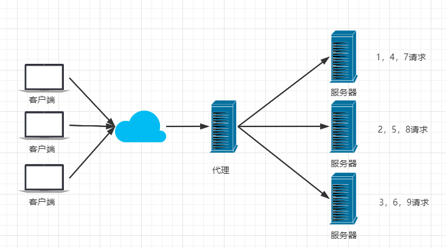

# Nginx学习笔记

## 公司产品出现瓶颈？

公司项目刚刚上线的时候，并发量小，用户使用的少，所以在低并发的情况下，一个jar包启动应用就够了，然后内部tomcat返回内容给用户。


但是慢慢的，使用我们平台的用户越来越多了，并发量慢慢增大了，这时候一台服务器满足不了我们的需求了。


于是我们横向扩展，又增加了服务器。这个时候几个项目启动在不同的服务器上，用户要访问，就需要增加一个代理服务器了，通过代理服务器来帮我们转发和处理请求。


我们希望这个代理服务器可以帮助我们接收用户的请求，然后将用户的请求按照规则帮我们转发到不同的服务器节点之上。这个过程用户是无感知的，用户并不知道是哪个服务器返回的结果，我们还希望他可以按照服务器的性能提供不同的权重选择。保证最佳体验！所以我们使用了Nginx。

## 什么是Nginx？

Nginx (engine x) 是一个高性能的HTTP和反向代理web服务器，同时也提供了IMAP/POP3/SMTP服务。Nginx是由伊戈尔·赛索耶夫为俄罗斯访问量第二的Rambler.ru站点（俄文：Рамблер）开发的，第一个公开版本0.1.0发布于2004年10月4日。2011年6月1日，nginx 1.0.4发布。

其特点是占有内存少，并发能力强，事实上nginx的并发能力在同类型的网页服务器中表现较好，中国大陆使用nginx网站用户有：百度、京东、新浪、网易、腾讯、淘宝等。在全球活跃的网站中有12.18%的使用比率，大约为2220万个网站。

Nginx 是一个安装非常的简单、配置文件非常简洁（还能够支持perl语法）、Bug非常少的服务。Nginx 启动特别容易，并且几乎可以做到7*24不间断运行，即使运行数个月也不需要重新启动。你还能够不间断服务的情况下进行软件版本的升级。

Nginx代码完全用C语言从头写成。官方数据测试表明能够支持高达 50,000 个并发连接数的响应。

## Nginx特点

- 高并发：一个nignx服务器不做任何配置，并发可达1000， 如果硬件允许的情况可达5-8万的并发
- 低消耗：10000个非活跃连接，仅消耗2.5M内存
- 热部署：平滑重启，7*24小时不间断运行
- 高可用：nginx中有一个主进程，有多个worker进程
- 高扩展：c语言扩展，lua脚本扩展

## Nginx作用？

**Http代理，反向代理：作为web服务器最常用的功能之一，尤其是反向代理。**

### 正向代理

正向代理，代理的其实是客户端

**隐藏**

隐藏客户端，服务端只知道代理服务器，并不知道客户端是谁


**翻墙**


**提速**


**缓存**


**授权**


### 反向代理

反向代理，代理的是服务端

**保护隐藏**


**分布式路由**


**集群负载均衡**


**动静分离**


**数据缓存**


### 总结

- 正向代理

    1. 正向代理是对客户端的代理
    2. 正向代理是架设在客户端的主机
    3. 客户端在使用代理服务器时是知道其所要真正访问的服务器地址的

- 反向代理

    1. 反向代理是对服务端的代理
    2. 反向代理是架设在服务端的主机
    3. 客户端在使用代理服务器时好像是知道其所要访问的服务器真正地址，但其实它是不知道的


**Nginx提供的负载均衡策略有2种：内置策略和扩展策略。内置策略为轮询，加权轮询，Ip hash。扩展策略，就天马行空，只有你想不到的没有他做不到的。**

轮询



加权轮询


iphash对客户端请求的ip进行hash操作，然后根据hash结果将同一个客户端ip的请求分发给同一台服务器进行处理，可以解决session不共享的问题。


动静分离，在我们的软件开发中，有些请求是需要后台处理的，有些请求是不需要经过后台处理的（如：css、html、jpg、js等等文件），这些不需要经过后台处理的文件称为静态文件。让动态网站里的动态网页根据一定规则把不变的资源和经常变的资源区分开来，动静资源做好了拆分以后，我们就可以根据静态资源的特点将其做缓存操作。提高资源响应的速度。


目前，通过使用Nginx大大提高了我们网站的响应速度，优化了用户体验，让网站的健壮性更上一层楼！

## Nginx的安装

### linux下安装

1、安装gcc

安装 nginx 需要先将官网下载的源码进行编译，编译依赖 gcc 环境，如果没有 gcc 环境，则需要安装：

```bash
yum install gcc-c++
```

2、PCRE pcre-devel 安装

PCRE(Perl Compatible Regular Expressions) 是一个Perl库，包括 perl 兼容的正则表达式库。nginx 的 http 模块使用 pcre 来解析正则表达式，所以需要在 linux 上安装 pcre 库，pcre-devel 是使用 pcre 开发的一个二次开发库。nginx也需要此库。命令：

```bash
yum install -y pcre pcre-devel
```

3、zlib 安装

zlib 库提供了很多种压缩和解压缩的方式， nginx 使用 zlib 对 http 包的内容进行 gzip ，所以需要在 Centos 上安装 zlib 库。

```bash
yum install -y zlib zlib-devel
```

4、OpenSSL 安装

OpenSSL 是一个强大的安全套接字层密码库，囊括主要的密码算法、常用的密钥和证书封装管理功能及 SSL 协议，并提供丰富的应用程序供测试或其它目的使用。
nginx 不仅支持 http 协议，还支持 https（即在ssl协议上传输http），所以需要在 Centos 安装 OpenSSL 库。

```bash
yum install -y openssl openssl-devel
```

5、下载安装包

手动下载.tar.gz安装包，地址：https://nginx.org/en/download.html

源码：https://trac.nginx.org/nginx/browser

官网：http://www.nginx.org/

下载完毕上传到服务器上 /root

6、解压

```bash
tar -zxvf nginx-1.18.0.tar.gz
cd nginx-1.18.0
```

7、配置

使用默认配置，在nginx根目录下执行

```bash
./configure
make
make install
查找安装路径： whereis nginx
```

## Nginx常用命令

```bash
cd /usr/local/nginx/sbin/
./nginx  启动
./nginx -s stop  停止
./nginx -s quit  安全退出
./nginx -s reload  重新加载配置文件
ps aux|grep nginx  查看nginx进程
启动成功访问 服务器ip:80
```

注意：如何连接不上，检查阿里云安全组是否开放端口，或者服务器防火墙是否开放端口！
相关命令：

```bash
# 开启
service firewalld start

# 重启
service firewalld restart

# 关闭
service firewalld stop

# 查看防火墙规则
firewall-cmd --list-all

# 查询端口是否开放
firewall-cmd --query-port=8080/tcp

# 开放80端口
firewall-cmd --permanent --add-port=80/tcp

# 移除端口
firewall-cmd --permanent --remove-port=8080/tcp

# 重启防火墙(修改配置后要重启防火墙)
firewall-cmd --reload

# 参数解释
firwall-cmd # 是Linux提供的操作firewall的一个工具；
--permanent # 表示设置为持久；
--add-port # 标识添加的端口；
```

## nginx配置

### nginx性能调优

1. **零拷贝**

零拷贝指的是，从一个存储区域到另一个存储区域的copy任务没有CPU（ALU）参与。零拷贝通常用于网络文件传输，以减少CPU消耗和内存带宽占用，减少用户空间与CPU内核空间的拷贝过程，减少用户上下文与CPU内核上下文的切换，提高系统效率。

**传统拷贝时序图**, 发生4次空间转换(上下文切换)，4次copy，其中有2次copy由CPU参与


**零拷贝时序图**, 发生2次空间转换(上下文切换)，3次copy，其中有0次copy由CPU参与


2. **多路复用器**

 **select**

select 多路复用器是采用轮询的方式，一直在轮询所有的相关内核进程，查看它们的进 程状态。若已经就绪，则马上将该内核进程放入到就绪队列。否则，继续查看下一个内核进 程状态。在处理内核进程事务之前，app 进程首先会从内核空间中将用户连接请求相关数据 复制到用户空间。

该多路复用器的缺陷有以下几点:

1. 对所有内核进程采用轮询方式效率会很低。因为对于大多数情况下，内核进程都不属于就绪状态，只有少部分才会是就绪态。所以这种轮询结果大多数都是无意义的。

2. 由于就绪队列底层由数组实现，所以其所能处理的内核进程数量是有限制的，即其能够处理的最大并发连接数量是有限制的。

3. 从内核空间到用户空间的复制，系统开销大。

**poll**

poll 多路复用器的工作原理与 select 几乎相同，不同的是，由于其就绪队列由链表实现， 所以，其对于要处理的内核进程数量理论上是没有限制的，即其能够处理的最大并发连接数 量是没有限制的(当然，要受限于当前系统中进程可以打开的最大文件描述符数 ulimit，后 面会讲到)。

**epoll**

epoll 多路复用是对 select 与 poll 的增强与改进。其不再采用轮询方式了，而是采用回 调方式实现对内核进程状态的获取:一旦内核进程就绪，其就会回调 epoll 多路复用器，进 入到多路复用器的就绪队列(由链表实现)。所以 epoll 多路复用模型也称为 epoll 事件驱动 模型。

另外，应用程序所使用的数据，也不再从内核空间复制到用户空间了，而是使用 mmap 零拷贝机制，大大降低了系统开销。

当内核进程就绪信息通知了 epoll 多路复用器后，多路复用器就会马上对其进行处理， 将其马上存放到就绪队列吗?不是的。根据处理方式的不同，可以分为两种处理模式:LT 模式与 ET 模式。

> LT模式：LT，Level Triggered，水平触发模式。即只要内核进程的就绪通知由于某种原因暂时没有 被 epoll 处理，则该内核进程就会定时将其就绪信息通知 epoll。直到 epoll 将其写入到就绪 队列，或由于某种原因该内核进程又不再就绪而不再通知。其支持两种通讯方式:BIO 与 NIO。
>
> ET模式：ET，Edge Triggered，边缘触发模式。其仅支持 NIO 的通讯方式。当内核进程的就绪信息仅会通知一次 epoll，无论 epoll 是否处理该通知。明显该方式的 效率要高于 LT 模式，但其有可能会出现就绪通知被忽视的情况，即连接请求丢失的情况。

3. **并发处理机制**

一般情况下并发处理机制有三种:多进程、多线程，与异步机制。Nginx 对于并发的处 理同时采用了三种机制。当然，其异步机制使用的是异步非阻塞方式。

我们知道 Nginx 的进程分为两类:master 进程与 worker 进程。每个 master 进程可以生 成多个 worker 进程，所以其是多进程的。每个 worker 进程可以同时处理多个用户请求，每 个用户请求会由一个线程来处理，所以其是多线程的。

那么，如何解释其“异步非阻塞”并发处理机制呢?

worker 进程采用的就是 epoll 多路复用机制来对后端服务器进行处理的。当后端服务器 返回结果后，后端服务器就会回调 epoll 多路复用器，由多路复用器对相应的 worker 进程进 行通知。此时，worker 进程就会挂起当前正在处理的事务，拿 IO 返回结果去响应客户端请 求。响应完毕后，会再继续执行挂起的事务。这个过程就是“异步非阻塞”的。

4. **全局模块下的调优**

    1. **worker_processes 2**

    ```
    打开 nginx.conf 配置文件，可以看到 worker_processes 的默认值为 1。
    worker_processes，工作进程，用于指定 Nginx 的工作进程数量。其数值一般设置为 CPU 内核数量，或内核数量的整数倍。
    不过需要注意，该值不仅仅取决于 CPU 内核数量，还与硬盘数量及负载均衡模式相关。 在不确定时可以指定其值为 auto。
    ```

    2. **worker_cpu_affinity 01 10**

    ```
    将 worker 进程与具体的内核进行绑定。不过，若指定 worker_processes 的值为 auto，
    则无法设置 worker_cpu_affinity。
    该设置是通过二进制进行的。每个内核使用一个二进制位表示，0 代表内核关闭，1 代 表内核开启。也就是说，有几个内核，就需要使用几个二进制位。
    ```

    | 内核数量 | worker_processes | worker_cpu_affinity | 说明                                                         |
    | -------- | ---------------- | ------------------- | ------------------------------------------------------------ |
    | 2        | 2                | 01 10               | 每个进程各使用一个内核                                       |
    | 2        | 4                | 01 10 01 10         | 每个进程交替使用各个内核                                     |
    | 4        | 4                | 0001 0010 0100 1000 | 每个进程各使用一个内核                                       |
    | 4        | 2                | 0101 1010           | 每个进程使用两个内核。对于需要CPU进行大量运算的应用，可以让每个进程使用多个CPU内核 |

    3. **worker_rlimit_nofile 65535**

    ```
    用于设置一个 worker 进程所能打开的最多文件数量。其默认值与当前 Linux 系统可以打 开的最大文件描述符数量相同。
    ```

5. **events模块下的调优**

a. **worker_connections 1024**

设置每一个 worker 进程可以并发处理的最大连接数。该值不能超过 worker_rlimit_nofile 的值。

b. **accept_mutex on**

- on:默认值，表示当一个新连接到达时，那些没有处于工作状态的worker将以串行方式来处理;

- off:表示当一个新连接到达时，所有的worker都会被唤醒，不过只有一个worker能获 取新连接，其它的 worker 会重新进入阻塞状态，这就是“惊群”现象。

c. **accept_mutex_delay 500ms**

设置队首 worker 会尝试获取互斥锁的时间间隔。默认值为 500 毫秒

d. **multi_accept on**

- off:系统会逐个拿出新连接按照负载均衡策略，将其分配给当前处理连接个数最少的 worker。

- on:系统会实时的统计出各个worker当前正在处理的连接个数，然后会按照“缺编” 最多的 worker 的“缺编”数量，一次性将这么多的新连接分配给该 worker。

e. **use epoll**

设置 worker 与客户端连接的处理方式。Nginx 会自动选择适合当前系统的最高效的方式。 当然，也可以使用 use 指令明确指定所要使用的连接处理方式。user 的取值有以下几种: select | poll | epoll | rtsig | kqueue | /dev/poll 。

- **select | poll | epoll** 这是三种多路复用机制。select 与 poll 工作原理几乎相同，而 epoll 的效率最高，是现在使用最多的一种多路复用机制。
- **rtsig** realtime signal，实时信号，Linux 2.2.19+的高效连接处理方式。但在 在 Linux 2.6 版本后，不再支持该方式。
- **kqueue** 应用在 BSD 系统上的 epoll。
- **/dev/poll** UNIX 系统上使用的 poll。

### 默认的config 

```bash
#user  nobody;
worker_processes  1;

#error_log  logs/error.log;
#error_log  logs/error.log  notice;
#error_log  logs/error.log  info;

#pid        logs/nginx.pid;


events {
    worker_connections  1024;
}


http {
    include       mime.types;
    default_type  application/octet-stream;

    #log_format  main  '$remote_addr - $remote_user [$time_local] "$request" '
    #                  '$status $body_bytes_sent "$http_referer" '
    #                  '"$http_user_agent" "$http_x_forwarded_for"';

    #access_log  logs/access.log  main;

    sendfile        on;
    #tcp_nopush     on;

    #keepalive_timeout  0;
    keepalive_timeout  65;

    #gzip  on;

    server {
        listen       80;
        server_name  localhost;

        #charset koi8-r;

        #access_log  logs/host.access.log  main;

        location / {
            root   html;
            index  index.html index.htm;
        }

        #error_page  404              /404.html;

        # redirect server error pages to the static page /50x.html
        #
        error_page   500 502 503 504  /50x.html;
        location = /50x.html {
            root   html;
        }

        # proxy the PHP scripts to Apache listening on 127.0.0.1:80
        #
        #location ~ \.php$ {
        #    proxy_pass   http://127.0.0.1;
        #}

        # pass the PHP scripts to FastCGI server listening on 127.0.0.1:9000
        #
        #location ~ \.php$ {
        #    root           html;
        #    fastcgi_pass   127.0.0.1:9000;
        #    fastcgi_index  index.php;
        #    fastcgi_param  SCRIPT_FILENAME  /scripts$fastcgi_script_name;
        #    include        fastcgi_params;
        #}

        # deny access to .htaccess files, if Apache's document root
        # concurs with nginx's one
        #
        #location ~ /\.ht {
        #    deny  all;
        #}
    }


    # another virtual host using mix of IP-, name-, and port-based configuration
    #
    #server {
    #    listen       8000;
    #    listen       somename:8080;
    #    server_name  somename  alias  another.alias;

    #    location / {
    #        root   html;
    #        index  index.html index.htm;
    #    }
    #}


    # HTTPS server
    #
    #server {
    #    listen       443 ssl;
    #    server_name  localhost;

    #    ssl_certificate      cert.pem;
    #    ssl_certificate_key  cert.key;

    #    ssl_session_cache    shared:SSL:1m;
    #    ssl_session_timeout  5m;

    #    ssl_ciphers  HIGH:!aNULL:!MD5;
    #    ssl_prefer_server_ciphers  on;

    #    location / {
    #        root   html;
    #        index  index.html index.htm;
    #    }
    #}

}
```

### nginx文件结构

```bash
...              #全局块

events {         #events块
   ...
}

http      #http块
{
    ...   #http全局块
    server        #server块
    { 
        ...       #server全局块
        location [PATTERN]   #location块
        {
            ...
        }
        location [PATTERN] 
        {
            ...
        }
    }
    server
    {
      ...
    }
    ...     #http全局块
}
```

1、全局块：配置影响nginx全局的指令。一般有运行nginx服务器的用户组，nginx进程pid存放路径，日志存放路径，配置文件引入，允许生成worker process数等。

2、events块：配置影响nginx服务器或与用户的网络连接。有每个进程的最大连接数，选取哪种事件驱动模型处理连接请求，是否允许同时接受多个网路连接，开启多个网络连接序列化等。

3、http块：可以嵌套多个server，配置代理，缓存，日志定义等绝大多数功能和第三方模块的配置。如文件引入，mime-type定义，日志自定义，是否使用sendfile传输文件，连接超时时间，单连接请求数等。

4、server块：配置虚拟主机的相关参数，一个http中可以有多个server。

5、location块：配置请求的路由，以及各种页面的处理情况。

### 示例1

```bash
########### 每个指令必须有分号结束。#################
# user administrator administrators;  # 配置用户或者组，默认为nobody nobody。
# worker_processes 2;  				  # 允许生成的进程数，默认为1
# worker_rlimit_nofile 65535;         # 配置Nginx worker进程最大打开文件数
# pid /nginx/pid/nginx.pid;   		  # 指定nginx进程运行文件存放地址
error_log log/error.log debug;  	  # 制定日志路径，级别。这个设置可以放入全局块，http块，server块，级别以此为：debug|info|notice|warn|error|crit|alert|emerg
events {
    accept_mutex on;   				  # 设置网路连接序列化，防止惊群现象发生，默认为on
    multi_accept on;  				  # 设置一个进程是否同时接受多个网络连接，默认为off
    # use epoll;      				  # 事件驱动模型，select|poll|kqueue|epoll|resig|/dev/poll|eventport
    worker_connections  1024;   	  # 最大连接数，默认为512
}
http {
    include       mime.types;   			# 文件扩展名与文件类型映射表
    default_type  application/octet-stream; # 默认文件类型，默认为text/plain
    # access_log off; 						# 取消服务日志    
    log_format myFormat '$remote_addr–$remote_user [$time_local] $request $status $body_bytes_sent $http_referer $http_user_agent $http_x_forwarded_for'; # 自定义格式
    access_log log/access.log myFormat;     # combined为日志格式的默认值
    sendfile on;                            # 允许sendfile方式传输文件，默认为off，可以在http块，server块，location块。
    # server_tokens  off; 					# 安全优化-隐藏版本号
    sendfile_max_chunk 100k;                # 每个进程每次调用传输数量不能大于设定的值，默认为0，即不设上限。
    keepalive_timeout 65;                   # 连接超时时间，默认为75s，可以在http，server，location块。

    upstream mysvr {   
      server 127.0.0.1:7878;
      server 192.168.10.121:3333 backup;    # 热备
    }
    error_page 404 https://www.baidu.com;   # 错误页
    server {
        keepalive_requests 120; 		    # 单连接请求上限次数。
        listen       4545;   				# 监听端口
        server_name  127.0.0.1;   		    # 监听地址       
        location  ~*^.+$ {       			# 请求的url过滤，正则匹配，~为区分大小写，~*为不区分大小写。
           # root path;  					# 根目录
           # index vv.txt;  			    # 设置默认页
           proxy_pass  http://mysvr;  		# 请求转向mysvr 定义的服务器列表
           deny 127.0.0.1;  				# 拒绝的ip
           allow 172.18.5.54; 				# 允许的ip           
        } 
    }
}
```

上面是nginx的基本配置，需要注意的有以下几点：

1. $remote_addr 与$http_x_forwarded_for 用以记录客户端的ip地址； 
2. $remote_user ：用来记录客户端用户名称； 
3. $time_local ： 用来记录访问时间与时区；
4. $request ： 用来记录请求的url与http协议；
5. $status ： 用来记录请求状态；成功是200， 
6. $body_bytes_s ent ：记录发送给客户端文件主体内容大小；
7. $http_referer ：用来记录从那个页面链接访问过来的； 
8. $http_user_agent ：记录客户端浏览器的相关信息；
9. 惊群现象：一个网路连接到来，多个睡眠的进程被同事叫醒，但只有一个进程能获得链接，这样会影响系统性能。
10. 每个指令必须有分号结束。

### 示例2

```bash
# 运行用户
user nobody;
# 启动进程,通常设置成和cpu的数量相等
worker_processes  1;

# 全局错误日志及PID文件
# error_log  logs/error.log;
# error_log  logs/error.log  notice;
# error_log  logs/error.log  info;

# pid        logs/nginx.pid;

# 工作模式及连接数上限
events {
    # epoll是多路复用IO(I/O Multiplexing)中的一种方式,
    # 仅用于linux2.6以上内核,可以大大提高nginx的性能
    use   epoll; 

    # 单个后台worker process进程的最大并发链接数    
    worker_connections  1024;

    # 并发总数是 worker_processes 和 worker_connections 的乘积
    # 即 max_clients = worker_processes * worker_connections
    # 在设置了反向代理的情况下，max_clients = worker_processes * worker_connections / 4  为什么
    # 为什么上面反向代理要除以4，应该说是一个经验值
    # 根据以上条件，正常情况下的Nginx Server可以应付的最大连接数为：4 * 8000 = 32000
    # worker_connections 值的设置跟物理内存大小有关
    # 因为并发受IO约束，max_clients的值须小于系统可以打开的最大文件数
    # 而系统可以打开的最大文件数和内存大小成正比，一般1GB内存的机器上可以打开的文件数大约是10万左右
    # 我们来看看360M内存的VPS可以打开的文件句柄数是多少：
    # $ cat /proc/sys/fs/file-max
    # 输出 34336
    # 32000 < 34336，即并发连接总数小于系统可以打开的文件句柄总数，这样就在操作系统可以承受的范围之内
    # 所以，worker_connections 的值需根据 worker_processes 进程数目和系统可以打开的最大文件总数进行适当地进行设置
    # 使得并发总数小于操作系统可以打开的最大文件数目
    # 其实质也就是根据主机的物理CPU和内存进行配置
    # 当然，理论上的并发总数可能会和实际有所偏差，因为主机还有其他的工作进程需要消耗系统资源。
    # ulimit -SHn 65535
}


http {
    # 设定mime类型,类型由mime.type文件定义
    include    mime.types;
    default_type  application/octet-stream;
    # 设定日志格式
    log_format  main  '$remote_addr - $remote_user [$time_local] "$request" '
                      '$status $body_bytes_sent "$http_referer" '
                      '"$http_user_agent" "$http_x_forwarded_for"';

    access_log  logs/access.log  main;

    # sendfile 指令指定 nginx 是否调用 sendfile 函数（zero copy 方式）来输出文件，
    # 对于普通应用，必须设为 on,
    # 如果用来进行下载等应用磁盘IO重负载应用，可设置为 off，
    # 以平衡磁盘与网络I/O处理速度，降低系统的uptime.
    sendfile     on;
    # tcp_nopush     on;

    # 连接超时时间
    # keepalive_timeout  0;
    keepalive_timeout  65;
    tcp_nodelay     on;

    # 开启gzip压缩
    gzip  on;
    gzip_disable "MSIE [1-6].";

    # 设定请求缓冲
    client_header_buffer_size    128k;
    large_client_header_buffers  4 128k;


    # 设定虚拟主机配置
    server {
        # 侦听80端口
        listen    80;
        # 定义使用 www.nginx.cn访问
        server_name  www.nginx.cn;

        # 定义服务器的默认网站根目录位置
        root html;

        # 设定本虚拟主机的访问日志
        access_log  logs/nginx.access.log  main;

        # 默认请求
        location / { 
            # 定义首页索引文件的名称
            index index.php index.html index.htm;   

        }

        # 定义错误提示页面
        error_page   500 502 503 504 /50x.html;
        location = /50x.html {
        }

        # 静态文件，nginx自己处理
        location ~ ^/(images|javascript|js|css|flash|media|static)/ {
            # 过期30天，静态文件不怎么更新，过期可以设大一点， 
            # 如果频繁更新，则可以设置得小一点。
            expires 30d;
        }

        # PHP 脚本请求全部转发到 FastCGI处理. 使用FastCGI默认配置.
        location ~ .php$ {
            fastcgi_pass 127.0.0.1:9000;
            fastcgi_index index.php;
            fastcgi_param  SCRIPT_FILENAME  $document_root$fastcgi_script_name;
            include fastcgi_params;
        }

        # 禁止访问 .htxxx 文件
            location ~ /.ht {
            deny all;
        }
    }
}
```

### 示例3（正向代理）

```bash
# 在默认配置文件的基础上
http {
    server {
        listen       80;
        server_name  192.168.1.1; # 修改为指定IP

		# ...

        location / {
            root   html;
            proxy_pass http://127.0.0.1:8080; # 添加代理
            index  index.html index.htm;
        }
		# ...
    }
}
```


### 示例4（反向代理）

```bash
# 在默认配置文件的基础上
http {
    server {
        listen       80;
        server_name  192.168.1.1; # 修改为指定IP
		
		# ...

        location / {
            root   html;
            proxy_pass http://127.0.0.1:8080; # 添加代理
            index  index.html index.htm;
        }
        
        # 多路径代理
        location ～ /edu/ {
            proxy_pass http://127.0.0.1:8081; # 添加代理
        }
        
        # 多路径代理
        location ～ /org/ {
            proxy_pass http://127.0.0.1:8082; # 添加代理
        }
        
        # 正则匹配路径
        location [ = | ~ | ~* | ^~ ] /uri/  {
            proxy_pass http://127.0.0.1:8082; # 添加代理
        }
		# ...
    }
}

# 1.= 用于不含正则表达式的uri前， 要求请求字符串与uri严格匹配，如果匹配成功，就停止继续向下搜索并立即处理该请求
# 2.～ 用于表示uri包含正则表达式，并且区分大小写
# 3.～* 用于表示uri包含正则表达式，并且不区分大小写
# 4.^～ 用于不含正则表达式的uri前，要求nginx处理器找到标识uri和请求字符串匹配度最高的location后，立即使用此location处理请	 求，而不再使用location块中的正则和请求字符串做匹配
```


### 示例5（负载均衡）

```bash
http {
    # 轮训（默认）
    upstream myserver {
    	server 192.168.17.129:8080;
    	server 192.168.17.129:8081;
    }
    
    # 权重
    upstream myserver {
    	server 192.168.17.129:8080 weight=5;
    	server 192.168.17.129:8081 weight=10;
    }
    
    # ip_hash 解决session问题
    upstream myserver {
    	ip_hash
    	server 192.168.17.129:8080;
    	server 192.168.17.129:8081;
    }
    
    # fair（第三方，按照响应时间进行分配）
    upstream myserver {
    	fair
    	server 192.168.17.129:8080;
    	server 192.168.17.129:8081;
    }

    server {
        listen       80;
        server_name  192.168.17.129;

        location / {
            root   html;
            proxy_pass http://myserver; # 添加代理
            index  index.html index.htm;
        }
    }
}
```


### 示例6（动静分离）

```bash
http {
    # ...
    server {
        listen       80;
        server_name  192.168.17.129;

        location /dynamic/ {
            root   /data/;
            index  index.html index.htm;
        }
        
        location /static/ {
            root   /data/;
            autoindex on; # 自动显示目录结构
        }
    }
}
```


### 示例7（主备模型）
