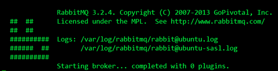
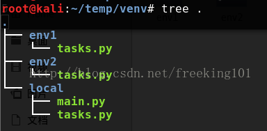
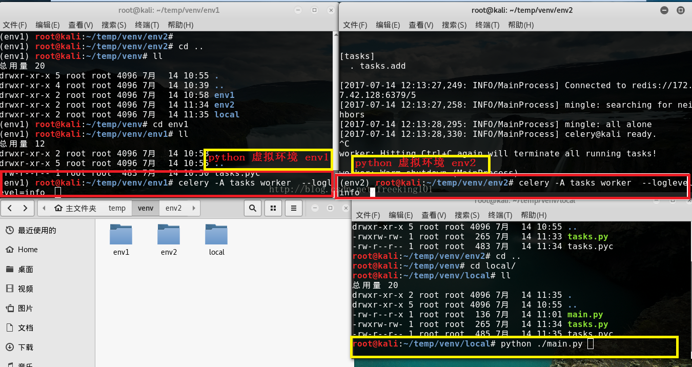
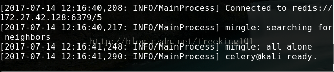
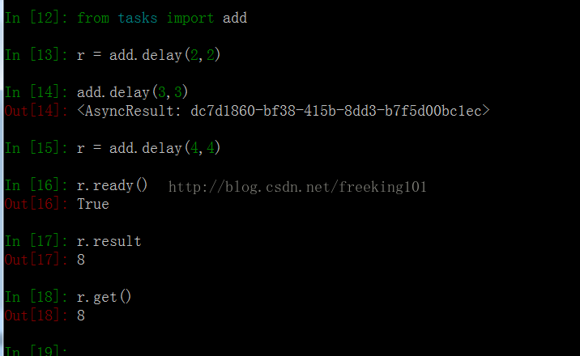

# Celery分布式系统

## 简介

​    除了redis，还可以使用另外一个神器---Celery。Celery是一个异步任务的调度工具。

​    Celery 是 Distributed Task Queue，分布式任务队列，分布式决定了可以有多个 worker 的存在，队列表示其是异步操作，即存在一个产生任务提出需求的工头，和一群等着被分配工作的码农。

​    在 Python 中定义 Celery 的时候，我们要引入 Broker，中文翻译过来就是“中间人”的意思，在这里 Broker 起到一个中间人的角色。在工头提出任务的时候，把所有的任务放到 Broker 里面，在 Broker 的另外一头，一群码农等着取出一个个任务准备着手做。

​    这种模式注定了整个系统会是个开环系统，工头对于码农们把任务做的怎样是不知情的。所以我们要引入 Backend 来保存每次任务的结果。这个 Backend 有点像我们的 Broker，也是存储任务的信息用的，只不过这里存的是那些任务的返回结果。我们可以选择只让错误执行的任务返回结果到 Backend，这样我们取回结果，便可以知道有多少任务执行失败了。

​    Celery(芹菜)是一个异步任务队列/基于分布式消息传递的作业队列。它侧重于实时操作，但对调度支持也很好。Celery用于生产系统每天处理数以百万计的任务。Celery是用Python编写的，但该协议可以在任何语言实现。它也可以与其他语言通过webhooks实现。Celery建议的消息队列是RabbitMQ，但提供有限支持Redis, Beanstalk, MongoDB, CouchDB, 和数据库（使用SQLAlchemy的或Django的 ORM） 。Celery是易于集成Django, Pylons and Flask，使用 django-celery, celery-pylons and Flask-Celery 附加包即可。

## 介绍

在Celery中几个基本的概念，需要先了解下，不然不知道为什么要安装下面的东西。概念：Broker、Backend。

### 什么是broker？

broker是一个消息传输的中间件，可以理解为一个邮箱。每当应用程序调用celery的异步任务的时候，会向broker传递消息，而后celery的worker将会取到消息，进行对于的程序执行。好吧，这个邮箱可以看成是一个消息队列。其中Broker的中文意思是 经纪人 ，其实就是一开始说的 消息队列 ，用来发送和接受消息。这个Broker有几个方案可供选择：RabbitMQ (消息队列)，[Redis](http://lib.csdn.net/base/redis)（缓存数据库），[数据库](http://lib.csdn.net/base/mysql)（不推荐），等等

### 什么是backend？

通常程序发送的消息，发完就完了，可能都不知道对方时候接受了。为此，celery实现了一个backend，用于存储这些消息以及celery执行的一些消息和结果。Backend是在Celery的配置中的一个配置项 CELERY_RESULT_BACKEND ，作用是保存结果和状态，如果你需要跟踪任务的状态，那么需要设置这一项，可以是Database backend，也可以是Cache backend，具体可以参考这里： [CELERY_RESULT_BACKEND](http://docs.celeryproject.org/en/latest/configuration.html#celery-result-backend) 。

对于 brokers，官方推荐是 rabbitmq 和 redis，至于 backend，就是数据库。为了简单可以都使用 redis。

我自己演示使用RabbitMQ作为Broker，用[MySQL](http://lib.csdn.net/base/mysql)作为backend。

来一张图，这是在网上最多的一张Celery的图了，确实描述的非常好


Celery的[架构](http://lib.csdn.net/base/architecture)由三部分组成，**消息中间件**（message broker），**任务执行单元**（worker）和**任务执行结果存储**（task result store）组成。

### 消息中间件

Celery本身不提供消息服务，但是可以方便的和第三方提供的消息中间件集成。包括，RabbitMQ, [Redis](http://lib.csdn.net/base/redis), [MongoDB](http://lib.csdn.net/base/mongodb) (experimental), Amazon SQS (experimental),CouchDB (experimental), SQLAlchemy (experimental),Django ORM (experimental), IronMQ

### 任务执行单元

Worker是Celery提供的任务执行的单元，worker并发的运行在分布式的系统节点中。

### 任务结果存储

Task result store用来存储Worker执行的任务的结果，Celery支持以不同方式存储任务的结果，包括AMQP, [redis](http://lib.csdn.net/base/redis)，memcached, [mongodb](http://lib.csdn.net/base/mongodb)，SQLAlchemy, Django ORM，Apache Cassandra, IronCache 等。

这里我先不去看它是如何存储的，就先选用redis来存储任务执行结果。

因为涉及到消息中间件（在Celery帮助文档中称呼为中间人<broker>），为了更好的去理解文档中的例子，可以安装两个中间件，一个是RabbitMQ,一个redis。

根据 Celery的帮助文档 安装和设置RabbitMQ, 要使用 Celery，需要创建一个 RabbitMQ 用户、一个虚拟主机，并且允许这个用户访问这个虚拟主机。

```bash
sudo rabbitmqctl add_user forward password #创建了一个RabbitMQ用户,用户名为forward，密码是password
sudo rabbitmqctl add_vhost ubuntu #创建了一个虚拟主机，主机名为ubuntu

 
# 设置权限。允许用户forward访问虚拟主机ubuntu，因为RabbitMQ通过主机名来与节点通信
sudo rabbitmqctl set_permissions -p ubuntu forward ".*" ".*" ".*"
sudo rabbitmq-server # 启用RabbitMQ服务器
```

结果如下，成功运行：



安装Redis,它的安装比较简单

```bash
sudo pip install redis
```

然后进行简单的配置，只需要设置 Redis 数据库的位置:

```bash
BROKER_URL = 'redis://localhost:6379/0'

# URL的格式为：
redis://:password@hostname:port/db_number
# URL Scheme 后的所有字段都是可选的，并且默认为 localhost 的 6479 端口，使用数据库 0。我的配置是：
# redis://:password@ubuntu:6379/5

# 安装Celery，我是用标准的Python工具pip安装的，如下：
sudo pip install celery
```

[Celery](https://github.com/celery/celery) 是一个强大的 分布式任务队列 的 异步处理框架，它可以让任务的执行完全脱离主程序，甚至可以被分配到其他主机上运行。我们通常使用它来实现异步任务（async task）和定时任务（crontab）。我们需要一个消息队列来下发我们的任务。首先要有一个消息中间件，此处选择rabbitmq (也可选择 redis 或 Amazon Simple Queue Service(SQS)消息队列服务)。推荐 选择 rabbitmq 。使用RabbitMQ是官方特别推荐的方式，因此我也使用它作为我们的broker。它的[架构](http://lib.csdn.net/base/architecture)组成如下图：


可以看到，Celery 主要包含以下几个模块：

- 任务模块 Task

    包含异步任务和定时任务。其中，**异步任务通常在业务逻辑中被触发并发往任务队列，而定时任务由 Celery Beat 进程周期性地将任务发往任务队列**。

- 消息中间件 Broker

    Broker，即为任务调度队列，**接收任务生产者发来的消息（即任务），将任务存入队列**。Celery 本身不提供队列服务，官方推荐使用 RabbitMQ 和 [Redis](http://lib.csdn.net/base/redis) 等。

- 任务执行单元 Worker

    Worker 是执行任务的处理单元，**它实时监控消息队列，获取队列中调度的任务，并执行它**。

- 任务结果存储 Backend

    Backend 用于**存储任务的执行结果**，以供查询。同消息中间件一样，存储也可使用 RabbitMQ, [redis](http://lib.csdn.net/base/redis) 和 [MongoDB](http://lib.csdn.net/base/mongodb) 等。

## 安装

有了上面的概念，需要安装这么几个东西：RabbitMQ、SQLAlchemy、Celery

### 安装rabbitmq

官网安装方法：http://www.rabbitmq.com/install-windows.html

启动管理插件：sbin/rabbitmq-plugins enable rabbitmq_management 
启动rabbitmq：sbin/rabbitmq-server -detached

rabbitmq已经启动，可以打开页面来看看 
地址：http://localhost:15672/#/ 

用户名密码都是guest 。现在可以进来了，可以看到具体页面。 关于rabbitmq的配置，网上很多 自己去搜以下就ok了。

消息中间件有了，现在该来代码了，使用  celeby官网代码。

剩下两个都是[Python](http://lib.csdn.net/base/python)的东西了，直接pip安装就好了，对于从来没有安装过[mysql](http://lib.csdn.net/base/mysql)驱动的同学可能需要安装MySQL-[python](http://lib.csdn.net/base/python)。安装完成之后，启动服务: $ rabbitmq-server[回车]。启动后不要关闭窗口, 下面操作新建窗口(Tab)。

 

### 安装celery

Celery可以通过pip自动安装，如果你喜欢使用虚拟环境安装可以先使用virtualenv创建一个自己的虚拟环境。反正我喜欢使用virtualenv建立自己的环境。

```bash
pip install celery
```

http://www.open-open.com/lib/view/open1441161168878.html

## 使用

使用celery包含三个方面：1. 定义任务函数。2. 运行celery服务。3. 客户应用程序的调用。

创建一个文件 `tasks.py`输入下列代码：

```bash
from celery import Celery

broker = 'redis://127.0.0.1:6379/5'`
backend = 'redis://127.0.0.1:6379/6'`
  
app = Celery('tasks', broker=broker, backend=backend)`

@app.task`
def add(x, y):`
		return x + y`
```

上述代码导入了celery，然后创建了celery 实例 app，实例化的过程中指定了任务名`tasks`（和文件名一致），传入了broker和backend。然后创建了一个任务函数`add`。下面启动celery服务。在当前命令行终端运行（分别在 env1 和 env2 下执行）：

```bash
celery -A tasks worker  --loglevel=info
```

目录结构 （*celery -A tasks worker --loglevel=info 这条命令当前工作目录必须和 tasks.py 所在的目录相同。即 进入tasks.py所在目录执行这条命令。*）



使用 python 虚拟环境 模拟两个不同的 主机。



此时会看见一对输出。包括注册的任务啦。



### 交互式客户端程序调用方法



调用 **delay** 函数即可启动 add 这个任务。这个函数的效果是发送一条消息到broker中去，这个消息包括要执行的函数、函数的参数以及其他信息，具体的可以看 Celery官方文档。这个时候 worker 会等待 broker 中的消息，一旦收到消息就会立刻执行消息。

### 应用程序中调用方法

新建一个 ***main.py*** 文件 代码如下：

```python
from tasks import add

r = add.delay(2, 2)
r = add.delay(3, 3)
print r.ready()
print r.result
print r.get()
```

## 配置文件

Celery 的配置比较多，可以在 官方配置文档：http://docs.celeryproject.org/en/latest/userguide/configuration.html 查询每个配置项的含义。

上述的使用是简单的配置，下面介绍一个更健壮的方式来使用celery。首先创建一个python包，celery服务，姑且命名为proj。目录文件如下：

```bash
☁ proj tree

.

├── __init__.py

├── celery.py # 创建 celery 实例

├── config.py # 配置文件

└── tasks.py # 任务函数
```

### celery.py

```python
#!/usr/bin/env python
# -*- coding:utf-8 -*-
  
from __future__ import absolute_import
from celery import Celery
  
app = Celery('proj', include=['proj.tasks'])
  
app.config_from_object('proj.config')
  
if __name__ == '__main__':
app.start()
```

这一次创建 app，并没有直接指定 broker 和 backend。而是在配置文件中。

### config.py

```python
#!/usr/bin/env python

# -*- coding:utf-8 -*-

 
from __future__ import absolute_import

 
CELERY_RESULT_BACKEND = 'redis://127.0.0.1:6379/5'

BROKER_URL = 'redis://127.0.0.1:6379/6'
```

剩下的就是**tasks.py**

### task.py

```python
#!/usr/bin/env python

# -*- coding:utf-8 -*-

 
from __future__ import absolute_import

from proj.celery import app

 
@app.task
def add(x, y):
return x + y
```

使用方法也很简单，**在 proj 的同一级目录执行 celery**：

```bash
celery -A proj worker -l info
```

现在使用任务也很简单，直接在客户端代码调用 proj.tasks 里的函数即可。

## Scheduler ( 定时任务，周期性任务 )

[官方介绍](http://docs.celeryproject.org/en/latest/userguide/periodic-tasks.html)

## crontab

计划任务当然也可以用crontab实现，celery也有crontab模式。修改 config.py

```python
#!/usr/bin/env python

# -*- coding:utf-8 -*-

 
from __future__ import absolute_import

 
CELERY_RESULT_BACKEND = 'redis://127.0.0.1:6379/5'

BROKER_URL = 'redis://127.0.0.1:6379/6'

 
CELERY_TIMEZONE = 'Asia/Shanghai'

 
from celery.schedules import crontab

 
CELERYBEAT_SCHEDULE = {

# Executes every Monday morning at 7:30 A.M

'add-every-monday-morning': {

'task': 'tasks.add',

'schedule': crontab(hour=7, minute=30, day_of_week=1),

'args': (16, 16),

},

}
```

### 发送任务到队列中

apply_async(args[, kwargs[, …]])、delay(*args, **kwargs) ：http://docs.celeryproject.org/en/master/userguide/calling.html

send_task  ：http://docs.celeryproject.org/en/master/reference/celery.html#celery.Celery.send_task

## Celery 监控和管理以及命令帮助

[官方文档](http://docs.celeryproject.org/en/master/userguide/monitoring.html)

## Celery 官网示例

[官网示例](http://docs.celeryproject.org/en/master/getting-started/first-steps-with-celery.html#first-steps)

[Python 并行分布式框架 Celery 超详细介绍](http://blog.csdn.net/liuxiaochen123/article/details/47981111)

## 参考资料

[Celery 官网](http://www.celeryproject.org/)

[Celery 官方文档英文版](http://docs.celeryproject.org/en/latest/index.html)

[Celery 官方文档中文版](http://docs.jinkan.org/docs/celery/)

[celery 配置](http://docs.jinkan.org/docs/celery/configuration.html#configuration)

**参考**

http://www.cnblogs.com/landpack/p/5564768.html 

http://blog.csdn.net/happyAnger6/article/details/51408266

http://www.cnblogs.com/forward-wang/p/5970806.html

[分布式队列神器 Celery](https://segmentfault.com/a/1190000008022050)

[celery 最佳实践](https://my.oschina.net/siddontang/blog/284107)

[Celery 分布式任务队列快速入门](http://www.cnblogs.com/alex3714/p/6351797.html)

[异步任务神器 Celery 快速入门教程](https://blog.csdn.net/chenqiuge1984/article/details/80127446)

[定时任务管理之python篇celery使用](http://student-lp.iteye.com/blog/2093397)

[异步任务神器 Celery](http://python.jobbole.com/87086)

[celery 任务调度框架实践](https://blog.csdn.net/qq_28921653/article/details/79555212)

[Celery-4.1 用户指南: Monitoring and Management Guide](https://blog.csdn.net/libing_thinking/article/details/78592801)

[Celery安装及使用](https://blog.csdn.net/u012325060/article/details/79292243)

[Celery学习笔记（一）](https://blog.csdn.net/sdulsj/article/details/73741350)