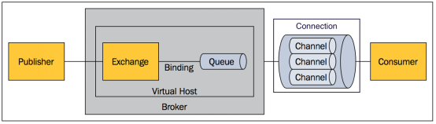

# RabbitMQ消息队列

## 什么叫消息队列

消息（Message）是指在应用间传送的数据。消息可以非常简单，比如只包含文本字符串，也可以更复杂，可能包含嵌入对象。

消息队列（Message Queue）是一种应用间的通信方式，消息发送后可以立即返回，由消息系统来确保消息的可靠传递。消息发布者只管把消息发布到 MQ 中而不用管谁来取，消息使用者只管从 MQ 中取消息而不管是谁发布的。这样发布者和使用者都不用知道对方的存在。

## 为何用消息队列

从上面的描述中可以看出消息队列是一种应用间的异步协作机制，那什么时候需要使用 MQ 呢？

以常见的订单系统为例，用户点击【下单】按钮之后的业务逻辑可能包括：扣减库存、生成相应单据、发红包、发短信通知。在业务发展初期这些逻辑可能放在一起同步执行，随着业务的发展订单量增长，需要提升系统服务的性能，这时可以将一些不需要立即生效的操作拆分出来异步执行，比如发放红包、发短信通知等。这种场景下就可以用 MQ ，在下单的主流程（比如扣减库存、生成相应单据）完成之后发送一条消息到 MQ 让主流程快速完结，而由另外的单独线程拉取MQ的消息（或者由 MQ 推送消息），当发现 MQ 中有发红包或发短信之类的消息时，执行相应的业务逻辑。

以上是用于业务解耦的情况，其它常见场景包括最终一致性、广播、错峰流控等等。

## RabbitMQ 特点

RabbitMQ 是一个由 Erlang 语言开发的 AMQP 的开源实现。

AMQP ：Advanced Message Queue，高级消息队列协议。它是应用层协议的一个开放标准，为面向消息的中间件设计，基于此协议的客户端与消息中间件可传递消息，并不受产品、开发语言等条件的限制。

RabbitMQ 最初起源于金融系统，用于在分布式系统中存储转发消息，在易用性、扩展性、高可用性等方面表现不俗。具体特点包括：

### 可靠性（Reliability）

RabbitMQ 使用一些机制来保证可靠性，如持久化、传输确认、发布确认。

### 灵活的路由（Flexible Routing）

在消息进入队列之前，通过 Exchange 来路由消息的。对于典型的路由功能，RabbitMQ 已经提供了一些内置的 Exchange 来实现。针对更复杂的路由功能，可以将多个 Exchange 绑定在一起，也通过插件机制实现自己的 Exchange 。

### 消息集群（Clustering）

多个 RabbitMQ 服务器可以组成一个集群，形成一个逻辑 Broker 。

### 高可用（Highly Available Queues）

队列可以在集群中的机器上进行镜像，使得在部分节点出问题的情况下队列仍然可用。

### 多种协议（Multi-protocol）

RabbitMQ 支持多种消息队列协议，比如 STOMP、MQTT 等等。

### 多语言客户端（Many Clients）

RabbitMQ 几乎支持所有常用语言，比如 Java、.NET、Ruby 等等。

### 管理界面（Management UI）

RabbitMQ 提供了一个易用的用户界面，使得用户可以监控和管理消息 Broker 的许多方面。

### 跟踪机制（Tracing）

如果消息异常，RabbitMQ 提供了消息跟踪机制，使用者可以找出发生了什么。

### 插件机制（Plugin System）

RabbitMQ 提供了许多插件，来从多方面进行扩展，也可以编写自己的插件。

## RabbitMQ 中的概念模型

### 消息模型

所有 MQ 产品从模型抽象上来说都是一样的过程：
消费者（consumer）订阅某个队列。生产者（producer）创建消息，然后发布到队列（queue）中，最后将消息发送到监听的消费者。


### 基本概念

上面只是最简单抽象的描述，具体到 RabbitMQ 则有更详细的概念需要解释。上面介绍过 RabbitMQ 是 AMQP 协议的一个开源实现，所以其内部实际上也是 AMQP 中的基本概念：



#### Message

消息，消息是不具名的，它由消息头和消息体组成。消息体是不透明的，而消息头则由一系列的可选属性组成，这些属性包括routing-key（路由键）、priority（相对于其他消息的优先权）、delivery-mode（指出该消息可能需要持久性存储）等。

#### Publisher

消息的生产者，也是一个向交换器发布消息的客户端应用程序。

#### Exchange

交换器，用来接收生产者发送的消息并将这些消息路由给服务器中的队列。

#### Binding

绑定，用于消息队列和交换器之间的关联。一个绑定就是基于路由键将交换器和消息队列连接起来的路由规则，所以可以将交换器理解成一个由绑定构成的路由表。

#### Queue

消息队列，用来保存消息直到发送给消费者。它是消息的容器，也是消息的终点。一个消息可投入一个或多个队列。消息一直在队列里面，等待消费者连接到这个队列将其取走。

#### Connection

网络连接，比如一个TCP连接。

#### Channel

信道，多路复用连接中的一条独立的双向数据流通道。信道是建立在真实的TCP连接内地虚拟连接，AMQP 命令都是通过信道发出去的，不管是发布消息、订阅队列还是接收消息，这些动作都是通过信道完成。因为对于操作系统来说建立和销毁 TCP 都是非常昂贵的开销，所以引入了信道的概念，以复用一条 TCP 连接。

#### Consumer

消息的消费者，表示一个从消息队列中取得消息的客户端应用程序。

#### Virtual Host

虚拟主机，表示一批交换器、消息队列和相关对象。虚拟主机是共享相同的身份认证和加密环境的独立服务器域。每个 vhost 本质上就是一个 mini 版的 RabbitMQ 服务器，拥有自己的队列、交换器、绑定和权限机制。vhost 是 AMQP 概念的基础，必须在连接时指定，RabbitMQ 默认的 vhost 是 / 。

#### Broker

表示消息队列服务器实体。

## RabbitMQ 安装

一般来说安装 RabbitMQ 之前要安装 Erlang ，可以去[Erlang官网](https://link.jianshu.com/?t=http://www.erlang.org/downloads)下载。接着去[RabbitMQ官网](https://link.jianshu.com/?t=https://www.rabbitmq.com/download.html)下载安装包，之后解压缩即可。根据操作系统不同官网提供了相应的安装说明：[Windows](https://link.jianshu.com/?t=http://www.rabbitmq.com/install-windows.html)、[Debian / Ubuntu](https://link.jianshu.com/?t=http://www.rabbitmq.com/install-debian.html)、[RPM-based Linux](https://link.jianshu.com/?t=http://www.rabbitmq.com/install-rpm.html)、[Mac](https://link.jianshu.com/?t=http://www.rabbitmq.com/install-standalone-mac.html)

## RabbitMQ 运行和管理

### 正常启动

启动很简单，找到安装后的 RabbitMQ 所在目录下的 sbin 目录，可以看到该目录下有6个以 rabbitmq 开头的可执行文件，直接执行 rabbitmq-server 即可，下面将 RabbitMQ 的安装位置以 . 代替，启动命令就是：

```bash
./sbin/rabbitmq-server
```

启动正常的话会看到一些启动过程信息和最后的 completed with 7 plugins，这也说明启动的时候默认加载了7个插件。

### 后台启动

如果想让 RabbitMQ 以守护程序的方式在后台运行，可以在启动的时候加上 -detached 参数：

```bash
./sbin/rabbitmq-server -detached
```

### 查询服务器状态

sbin 目录下有个特别重要的文件叫 rabbitmqctl ，它提供了 RabbitMQ 管理需要的几乎一站式解决方案，绝大部分的运维命令它都可以提供。
查询 RabbitMQ 服务器的状态信息可以用参数 status ：

```bash
./sbin/rabbitmqctl status
```

该命令将输出服务器的很多信息，比如 RabbitMQ 和 Erlang 的版本、OS 名称、内存等等

### 关闭 RabbitMQ 节点

我们知道 RabbitMQ 是用 Erlang 语言写的，在Erlang 中有两个概念：节点和应用程序。节点就是 Erlang 虚拟机的每个实例，而多个 Erlang 应用程序可以运行在同一个节点之上。节点之间可以进行本地通信（不管他们是不是运行在同一台服务器之上）。比如一个运行在节点A上的应用程序可以调用节点B上应用程序的方法，就好像调用本地函数一样。如果应用程序由于某些原因奔溃，Erlang 节点会自动尝试重启应用程序。
如果要关闭整个 RabbitMQ 节点可以用参数 stop ：

```bash
./sbin/rabbitmqctl stop
```

它会和本地节点通信并指示其干净的关闭，也可以指定关闭不同的节点，包括远程节点，只需要传入参数 -n ：

```dart
./sbin/rabbitmqctl -n rabbit@server.example.com stop 
```

-n node 默认 node 名称是 rabbit@server ，如果你的主机名是 [server.example.com](https://link.jianshu.com/?t=http://server.example.com) ，那么 node 名称就是 [rabbit@server.example.com](https://link.jianshu.com/?t=mailto:rabbit@server.example.com) 。

### 关闭 RabbitMQ 应用程序

如果只想关闭应用程序，同时保持 Erlang 节点运行则可以用 stop_app：

```bash
./sbin/rabbitmqctl stop_app
```

这个命令在后面要讲的集群模式中将会很有用。

### 启动 RabbitMQ 应用程序

```bash
./sbin/rabbitmqctl start_app
```

### 重置 RabbitMQ 节点

```bash
./sbin/rabbitmqctl reset
```

该命令将清除所有的队列。

### 查看已声明的队列

```bash
./sbin/rabbitmqctl list_queues
```

### 查看交换器

```bash
./sbin/rabbitmqctl list_exchanges
```

该命令还可以附加参数，比如列出交换器的名称、类型、是否持久化、是否自动删除：

```bash
./sbin/rabbitmqctl list_exchanges name type durable auto_delete
```

### 查看绑定

```bash
./sbin/rabbitmqctl list_bindings
```

### 常用命令

```bash
rabbitmqctl的使用方法：

rabbitmqctl [-n <node>] [-q] <command> [<command options>]
rabbitmqctl [-n <node>] [-q] <command> [<command options>]

-n node #默认node名称是"rabbit@server"，如果你的主机名是'server.example.com'，那么node名称是'rabbit@server'； 
-q      #安静输出模式，信息会被禁止输出；

-n node #默认node名称是"rabbit@server"，如果你的主机名是'server.example.com'，那么node名称是'rabbit@server'； 
-q      #安静输出模式，信息会被禁止输出；
<command> [<command options>]

1）基本管理命令

# 停止在erlang node上运行的rabbitmq，会使rabbitmq停止；
stop

#停止erlang node上的rabbitmq的应用，但是erlang node还是会继续运行的；
stop_app            

#启动erlan node上的rabbitmq的应用； 
start_app           

# 等待rabbitmq服务启动；
wait <pid_file>     

# 初始化node状态，会从集群中删除该节点，从管理数据库中删除所有数据，例如vhosts等等。在初始化之前rabbitmq的应用必须先停止；
reset               

# 无条件的初始化node状态；
force_reset         
  
# 轮转日志文件；
rotate_logs <suffix>

# 停止在erlang node上运行的rabbitmq，会使rabbitmq停止；
stop
 
#停止erlang node上的rabbitmq的应用，但是erlang node还是会继续运行的；
stop_app            
 
#启动erlan node上的rabbitmq的应用； 
start_app           
 
# 等待rabbitmq服务启动；
wait <pid_file>     
 
# 初始化node状态，会从集群中删除该节点，从管理数据库中删除所有数据，例如vhosts等等。在初始化之前rabbitmq的应用必须先停止；
reset               
 
# 无条件的初始化node状态；
force_reset         
  
# 轮转日志文件；
rotate_logs <suffix>
2）集群管理命令


# clusternode表示node名称，--ram表示node以ram node加入集群中。默认node以disc node加入集群，在一个node加入cluster之前，必须先停止该node的rabbitmq应用，即先执行stop_app；
join_cluster <clusternode> [--ram]  

# 显示cluster中的所有node；
cluster_status                      

# 改变一个cluster中节点的模式，该节点在转换前必须先停止，不能把一个集群中唯一的disk node转化为ram node；
stop_app
change_cluster_node_type disc | ram
start_app
 
# 远程移除cluster中的一个node，前提是该node必须处于offline状态，如果是online状态，则需要加--offline参数；
forget_cluster_node [--offline]     

# 更新集群节点；
update_cluster_nodes clusternode    

# 同步镜像队列；
sync_queue queue                    

# 取消同步镜像队列；
cancel_sync_queue queue

# clusternode表示node名称，--ram表示node以ram node加入集群中。默认node以disc node加入集群，在一个node加入cluster之前，必须先停止该node的rabbitmq应用，即先执行stop_app；
join_cluster <clusternode> [--ram]  
 
# 显示cluster中的所有node；
cluster_status                      
 
# 改变一个cluster中节点的模式，该节点在转换前必须先停止，不能把一个集群中唯一的disk node转化为ram node；
stop_app
change_cluster_node_type disc | ram
start_app
 
# 远程移除cluster中的一个node，前提是该node必须处于offline状态，如果是online状态，则需要加--offline参数；
forget_cluster_node [--offline]     
 
# 更新集群节点；
update_cluster_nodes clusternode    
 
# 同步镜像队列；
sync_queue queue                    
 
# 取消同步镜像队列；
cancel_sync_queue queue
3）用户管理命令


# 在rabbitmq的内部数据库添加用户；
add_user <username> <password>  

# 删除一个用户；
delete_user <username>  

# 改变用户密码（也是改变web管理登陆密码）；
change_password <username> <newpassword>  

# 清除用户的密码，该用户将不能使用密码登陆，但是可以通过SASL登陆如果配置了SASL认证；
clear_password <username> 

# 设置用户tags；
set_user_tags <username> <tag> ...

# 列出用户；
list_users  

# 创建一个vhosts；
add_vhost <vhostpath>  

# 删除一个vhosts；
delete_vhost <vhostpath>  

# 列出vhosts；
list_vhosts [<vhostinfoitem> ...]  

# 针对一个vhosts给用户赋予相关权限；
set_permissions [-p <vhostpath>] <user> <conf> <write> <read>  

# 清除一个用户对vhosts的权限；
clear_permissions [-p <vhostpath>] <username>  

# 列出哪些用户可以访问该vhosts；
list_permissions [-p <vhostpath>]   

# 列出该用户的访问权限；
list_user_permissions <username>  

set_parameter [-p <vhostpath>] <component_name> <name> <value>
clear_parameter [-p <vhostpath>] <component_name> <key>
list_parameters [-p <vhostpath>]

# 在rabbitmq的内部数据库添加用户；
add_user <username> <password>  
 
# 删除一个用户；
delete_user <username>  
 
# 改变用户密码（也是改变web管理登陆密码）；
change_password <username> <newpassword>  
 
# 清除用户的密码，该用户将不能使用密码登陆，但是可以通过SASL登陆如果配置了SASL认证；
clear_password <username> 
 
# 设置用户tags；
set_user_tags <username> <tag> ...
 
# 列出用户；
list_users  
 
# 创建一个vhosts；
add_vhost <vhostpath>  
 
# 删除一个vhosts；
delete_vhost <vhostpath>  
 
# 列出vhosts；
list_vhosts [<vhostinfoitem> ...]  
 
# 针对一个vhosts给用户赋予相关权限；
set_permissions [-p <vhostpath>] <user> <conf> <write> <read>  
 
# 清除一个用户对vhosts的权限；
clear_permissions [-p <vhostpath>] <username>  
 
# 列出哪些用户可以访问该vhosts；
list_permissions [-p <vhostpath>]   
 
# 列出该用户的访问权限；
list_user_permissions <username>  
 
set_parameter [-p <vhostpath>] <component_name> <name> <value>
clear_parameter [-p <vhostpath>] <component_name> <key>
list_parameters [-p <vhostpath>]
4）策略管理命令
# 策略用来控制和修改queues和exchange在集群中的行为，策略可以应用到vhost。

# 设置一个policy，"name"为该policy的名字，"pattern"为一个正则表达式，所有匹配该正则表达式的资源都会应用该 policy，"definition"是policy的定义，为json格式。"priority"为优先权，整数值。
set_policy [-p vhostpath] {name} {pattern} {definition} [priority] 
   
# 清除一个策略；
clear_policy [-p <vhostpath>] <name>

# 列出已有的策略；
list_policies [-p <vhostpath>]

# 设置一个policy，"name"为该policy的名字，"pattern"为一个正则表达式，所有匹配该正则表达式的资源都会应用该 policy，"definition"是policy的定义，为json格式。"priority"为优先权，整数值。
set_policy [-p vhostpath] {name} {pattern} {definition} [priority] 
   
# 清除一个策略；
clear_policy [-p <vhostpath>] <name>
 
# 列出已有的策略；
list_policies [-p <vhostpath>]
queues && exchange状态信息

# 返回queue的信息，如果省略了-p参数，则默认显示的是"/"vhosts的信息；
list_queues [-p <vhostpath>] [<queueinfoitem> ...]  

# 返回exchange的信息；
list_exchanges [-p <vhostpath>] [<exchangeinfoitem> ...]  

# 返回绑定信息；
list_bindings [-p <vhostpath>] [<bindinginfoitem> ...] 

# 返回链接信息；
list_connections [<connectioninfoitem> ...]  

# 返回目前所有的channels；
list_channels [<channelinfoitem> ...]  

# 返回consumers；
list_consumers [-p <vhostpath>]  

# 显示broker的状态；
status  

# 显示环境参数的信息；
environment  

# 返回一个服务状态report；
report

# 返回queue的信息，如果省略了-p参数，则默认显示的是"/"vhosts的信息；
list_queues [-p <vhostpath>] [<queueinfoitem> ...]  
 
# 返回exchange的信息；
list_exchanges [-p <vhostpath>] [<exchangeinfoitem> ...]  
 
# 返回绑定信息；
list_bindings [-p <vhostpath>] [<bindinginfoitem> ...] 
 
# 返回链接信息；
list_connections [<connectioninfoitem> ...]  
 
# 返回目前所有的channels；
list_channels [<channelinfoitem> ...]  
 
# 返回consumers；
list_consumers [-p <vhostpath>]  
 
# 显示broker的状态；
status  
 
# 显示环境参数的信息；
environment  
 
# 返回一个服务状态report；
report
rabbitmq支持各种插件，开启插件可以使用rabbitmq-plugins命令

# 插件的开启和关闭方法
rabbitmq-plugins <command> [<command options>]
Commands:
  list [-v] [-m] [-E] [-e] [<pattern>]  #显示所有的的插件，-v显示版本、-m显示名称、-E显示明确已经开启的、-e显示明确的和暗中开启的；
  enable <plugin> ...                   #开启一个插件；
  disable <plugin> ...                  #关闭一个插件；

rabbitmq-plugins <command> [<command options>]
Commands:
  list [-v] [-m] [-E] [-e] [<pattern>]  #显示所有的的插件，-v显示版本、-m显示名称、-E显示明确已经开启的、-e显示明确的和暗中开启的；
  enable <plugin> ...                   #开启一个插件；
  disable <plugin> ...                  #关闭一个插件；
如，开启rabbitmq web监控界面插件（端口15672）。
```


## RabbitMq 持久化

MQ默认建立的是临时 queue 和 exchange，如果不声明持久化，一旦 rabbitmq 挂掉，queue、exchange 将会全部丢失。所以我们一般在创建 queue 或者 exchange 的时候会声明 持久化。

### queue 声明持久化

```python
# 声明消息队列，消息将在这个队列传递，如不存在，则创建。durable = True 代表消息队列持久化存储，False 非持久化存储
result = channel.queue_declare(queue = 'python-test', durable = True)
```

### exchange 声明持久化

```python
# 声明exchange，由exchange指定消息在哪个队列传递，如不存在，则创建.durable = True 代表exchange持久化存储，False 非持久化存储
channel.exchange_declare(exchange = 'python-test', durable = True)
```

注意：如果已存在一个非持久化的 queue 或 exchange ，执行上述代码会报错，因为当前状态不能更改 queue 或 exchange 存储属性，需要删除重建。如果 queue 和 exchange 中一个声明了持久化，另一个没有声明持久化，则不允许绑定。

###  消息持久化

虽然 exchange 和 queue 都申明了持久化，但如果消息只存在内存里，rabbitmq 重启后，内存里的东西还是会丢失。所以必须声明消息也是持久化，从内存转存到硬盘。

```python
# 向队列插入数值 routing_key是队列名。delivery_mode = 2 声明消息在队列中持久化，delivery_mod = 1 消息非持久化
channel.basic_publish(exchange='',routing_key='python-test', body=message, properties=pika.BasicProperties(delivery_mode=2))
```

### acknowledgement 消息不丢失

消费者（consumer）调用callback函数时，会存在处理消息失败的风险，如果处理失败，则消息丢失。但是也可以选择消费者处理失败时，将消息回退给 rabbitmq ，重新再被消费者消费，这个时候需要设置确认标识。

```python
channel.basic_consume(callback,queue = 'python-test', no_ack = False)
# no_ack 设置成 False，在调用callback函数时，未收到确认标识，消息会重回队列。True，无论调用callback成功与否，消息都被消费掉  
```

##  RabbitMq 发布与订阅

rabbitmq 的发布与订阅要借助交换机（Exchange）的原理实现：


Exchange 一共有三种工作模式：**fanout, direct, topicd**

### 模式一：fanout

这种模式下，传递到 exchange 的消息将会**转发到所有**与其绑定的 queue 上。

- 不需要指定 routing_key ，即使指定了也是无效。
- 需要提前将 exchange 和 queue 绑定，一个 exchange 可以绑定多个 queue，一个queue可以绑定多个exchange。
- 需要先启动 **订阅者**，此模式下的队列是 consumer 随机生成的，**发布者** 仅仅发布消息到 exchange ，由 exchange 转发消息至 queue。

### 模式二：**direct**

这种工作模式的原理是 消息发送至 exchange，exchange 根据 **路由键（routing_key）**转发到相对应的 queue 上。

-  可以使用默认 exchange =' ' ，也可以自定义 exchange
- 这种模式下不需要将 exchange 和 任何进行绑定，当然绑定也是可以的。可以将 exchange 和 queue ，routing_key 和 queue 进行绑定
- 传递或接受消息时 需要 **指定 routing_key**
- 需要先启动 **订阅者**，此模式下的队列是 consumer 随机生成的，**发布者** 仅仅发布消息到 exchange ，由 exchange 转发消息至 queue。

### 模式三：**topicd**

　　这种模式和第二种模式差不多，exchange 也是通过 路由键 routing_key 来转发消息到指定的 queue 。 不同点是 **routing_key 使用正则表达式支持模糊匹配**，但匹配规则又与常规的正则表达式不同，比如“#”是匹配全部，“*”是匹配一个词。

举例：routing_key =“#orderid#”，意思是将消息转发至所有 routing_key 包含 “orderid” 字符的队列中。代码和模式二 类似，就不贴出来了。


## 报错解决

```bash
warning: the VM is running with native name encoding of latin1 which may cause Elixir to malfunction as it expects utf8. Please ensure your locale is set to UTF-8 (which can be verified by running "locale" in your shell)

# 解决方法是在/etc/profile环境变量配置文件末尾加上如下配置:
export LC_ALL=en_US.UTF-8
# 然后执行：
source /etc/profile
```

