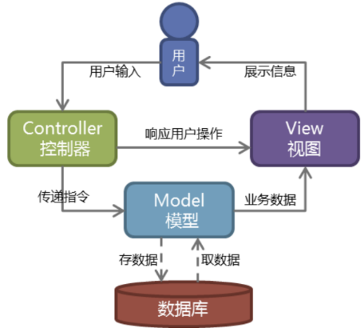

# DjangoWeb框架

## web框架介绍

[菜鸟教程](https://www.runoob.com/django/django-tutorial.html)

具体介绍Django之前，必须先介绍WEB框架等概念。

web框架： 别人已经设定好的一个web网站模板，你学习它的规则，然后“填空”或“修改”成你自己需要的样子。

一般web框架的架构是这样的：

其它基于python的web框架，如tornado、flask、webpy都是在这个范围内进行增删裁剪的。例如tornado用的是自己的异步非阻塞“wsgi”，flask则只提供了最精简和基本的框架。Django则是直接使用了WSGI，并实现了大部分功能。

## MVC/MTV介绍

**MVC百度百科**：全名Model View Controller，是模型(model)－视图(view)－控制器(controller)的缩写，一种软件设计典范，用一种业务逻辑、数据、界面显示分离的方法组织代码，将业务逻辑聚集到一个部件里面，在改进和个性化定制界面及用户交互的同时，不需要重新编写业务逻辑。

**通俗解释**：一种文件的组织和管理形式！不要被缩写吓到了，这其实就是把不同类型的文件放到不同的目录下的一种方法，然后取了个高大上的名字。当然，它带来的好处有很多，比如前后端分离，松耦合等等，就不详细说明了。　　　　　　　

- 模型(model)：定义数据库相关的内容，一般放在models.py文件中。
- 视图(view)：定义HTML等静态网页文件相关，也就是那些html、css、js等前端的东西。
- 控制器(controller)：定义业务逻辑相关，就是你的主要代码。　　

**MTV**: 有些WEB框架觉得MVC的字面意思很别扭，就给它改了一下。view不再是HTML相关，而是主业务逻辑了，相当于控制器。html被放在Templates中，称作模板，于是MVC就变成了MTV。这其实就是一个文字游戏，和MVC本质上是一样的，换了个名字和叫法而已，换汤不换药。

## Django的MTV模型组织

目录分开，就必须有机制将他们在内里进行耦合。在Django中，urls、orm、static、settings等起着重要的作用。一个典型的业务流程是如下图所示：

用户操作流程图

## Django项目实例

**参考**

https://www.cnblogs.com/qianyuliang/p/6814376.html

