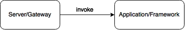
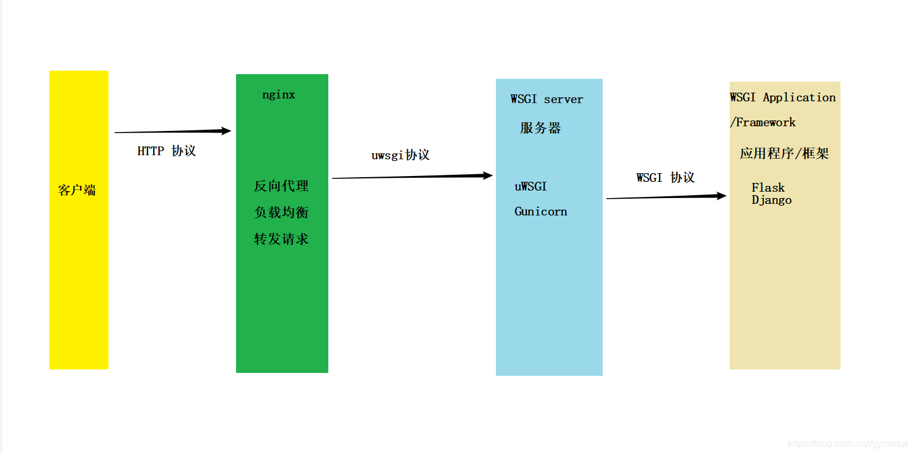

# uswgi高并发处理

## 简介

### WSGI

英文全称：Web Server Gateway Interface，Web服务网关接口，简单来说它是一种Web服务器和应用程序间的通信规范。定义了Web服务器如何与Python应用程序进行交互，使得使用Python写的Web应用程序可以和Web服务器对接起来。

在WSGI中定义了两个角色，Web服务器端称为server或者gateway，应用程序端称为application或者framework（因为WSGI的应用程序端的规范一般都是由具体的框架来实现的）。我们下面统一使用server和application这两个术语。

server端会先收到用户的请求，然后会根据规范的要求调用application端，如下图所示：



调用的结果会被封装成HTTP响应后再发送给客户端。

要使用WSGI，需要分别实现server角色和application角色。

Application端的实现一般是由Python的各种框架来实现的，比如Django, web.py等，一般开发者不需要关心WSGI的实现，框架会会提供接口让开发者获取HTTP请求的内容以及发送HTTP响应；

Server端的实现会比较复杂一点，这个主要是因为软件架构的原因。一般常用的Web服务器，如Apache和nginx，都不会内置WSGI的支持，而是通过扩展来完成。比如Apache服务器，会通过扩展模块mod_wsgi来支持WSGI。Apache和mod_wsgi之间通过程序内部接口传递信息，mod_wsgi会实现WSGI的server端、进程管理以及对application的调用。Nginx上一般是用proxy的方式，用nginx的协议将请求封装好，发送给应用服务器，比如uWSGI，应用服务器会实现WSGI的服务端、进程管理以及对application的调用。

### uwsgi

uwsgi是一种通信协议，不过跟WSGI分属两种东西，该协议下速度比较快。它是一个二进制协议，可以携带任何类型的数据。一个uwsgi分组的头4个字节描述了这个分组包含的数据类型。

uwsgi是一种线路协议而不是通信协议，在此常用于在uWSGI服务器与其他网络服务器的数据通信；

### uWSGI

uWSGI是一个Web Server，并且独占uwsgi协议，但是同时支持WSGI协议、HTTP协议等，它的功能是把HTTP协议转化成语言支持的网络协议供python使用。

WSGI，uwsgi， uWSGI: 实现过程图解



## 用途

在做Django项目时，一般测试开发我们直接用Django内嵌的Web Server即可，但是如果项目要上生产环境，考虑并发等性能时，我们可能需要uwsgi和nginx，下面只说明uwsgi的常用用法，至于nginx的配置笔者后续准备专门写一篇博文来讲。

## 安装

```bash
pip install uwsgi
```

## 配置

uwsgi执行一般有两种方式：命令行和文件配置，但是命令行可能需要识记很多参数，因此采用文件配置是更通用的做法，文件格式支持很多种比如ini、xml、yaml等，笔者建议还是采用比较简单key-value形式ini模式，下面给出一个简单的uwsgi ini配置实例：

```ini
[uwsgi]
socket = 127.0.0.1:8001
master = false
chdir = /var/www/cmpvirtmgr/
module = cmpvirtmgr.wsgi
home = /var/www/env
workers = 2
reload-mercy = 10
vacuum = true
max-requests = 1000
limit-as = 512
buffer-size = 30000
pidfile = /etc/uwsgi/uwsgi.pid
```

执行：uwsgi --ini /path/to/uwsgi.ini

**参数解释**

[更多uwsgi参数可参考官方文档](https://uwsgi-docs.readthedocs.io/en/latest/)

- socket：socket文件，也可以是地址+端口；
- master：是否启动主进程来管理其他进程；
- chdir：项目的根目录；
- module：wsgi文件相对路径；
- home：虚拟环境目录；
- workers：开启的进程数量；
- reload-mercy：设置在平滑的重启（直到接收到的请求处理完才重启）一个工作子进程中，等待这个工作结束的最长秒数；
- vacuum：服务结束后时候删除对应的socket和pid文件；
- max_requests：每个工作进程设置的请求上限；
- limit_as：限制每个uwsgi进程占用的虚拟内存数目；
- buffer_size：设置用于uwsgi包解析的内部缓存区大小；
- pid_file：指定pid文件；
- harakiri：请求的超时时间；
- daemonize：进程后台执行，并保存日志到特定路径；如果uwsgi进程被supervisor管理，不能设置该参数；

## uWSGI 托管 Django

[官方文档](https://docs.djangoproject.com/zh-hans/2.2/howto/deployment/wsgi/uwsgi/)