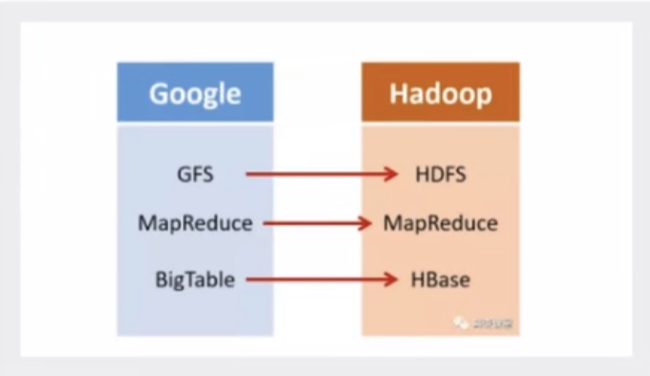

# ElasticSearch

## 聊聊Doug Cutting

1998年8月4日，Google公司在美国硅谷成立，正如大家所知，他是一家做搜索引擎起家的公司

无独有偶，一位名叫Doug Cutting的美国工程师，也迷上了搜索引擎，他做了一个用于文本搜索的函数库（姑且理解为软件的功能组件）名为Lucene


Lucene是用JAVA写的，目标是为各种小型应用软件加入全文检索功能，因为好用而且开源（代码公开），非常受程序员的欢迎。

早期的时候，这个项目被发布在Doug Cutting的个人网站和SourceForge（一个开源软件网站）。后来2001年底，lucene成为Apache软件基金会jakarta项目的一个子项目


2004年，Doug Cutting再接再厉，在Lucene的基础上，和Apache开源伙伴MIke Cafarella合作，开发了一款可以替代当时的主流搜索的开源所搜引擎，命名为Nutch

Nutch是一个简历在lucene核心之上的网页搜索应用程序，可以下载下来直接使用，他在Lucene的基础上加了网络爬虫和一些网页相关的功能，目的就是从一个简单的站内检索推广到全球网络的搜索上，就像Google一样

Nutch在业界的影响力比Lucene更大

大批网站采用了了Nutch平台，大大降低了技术门槛，使低成本的普通计算机取代高价的Web服务器成为可能，审计有一段时间，在硅谷有了一半用Nutch低成本创业的潮流（大数据！）

随着时间的推移，无论是Google还是Nutch，都面临搜索对象“体积”不断增大的问题

尤其是Google，作为互联网搜索引擎，需要存储大量的网页，并不断优化自己的搜索算法，提升搜索效率


在这个过程中，Google确实找到了不少好办法，并且无私第分享了出来

2003年，Google发表了一篇技术学术论文，公开介绍了自己的谷歌文件系统GFS（Google File System），这是Google公司为了存储海量搜索数据而设计的专用文件系统

第二年，也就是2004年，Doug Cutting机遇Google的GFS论文，实现了分布式文件存储系统，并将它命名为NDFS（Nutch Distributed File System）


还是2004年，Google又发表了一篇学术论文，介绍自己的MapReduce编程模型，用于大规模数据集（大于1TB）的并行分析计算

第二年（2005年），Doug Cutting又基于MapReduce，在Nutch搜索引擎实现了该功能


2006年，当时依然很厉害的Yahoo（雅虎），招安了Doug Cutting


加盟Yahoo之后，Doug Cutting将NDFS和MapReduce进行了升级改造，并重新命名为Hadoop（NDFS也改名为HDFS，Hadoop Distributed File System）

这个，就是后来大名鼎鼎的大数据框架系统——Hadoop的由来，而Doug Cutting则被人们称为Hadoop之父


Hadoop这个名字，实际上是Doug Cutting他儿子的黄色玩具大象的名字，所以Hadoop的Logo，就是一只奔跑的黄色大象


我们继续往下说

还是2006年，Google又发论文了

这次，他们介绍了自己的BigTable，这是一种分布式数据存储系统，一种用来处理海量数据的非关系型数据库。

Doug Cutting当然没有放过，在自己的Hadoop系统里面，引入了BigYTable，并命名为HBase


好吧就是紧跟Google时代步伐，你出什么，我学什么

所以，Hadoop的核心部分，基本上都有Google的影子



2008年1月，Hadoop成功上位，正式成为Apache基金会的顶级项目。

同年2月，Yahoo宣布建成了一个拥有1万个内核的Hadoop集群，并将自己的搜索引擎产品部署在上面，

7月，Hadoop打破世界记录，成为最快排序1TB数据的系统，用时209秒

## ElasticSearch概述

ElasticSearch，简称es，es是一个开源的高可扩展的分布式全文检索引擎，它可以近乎实时的存储，检索数据；本身扩展性很好，有扩展到上百台服务器，处理PA级别的数据，es也使用java开发并使用Lucene作为期核心来实现所有索引和搜索的功能，但是他的目的是通过简单的RESTful API来隐藏Lucene的复杂性，从而让全文搜索变得简单。

据国际权威的数据库产品评测机构DB Engines的统计，在2016年1月，ElasticSearch已超过Slor等，成为排名第一的搜索引擎类应用

### 历史

多年前，一个叫做Shay Banon的刚结婚不久的失业开发者，由于妻子要去伦敦学习厨师，他便跟着去了，在他找工作的过程中，为了给妻子构造一个食谱的搜索引擎，他开始构建一个早期版本的Lucene

直接基于Lucene工作会比较困难，所以Shay开始抽象代码以便Java程序员可以在应用中添加搜索功能，他发布了他的第一个开源项目，叫做Compass

后来找到一份工作，这份工作处在高性能和内存数据网络的分布式环境中，因此高性能的、实时的、分布式的锁搜引擎也是理所当然的。然后他决定重写Compass库使其成为一个独立的服务叫做ElatsticSearch

第一个公开版本出现在2010年2月，在哪之后的ElasticSearch已经成为Github上最受欢迎的项目之一，代码贡献超过300人。一家主营ElasticSearch的公司就此成立，他们一边提供商业支持一边开发新功能，不过ElasticSearch将永远开源且对所有人可用。

Shay的妻子依旧等待着他的食谱搜索。。。。。

### 谁在使用

1. 维基百科，类似百度百科，全文检索，高亮，推荐搜索（权重、百度！）
2. the guardian（国外新闻网站），类似搜狐新闻，用户行为日志（点击，浏览，收藏，评论）+社交网络数据（对某某新闻的相关看法），数据分析，给到每篇新闻的作者，让他知道他的文章的公众反馈（好、坏、热门、垃圾、鄙视、崇拜）
3. stack overflow（国外的程序一场讨论论坛），IT问题，程序的报错，提交上去，有人会跟你讨论和回答，全文检索，搜索相关问题和答案，程序报错了，就会有报错信息粘贴到里面去，搜索也没有对应的答案。
4. github（开源代码管理），搜索上千亿行代码
5. 电商网站，检索商品
6. 日志数据分析，logstash采集日志，ES进行复杂的数据分析，ELK技术，**elasticserch+ logstash + kibana**
7. 商品价格监控网站，用户设定某商品的价格阈值，当低于阈值的时候，发送通知消息给用户，比如订阅牙膏的监控，如果高露洁牙膏的家庭套装低于50块钱，就通知我，我就去买
8. BI系统，商业智能，Business Intelligence，比如说有个大型商场集团，BI，分析一下某某区域最近3年的用户消费金额的趋势以及用户群体的组成构成，产出相关的数张报表，**区，最近三年，每年消费金额呈现100%的增长，而且用户群体85%是高级白领，开一个新商场，ES执行数据分析和挖掘，Kibana进行数据可视化
9. 国内站内搜索（电商，招聘，门户，等等），IT系统搜索（OA，CRM，ERP等等），数据分析（ES热门的一个使用场景）

## ES和solr的差别

### Elasticsearch简介

ElasticSearch是一个实时分布式搜索的分析引擎，他让你以前所未有的速度处理大数据成为可能。

它用于全文搜索、结构化搜索、分析以及将这三者混合使用；

维基百科使用elasticsearch提供全文搜索并高亮关键字，以及输入实时搜索（search-asyou-type）和搜索纠错（did-you-mean）等搜索建议功能。

英国卫报使用ElasticSearch结合用户日志和社交网络提供他们的编辑以实时的反馈，以便及时了解公众对新发表的文章的回应

StackOverFlow结合全文搜索与地理位置查询以及more-like-this功能找到相关的问题和答案

github使用ElasticSearch检索1300亿行代码

但是ElasticSearch不仅用于大型企业，他还像DataDog以及Kout这样的创业公司将最初的想法变成可扩张的解决方案。ElasticSearch可用在你的笔记本上运行，也可以在数以百计的服务器砂锅处理PB级别的数据

ElasticSearch是一个基于Apach Lucene（TM）的开源搜索引擎，无论在开源还是专有领域，Lucene可以被任务是迄今为止最先进性能最好的、功能最全的搜索引擎库

但是，Lucene只是一个库，想要使用它你必须用java来作为开发语言并将其直接结成到你的应用中，更糟糕的是，Lucene非常复杂，你需要深入了解检索的相关知识来理解它是如何工作的

ElasticSearch也使用java开发并使用Lucene作为期核心来实现所有索引和搜索的功能，但是它的目的通过简单的RESTful API 来隐藏Lucene的复杂性，从而让全文搜索变得简单

### Solr简介

Solr是Apache下的一个顶级开源项目，采用java开发，他是基于Lucene的全文服务器，Solr提供了比Lucene更为丰富的查询语言，同时实现了可配置，可扩展，并对索引、搜索性能进行了优化

Solr可以独立运行，运行在jetty、tomcat等着写servlet容器中，solr索引的实现方法很简单，用Post方法向solr服务器发送一个描述Field及其内容的XML文档，solr根据xml文档添加、删除、更新索引。solr搜索只需要发送http get请求，然后对solr返回xml、json格式的查询结果进行解析，组织页面布局。solr不提供构建UI的功能，solr提供了一个管理界面，通过管理界面可以查询solr的配置和运行情况

solr是基于lucene开发企业级搜索服务器，实际上就是封装了lucene

solr是一个独立的企业级搜索应用服务器，他对外提供类似于web-service的API接口，用户可以通过http请求，向搜索引擎服务器提交一定格式的文件，生成索引；也可以通过提出查找请求，并得到返回结果

### Lucene简介

Lucene是apache软件基金会项目组的一个子项目，是一个开放源代码的全文检索引擎工具包，但它不是一个完整的全文检索引擎，而是一个全文检索引擎的架构，提供了完整的查询引擎和搜索引擎，（英文与德文来那个汇总西方语言）。Lucene的目的是为软件开发人员提供一个简单易用的工具包，以便在目标系统中实现全文检索的功能，或者是以此为基础建立起完整的全文检索引擎。Lucene是一套用于全文检索和搜索的开源程式库，由apache软件基金会支持和提供，Lucene提供了一个简单却强大的应用程式接口，能够做全文索引和搜索，在java开发环境里Lucene是一个成熟的免费开源工具，就起本身而言，Lucene是当前以及最近几年最受欢迎的免费java信息检索程序库，人们经常提到信息检索程序库，虽然雨搜索引擎有关，但不应该讲信息检索程序库与搜索引擎相混淆

Lucene是一个全文检索引擎的架构，那什么是全文搜索引擎？

全文搜索引擎是名副其实的搜索引擎，国外具代表性的有Google、Fast/AllTheWeb、AltaVista、inktoml、Teoma、WiseNut等，国内著名的有百度，他们都是通过从互联网上提取的各个网站的信息（以网页名字为主）而建立的数据库，检索与用户查询的条件匹配的相关记录，然后按一定的排列顺序将结果返回给用户，因此他们是真正的搜索引擎

从搜结果来源的角度，全文搜索引擎又可分为来那个两种，一种是拥有自己的检索程序，俗称“蜘蛛”程序或者“机器人”程序，并自建网页数据库，搜索结果直接从自身的数据库中调用，如上面提到的7家引擎；另一种则是租用其他引擎的数据库，并按照自定的格式排列搜索结果，如Lycos引擎

### ElasticSearch和Solr比较

- 当单纯的对已有数据进行搜索时，solr更快
- 当实时建立索引时，Solr会产生io阻塞，查询性能较差，ElasticSearch具有明显的优势
- 随着数据量的增加，Solr的搜索效率会变的更低，而ElasticSearch却没有明显的变化

**总结**

1. es基本是开箱即用，非常简单，solr安装略微复杂一丢丢！
2. solr利用Zookeeper进行分布式管理，而ElasticSearch自身带有分布式协调管理功能
3. solr支持更能多格式的数据，比如JSON、XML、CSV，而es仅支持json文件格式
4. solr官方提供的功能更多，而es本身更注重于核心功能，高级功能多有第三方插件提供，例如图形化界面需要kibana友好支撑
5. solr查询快，但更新搜索时慢（即插入删除慢），用于电扇等查询多的应用
6. es建立索引快（即查询慢），即实时性查询快，用于facebook新浪等搜索
7. solr是传统搜索应用的有力解决方案，但Es更适用于新兴的实时搜索应用
8. solr比较成熟，有一个更大，更成熟的用户、开发和贡献社区，而es开发维护者少，更新太快，学习使用成本高

## ElasticSearch安装

[下载](https://www.elastic.co/cn/downloads/elasticsearch)

```bash
bin # 启动文件
config # 配置文件
	log4j2 # 日志配置文件
	jvm.option java # 虚拟机相关的配置
	elasticsearch.yml es的配置文件！默认9200端口！跨域！
	
lib # 相关jar包
logs # 日志
modules # 功能模块
plugins # 插件
```

### 了解ELK

ELK是ElasticSearch，Logstash、Kibana三大开源框架首字母简称，市面上也被称为Elastic Stack，其中ElasticSearch是一个机遇Lucene、分布式，通过REATful方式进行交互的近实时搜索平台框架，像类似百度、谷歌这种大数据全文搜索的场景都可以使用ElasticSearch作为底层支持框架，可见ElasticSearch提供的搜索能力确实强大，市面上很多时候我们简称ElasticSearch为es。

Logstash是ELK的中央数据流引擎，用于从不同目标（文件/数据存储MQ）收集的不同格式数据，经过过滤后支持输出到不同目的地（文件/MQ/redis/es/kafka等），

Kibana可以将es的数据通过友好的夜无眠展示出来，提供实时分析的功能

市面上很多开发只要提到ELK能够一致说出它是一个日志分析架构技术站总称，但实际上ELK不仅仅适用于日志分析，他还可以支持其它任何数据分析和手机的场景，日志分析和收集只是更具有代表性，并非一致性


### 安装Kibana

Kibana是一个针对ElasticSearch的开源分析及可视化平台，用来搜索，查看交互存储在ElasticSearch索引中的数据，使用kibana，可以通过各种图表进行高级数据分析及展示，kibana让海量数据跟容易理解，他操作简单，机遇浏览器的用户界面可以快速创建仪表板实时展示ElasticSearch查询动态，设置kibana非常简单，无需编码或者额外的基础架构，几分钟就可以完成kibana的安装并启动ElasticSearch索引检测

[下载](https://www.elastic.co/cn/start)

## ElasticSearch核心概念

### 概述

在前面的学习中，我们已经掌握了es是什么，同时把es的服务已经安装启动，那么es是如何去存储数据，数据结构是什么，又如何实现的呢？

**集群、节点、索引、类型、文档、分片、映射是什么？**

| Relational DB      | ElasticSearch |
| ------------------ | ------------- |
| 数据库（database） | 索引          |
| 表（tables）       | types         |
| 行（rows）         | documents     |
| 字段（columns）    | fields        |

elasticsearch（集群）中可以包含多个索引（数据库），每个索引中可以包含多个类型（表），每个类型下又包含多个文档（行），每个文档中又包含多个字短（列）

### 物理设计

elasticsearch 在后面把每个索引划分成多个分片，每分片可以在集群中的不同服务器间迁移

#### 节点和分片（Node 和 Cluster）

Elasticsearch 本质上是一个分布式数据库，允许多台服务器协同工作，每台服务器可以运行多个 Elasticsearch 实例。

单个 Elasticsearch 实例称为一个节点（Node）。一组节点构成一个集群（Cluster）。

**节点和分片如何工作？**

一个集群至少有一个节点，而一个节点就是一个elasticsearch进程，节点可以有多个索引默认的，如果你创建索引，那么索引将会有5个分片（primary shard，又称主分片）构成的，每一个主分片会有一个副本（replica shard，又称复制分片）


上图是一个有三个节点和集群，可以看到主分片和对应的复制分片都不会在同一个节点内，这样有利于某个节点挂掉了，数据也不会丢失，实际上，一个分片是一个lucene索引，一个包含倒排索引的结构使得elasticsearch在不扫描全部文档的情况下，就能告诉你哪些文档包含特定的关键字。不过，等等，倒排索引是什么鬼？

#### 倒排索引

ealsticsearch使用的是一种称谓倒排索引的结构，采用lucene倒排索引为底层，这种结构适用于快速的全文搜索，一个索引由文档中所有不重复的列表构成，对于每一个词，都有一个包含它的文档列表，例如现在由两个文档，每个文档包含如下内容

| 博客文章（原始数据） |               | 索引列表（倒排索引） |            |
| -------------------- | ------------- | -------------------- | ---------- |
| 博客文章ID           | 标签          | 标签                 | 博客文章ID |
| 1                    | python        | python               | 1，2，3    |
| 2                    | python        | linux                | 3，4       |
| 3                    | linux，python |                      |            |
| 4                    | linux         |                      |            |

如果需要搜索含有python标签的文章，那相对于查找所有原始数据而言，查找倒排索引后的数据将会快的多，只需要查看标签这一栏，然后获取相关的文章ID即可

### 逻辑设计

一个索引类型中，包含多个文档，比如说文档1，文档2，当我们索引一篇文档时，可以通过这恶扬的一个顺序找到他：索引->类型->文档ID,通过这个组合我们就能索引到某个具体的文档，注意：ID不必是整数，实际上他是个字符串

#### 索引（Index）

索引是映射类型的容器，elasticsearch中的索引是一个非常大的文档集合，索引存储了映射类型的字段和其他设置。然后他们被存储到了各个分片上了，我们来研究下分片是如何工作的。

Elasticsearch 会索引所有字段，经过处理后写入一个反向索引（Inverted Index）。查找数据的时候，直接查找该索引。

所以，Elasticsearch 数据管理的顶层单位就叫做 Index（索引），其实就相当于 MySQL、MongoDB 等里面的数据库的概念。另外值得注意的是，每个 Index （即数据库）的名字必须是小写。

#### 文档（Document）

之前说elasticsearch是面向文档的，那么就意味着索引和搜索数据的最小单位是文档，elasticsearch中，文档有几个重要属性：

- 自我包含，一篇文档同时包含字段和对应的值，也就是同时包含key-value
- 可以是层次型的，一个文档中包含自文档，复杂的逻辑尸体就是这么来的
- 灵活的结构，文档不依赖预先定义的模式，我们知道关系型数据库中，要提前定义字段才能使用，在elasticsearch中，对于字段是非常灵活的，有时候，我们可以忽略该字段，或者动态的添加一个新的字段

尽管我们可以随意的新增或者忽略某个字段，但是，每个字段的类型非常重要，比如一个年龄字段类型，可以是字符串也可以是整形。因为elasticsearch中，类型有时候也称为映射类型。

Index 里面单条的记录称为 Document（文档）。许多条 Document 构成了一个 Index。

Document 使用 JSON 格式表示，下面是一个例子。

同一个 Index 里面的 Document，不要求有相同的结构（scheme），但是最好保持相同，这样有利于提高搜索效率。

#### 类型（Type）

类型是文档的逻辑容器，就像关系型数据库一样，表格是行的容器。类型中对于字段的定义称谓映射，比如name映射为字符串类型，我们说文档是无模式的，它们不需要拥有映射中所定义的所有字段，比如增一个字段，那么elasticsearch是怎么做的呢？elasticsearch会自动的阿静心字段加入映射，但是这个字段的不确定它是什么类型，elasticsearch就开始猜，如果这个值是18那么elasticsearch会认为他是整型，但是elasticsearch也可能猜不对，所以安全的方式就是提前定义好所需要的映射，这点跟关系型数据库殊途同归了，先定义好字段，然后再使用，别整什么幺蛾子

Document 可以分组，比如 weather 这个 Index 里面，可以按城市分组（北京和上海），也可以按气候分组（晴天和雨天）。这种分组就叫做 Type，它是虚拟的逻辑分组，用来过滤 Document，类似 MySQL 中的数据表，MongoDB 中的 Collection。

不同的 Type 应该有相似的结构（Schema），举例来说，id 字段不能在这个组是字符串，在另一个组是数值。这是与关系型数据库的表的一个区别。性质完全不同的数据（比如 products 和 logs）应该存成两个 Index，而不是一个 Index 里面的两个 Type（虽然可以做到）。

根据规划，Elastic 6.x 版只允许每个 Index 包含一个 Type，7.x 版将会彻底移除 Type。

#### 字段（Fields）

即字段，每个 Document 都类似一个 JSON 结构，它包含了许多字段，每个字段都有其对应的值，多个字段组成了一个 Document，其实就可以类比 MySQL 数据表中的字段。

在 Elasticsearch 中，文档归属于一种类型（Type），而这些类型存在于索引（Index）中，我们可以画一些简单的对比图来类比传统关系型数据库：

```python
Relational DB -> Databases -> Tables -> Rows -> Columns
Elasticsearch -> Indices   -> Types  -> Documents -> Fields
```

以上就是 Elasticsearch 里面的一些基本概念，通过和关系性数据库的对比更加有助于理解


## IK分词器

### 什么是Ik分词器？

分词：即把一段中文或者别的划分成一个个的关键字，我们在搜索的时候会把自己的信息进行分词，会把数据库中或者索引库中的数据进行分词，然后进行一个匹配操作，默认的中文分词是将每个字看成一个词，比如“我爱狂神”会被分为“我”，“爱”，“狂”，“神”，这显然是不符合要求的，所以我们需要安装中文分词器ik来解决这个问题

如果要使用中文分词，建议使用ik分词器

IK提供了两个分词算法：ik_smart和ik_max_work，其中ik_smart为最少切分，ik_max_work为最细粒度划分！

### 安装

https://github.com/medcl/elasticsearch-analysis-ik/releases

## Rest风格说明

一种软件架构风格，而不是标准，只是提供了一组设计原则和约束条件，它主要用于客户端和服务端交互类的软件，机遇这个风格可以更为简洁，更有层次，更抑郁是心啊缓存等机制

### 基本Rest命令说明

| method | url地址                                          | 描述                   |
| ------ | ------------------------------------------------ | ---------------------- |
| PUT    | Locallhost:9200/索引名称/类型名称/文档ID         | 创建文档（指定文档ID） |
| POST   | Locallhost:9200/索引名称/类型名称                | 创建文档（随机文档ID） |
| POST   | Locallhost:9200/索引名称/类型名称/文档ID/_update | 修改文档               |
| DELETE | Locallhost:9200/索引名称/类型名称/文档ID         | 删除文档               |
| GET    | Locallhost:9200/索引名称/类型名称/文档ID         | 查询文档通过ID         |
| POST   | Locallhost:9200/索引名称/类型名称/_search        | 查询所有数据           |

### 类型分析

| 类型   | 说明                                                         |
| ------ | ------------------------------------------------------------ |
| 字符串 | text，keyword                                                |
| 数值   | long，integer，short，double，float，half float，scaled float |
| 日期   | date                                                         |
| 布尔值 | boolean                                                      |
| 二进制 | binary                                                       |

## Python 对接 Elasticsearch

Elasticsearch 实际上提供了一系列 Restful API 来进行存取和查询操作，我们可以使用 curl 等命令来进行操作，但毕竟命令行模式没那么方便，所以这里我们就直接介绍利用 Python 来对接 Elasticsearch 的相关方法。

Python 中对接 Elasticsearch 使用的就是一个同名的库，安装方式非常简单：

```bash
pip3 install elasticsearch
```

官方文档是：https://elasticsearch-py.readthedocs.io/，所有的用法都可以在里面查到，文章后面的内容也是基于官方文档来的。

**下面的例子是本地连接**

### 创建索引

我们先来看下怎样创建一个索引（Index），这里我们创建一个名为 news 的索引：

```python
from elasticsearch import Elasticsearch

es = Elasticsearch()
result = es.indices.create(index='news', ignore=400)
print(result)
```

如果创建成功，会返回如下结果：

```python
{'acknowledged': True, 'shards_acknowledged': True, 'index': 'news'}
```

返回结果是 JSON 格式，其中的 acknowledged 字段表示创建操作执行成功。

但这时如果我们再把代码执行一次的话，就会返回如下结果：

```python
{'error': {'root_cause': [{'type': 'resource_already_exists_exception', 'reason': 'index [news/QxBPZzVwQhujlPqCLjOlVg] already exists', 'index_uuid': 'QxBPZzVwQhujlPqCLjOlVg', 'index': 'news'}], 'type': 'resource_already_exists_exception', 'reason': 'index [news/QxBPZzVwQhujlPqCLjOlVg] already exists', 'index_uuid': 'QxBPZzVwQhujlPqCLjOlVg', 'index': 'news'}, 'status': 400}
```

它提示创建失败，status 状态码是 400，错误原因是 Index 已经存在了。

注意这里我们的代码里面使用了 ignore 参数为 400，这说明如果返回结果是 400 的话，就忽略这个错误不会报错，程序不会执行抛出异常。

假如我们不加 ignore 这个参数的话：

```python
es = Elasticsearch()
result = es.indices.create(index='news')
print(result)
```

再次执行就会报错了：

```python
raise HTTP_EXCEPTIONS.get(status_code, TransportError)(status_code, error_message, additional_info)
elasticsearch.exceptions.RequestError: TransportError(400, 'resource_already_exists_exception', 'index [news/QM6yz2W8QE-bflKhc5oThw] already exists')
```

这样程序的执行就会出现问题，所以说，我们需要善用 ignore 参数，把一些意外情况排除，这样可以保证程序的正常执行而不会中断。

### 删除索引

删除 Index 也是类似的，代码如下：

```python
from elasticsearch import Elasticsearch

es = Elasticsearch()
result = es.indices.delete(index='news', ignore=[400, 404])
print(result)
```

这里也是使用了 ignore 参数，来忽略 Index 不存在而删除失败导致程序中断的问题。

如果删除成功，会输出如下结果：

```python
{'acknowledged': True}
```

如果 Index 已经被删除，再执行删除则会输出如下结果：

```python
{'error': {'root_cause': [{'type': 'index_not_found_exception', 'reason': 'no such index', 'resource.type': 'index_or_alias', 'resource.id': 'news', 'index_uuid': '_na_', 'index': 'news'}], 'type': 'index_not_found_exception', 'reason': 'no such index', 'resource.type': 'index_or_alias', 'resource.id': 'news', 'index_uuid': '_na_', 'index': 'news'}, 'status': 404}
```

这个结果表明当前 Index 不存在，删除失败，返回的结果同样是 JSON，状态码是 400，但是由于我们添加了 ignore 参数，忽略了 400 状态码，因此程序正常执行输出 JSON 结果，而不是抛出异常。

### 插入数据

Elasticsearch 就像 MongoDB 一样，在插入数据的时候可以直接插入结构化字典数据，插入数据可以调用 create() 方法，例如这里我们插入一条新闻数据：

```python
from elasticsearch import Elasticsearch

es = Elasticsearch()
es.indices.create(index='news', ignore=400)

data = {'title': '美国留给伊拉克的是个烂摊子吗', 'url': 'http://view.news.qq.com/zt2011/usa_iraq/index.htm'}
result = es.create(index='news', doc_type='politics', id=1, body=data)
print(result)
```

这里我们首先声明了一条新闻数据，包括标题和链接，然后通过调用 create() 方法插入了这条数据，在调用 create() 方法时，我们传入了四个参数，index 参数代表了索引名称，doc_type 代表了文档类型，body 则代表了文档具体内容，id 则是数据的唯一标识 ID。

运行结果如下：

```python
{'_index': 'news', '_type': 'politics', '_id': '1', '_version': 1, 'result': 'created', '_shards': {'total': 2, 'successful': 1, 'failed': 0}, '_seq_no': 0, '_primary_term': 1}
```

结果中 result 字段为 created，代表该数据插入成功。

另外其实我们也可以使用 index() 方法来插入数据，但与 create() 不同的是，create() 方法需要我们指定 id 字段来唯一标识该条数据，而 index() 方法则不需要，如果不指定 id，会自动生成一个 id，调用 index() 方法的写法如下：

```python
es.index(index='news', doc_type='politics', body=data)
```

create() 方法内部其实也是调用了 index() 方法，是对 index() 方法的封装。

### 更新数据

更新数据也非常简单，我们同样需要指定数据的 id 和内容，调用 update() 方法即可，代码如下：

```python
from elasticsearch import Elasticsearch

es = Elasticsearch()
data = {
    'title': '美国留给伊拉克的是个烂摊子吗',
    'url': 'http://view.news.qq.com/zt2011/usa_iraq/index.htm',
    'date': '2011-12-16'
}
result = es.update(index='news', doc_type='politics', body=data, id=1)
print(result)
```

这里我们为数据增加了一个日期字段，然后调用了 update() 方法，结果如下：

```python
{'_index': 'news', '_type': 'politics', '_id': '1', '_version': 2, 'result': 'updated', '_shards': {'total': 2, 'successful': 1, 'failed': 0}, '_seq_no': 1, '_primary_term': 1}
```

可以看到返回结果中，result 字段为 updated，即表示更新成功，另外我们还注意到有一个字段 _version，这代表更新后的版本号数，2 代表这是第二个版本，因为之前已经插入过一次数据，所以第一次插入的数据是版本 1，可以参见上例的运行结果，这次更新之后版本号就变成了 2，以后每更新一次，版本号都会加 1。

如果报错：ActionRequestValidationException[Validation Failed: 1: script or doc is missing。解决方法：body中加’doc’节点，把其他包裹起来：body={‘doc’: data}

另外更新操作其实利用 index() 方法同样可以做到，写法如下：

```python
es.index(index='news', doc_type='politics', body=data, id=1)
```

可以看到，index() 方法可以代替我们完成两个操作，如果数据不存在，那就执行插入操作，如果已经存在，那就执行更新操作，非常方便。

### 删除数据

如果想删除一条数据可以调用 delete() 方法，指定需要删除的数据 id 即可，写法如下：

```python
from elasticsearch import Elasticsearch

es = Elasticsearch()
result = es.delete(index='news', doc_type='politics', id=1)
print(result)
```

运行结果如下：

```python
{'_index': 'news', '_type': 'politics', '_id': '1', '_version': 3, 'result': 'deleted', '_shards': {'total': 2, 'successful': 1, 'failed': 0}, '_seq_no': 2, '_primary_term': 1}
```

可以看到运行结果中 result 字段为 deleted，代表删除成功，_version 变成了 3，又增加了 1。

### 查询数据

上面的几个操作都是非常简单的操作，普通的数据库如 MongoDB 都是可以完成的，看起来并没有什么了不起的，Elasticsearch 更特殊的地方在于其异常强大的检索功能。

对于中文来说，我们需要安装一个分词插件，这里使用的是 elasticsearch-analysis-ik，GitHub 链接为：https://github.com/medcl/elasticsearch-analysis-ik，这里我们使用 Elasticsearch 的另一个命令行工具 elasticsearch-plugin 来安装，这里安装的版本是 6.2.4，请确保和 Elasticsearch 的版本对应起来，命令如下：

elasticsearch-plugin install https://github.com/medcl/elasticsearch-analysis-ik/releases/download/v6.8.8/elasticsearch-analysis-ik-6.8.8.zip
这里的版本号请替换成你的 Elasticsearch 的版本号。

安装之后重新启动 Elasticsearch 就可以了，它会自动加载安装好的插件。

首先我们新建一个索引并指定需要分词的字段，代码如下：

```python
from elasticsearch import Elasticsearch

es = Elasticsearch()
mapping = {
    'properties': {
        'title': {
            'type': 'text',
            'analyzer': 'ik_max_word',
            'search_analyzer': 'ik_max_word'
        }
    }
}
es.indices.delete(index='news', ignore=[400, 404])
es.indices.create(index='news', ignore=400)
result = es.indices.put_mapping(index='news', doc_type='politics', body=mapping)
print(result)
```

这里我们先将之前的索引删除了，然后新建了一个索引，然后更新了它的 mapping 信息，mapping 信息中指定了分词的字段，指定了字段的类型 type 为 text，分词器 analyzer 和 搜索分词器 search_analyzer 为 ik_max_word，即使用我们刚才安装的中文分词插件。如果不指定的话则使用默认的英文分词器。

接下来我们插入几条新的数据：

```python
datas = [
    {
        'title': '美国留给伊拉克的是个烂摊子吗',
        'url': 'http://view.news.qq.com/zt2011/usa_iraq/index.htm',
        'date': '2011-12-16'
    },
    {
        'title': '公安部：各地校车将享最高路权',
        'url': 'http://www.chinanews.com/gn/2011/12-16/3536077.shtml',
        'date': '2011-12-16'
    },
    {
        'title': '中韩渔警冲突调查：韩警平均每天扣1艘中国渔船',
        'url': 'https://news.qq.com/a/20111216/001044.htm',
        'date': '2011-12-17'
    },
    {
        'title': '中国驻洛杉矶领事馆遭亚裔男子枪击 嫌犯已自首',
        'url': 'http://news.ifeng.com/world/detail_2011_12/16/11372558_0.shtml',
        'date': '2011-12-18'
    }
]

for data in datas:
    es.index(index='news', doc_type='politics', body=data)
```

这里我们指定了四条数据，都带有 title、url、date 字段，然后通过 index() 方法将其插入 Elasticsearch 中，索引名称为 news，类型为 politics。

接下来我们根据关键词查询一下相关内容：

```python
result = es.search(index='news', doc_type='politics')
print(result)
1
2
可以看到查询出了所有插入的四条数据：

{
  "took": 0,
  "timed_out": false,
  "_shards": {
    "total": 5,
    "successful": 5,
    "skipped": 0,
    "failed": 0
  },
  "hits": {
    "total": 4,
    "max_score": 1.0,
    "hits": [
      {
        "_index": "news",
        "_type": "politics",
        "_id": "c05G9mQBD9BuE5fdHOUT",
        "_score": 1.0,
        "_source": {
          "title": "美国留给伊拉克的是个烂摊子吗",
          "url": "http://view.news.qq.com/zt2011/usa_iraq/index.htm",
          "date": "2011-12-16"
        }
      },
      {
        "_index": "news",
        "_type": "politics",
        "_id": "dk5G9mQBD9BuE5fdHOUm",
        "_score": 1.0,
        "_source": {
          "title": "中国驻洛杉矶领事馆遭亚裔男子枪击，嫌犯已自首",
          "url": "http://news.ifeng.com/world/detail_2011_12/16/11372558_0.shtml",
          "date": "2011-12-18"
        }
      },
      {
        "_index": "news",
        "_type": "politics",
        "_id": "dU5G9mQBD9BuE5fdHOUj",
        "_score": 1.0,
        "_source": {
          "title": "中韩渔警冲突调查：韩警平均每天扣1艘中国渔船",
          "url": "https://news.qq.com/a/20111216/001044.htm",
          "date": "2011-12-17"
        }
      },
      {
        "_index": "news",
        "_type": "politics",
        "_id": "dE5G9mQBD9BuE5fdHOUf",
        "_score": 1.0,
        "_source": {
          "title": "公安部：各地校车将享最高路权",
          "url": "http://www.chinanews.com/gn/2011/12-16/3536077.shtml",
          "date": "2011-12-16"
        }
      }
    ]
  }
}


```

可以看到返回结果会出现在 hits 字段里面，然后其中有 total 字段标明了查询的结果条目数，还有 max_score 代表了最大匹配分数。

另外我们还可以进行全文检索，这才是体现 Elasticsearch 搜索引擎特性的地方：

```python
dsl = {
    'query': {
        'match': {
            'title': '中国 领事馆'
        }
    }
}

es = Elasticsearch()
result = es.search(index='news', doc_type='politics', body=dsl)
print(json.dumps(result, indent=2, ensure_ascii=False))
```


这里我们使用 Elasticsearch 支持的 DSL 语句来进行查询，使用 match 指定全文检索，检索的字段是 title，内容是“中国领事馆”，搜索结果如下：

```python
{
  "took": 1,
  "timed_out": false,
  "_shards": {
    "total": 5,
    "successful": 5,
    "skipped": 0,
    "failed": 0
  },
  "hits": {
    "total": 2,
    "max_score": 2.546152,
    "hits": [
      {
        "_index": "news",
        "_type": "politics",
        "_id": "dk5G9mQBD9BuE5fdHOUm",
        "_score": 2.546152,
        "_source": {
          "title": "中国驻洛杉矶领事馆遭亚裔男子枪击，嫌犯已自首",
          "url": "http://news.ifeng.com/world/detail_2011_12/16/11372558_0.shtml",
          "date": "2011-12-18"
        }
      },
      {
        "_index": "news",
        "_type": "politics",
        "_id": "dU5G9mQBD9BuE5fdHOUj",
        "_score": 0.2876821,
        "_source": {
          "title": "中韩渔警冲突调查：韩警平均每天扣1艘中国渔船",
          "url": "https://news.qq.com/a/20111216/001044.htm",
          "date": "2011-12-17"
        }
      }
    ]
  }
}
```

这里我们看到匹配的结果有两条，第一条的分数为 2.54，第二条的分数为 0.28，这是因为第一条匹配的数据中含有“中国”和“领事馆”两个词，第二条匹配的数据中不包含“领事馆”，但是包含了“中国”这个词，所以也被检索出来了，但是分数比较低。

因此可以看出，检索时会对对应的字段全文检索，结果还会按照检索关键词的相关性进行排序，这就是一个基本的搜索引擎雏形。

另外 Elasticsearch 还支持非常多的查询方式，详情可以参考官方文档：https://www.elastic.co/guide/en/elasticsearch/reference/6.3/query-dsl.html

以上便是对 Elasticsearch 的基本介绍以及 Python 操作 Elasticsearch 的基本用法。

## 参考资料

Elasticsearch 权威指南：https://es.xiaoleilu.com/index.html
全文搜索引擎 Elasticsearch 入门教程：http://www.ruanyifeng.com/blog/2017/08/elasticsearch.html
Elastic 中文社区：https://www.elasticsearch.cn/