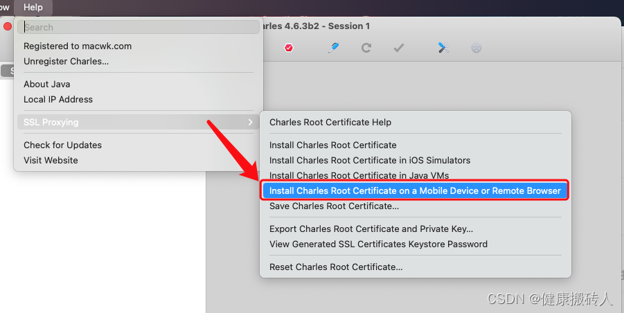

# 使用 charles 进行抓包

[Charles 官网下载](https://www.charlesproxy.com/download/)
[Charles 破解软件](https://macwk.com/soft/charles)
[Charles 密钥](https://www.zzzmode.com/mytools/charles/)
[Charles 授权码](https://www.charles.ren)
[参考](https://blog.csdn.net/a549654065/article/details/124499033)

## 配置

### Charles抓包代理配置

`Proxy ---> Proxy Settings` 默认端口是 8888，根据实际情况可修改。

当然，如果想要配置 `https`

### Android手机抓包配置

首先查看本机的 `ip` 地址：`Help ---> Local IP Address`

保持手机和电脑在同个 `wifi` 环境下，打开手机的 `wifi` 设置，设置代理

### mac 电脑配置

关闭本机的代理，作为一名程序员，为了顺畅的访问 GitHub、Google 网站。我们一般会使用 vpn，这些工具一般会自动开启 HTTP/HTTPS 代理从而抢占端口，导致 Charles 代理失败。

解决这个问题也很简单，Charles 抓包前，把电脑和手机的辅助工具都关掉，这样就不会有代理冲突的问题了。我们可以查看 mac 的 Wi-Fi 代理界面，开启 Charles 抓包前要保证下面的选项都没被勾选就好了。

## 下载证书

### mac 电脑下载证书

首先点击 **Charles -> Help -> SSL Proxying -> Install Charles Root Certificate** 在电脑端安装证书，然后点击刚刚安装的证书，手动信任全部权限，最后输入密码保存修改就可。

### android 手机下载证书

Android 安装证书的步骤不但麻烦，作用还不大。

#### 方法一

首先点击 **Charles -> Help -> SSL Proxying -> Save Charles Root Certificate**，把证书文件以 `*.cer` 格式保存，然后发给手机，点击证书进行安装即可，不同的手机可能需要自行查询一下安装 `CA` 证书的方法

Charles 保存证书文件时，有两种格式可选：.pem 和 .cer。前者是一种证书容器格式，一般是对证书进行 base64 编码；后者一般是二进制格式的证书。

Android 系统对二进制格式的证书兼容性更好一些，所以我们选择 .cer 文件。

保存好文件后，我们再用 USB 或着其它方式把 CA 证书导入到 Android 内，最后点击证书安装就可。

#### 方法二

首先点击 Charles -> Help -> SSL Proxying -> Install Charles Root Certificate on a Mobile Device or Remote Browser

弹窗告诉我们，用 [手机配置](#2. Android手机抓包配置) 完，打开浏览器 输入 chls.pro/ssl 下载证书并安装即可。

配置到这里的时候，就可以开始抓包了

